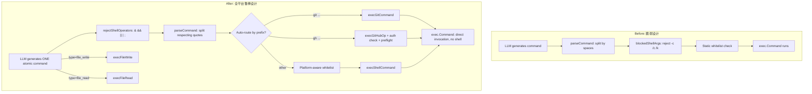
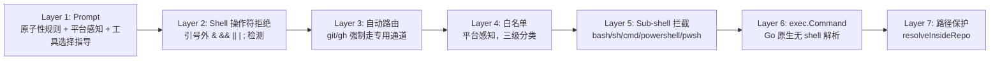

# GitDex 命令执行层全面重构规划 v2

## 一、当前问题全景诊断

### 直接触发 bug

```
gh label create bug -t "Bug" -c "#d73a4a" & gh label create enhancement ...
X shell_command: flag "-c" is blocked (sub-shell invocation)
```

### 系统性设计缺陷


| #   | 缺陷                                       | 影响                                                                |
| --- | ---------------------------------------- | ----------------------------------------------------------------- |
| 1   | `blockedShellArgs` 按字面值拦截 `-c`/`/c`/`/k` | `gh label -c`(颜色)、`curl -c`(cookie) 等合法参数被误杀                      |
| 2   | LLM 用 `&`/`&&`/`;` 链接多条命令                | `exec.Command` 不是 shell，操作符被当作普通参数传入，命令全部失败                       |
| 3   | `git`/`gh` 在 shell_command 白名单中          | LLM 可绕过 `git_command`/`github_op` 的 auth 预检和存在性检查                 |
| 4   | Windows 上缺少 `sed`/`awk`/`cat` 等工具        | LLM 生成的文本处理命令全部失败                                                 |
| 5   | 无 `file_read` 工具                         | LLM 被迫用 `cat`/`type` 读文件，跨平台不兼容                                   |
| 6   | Prompt 未明确原子性规则                          | LLM 经常把多条操作塞进一个 suggestion                                        |
| 7   | 白名单按平台硬编码                                | 未覆盖 Windows 内置命令如 `icacls`、`attrib` 等；未覆盖常用跨平台工具如 `java`、`dotnet` |


## 二、业界顶尖实践全面对标

### 执行架构对比


| 项目                      | 执行模型                                  | 安全策略                          | 跨平台                    |
| ----------------------- | ------------------------------------- | ----------------------------- | ---------------------- |
| **Claude Code**         | OS 级沙箱 (Seatbelt/bubblewrap)          | 文件系统隔离 + 网络代理，17 个生命周期钩子      | macOS + Linux (需 WSL2) |
| **Codex CLI**           | 每轮 tool call -> 执行 -> 回流，JSON-RPC API | 内核级沙箱 + MCP 协议 + prompt cache | 多平台 (App Server)       |
| **SWE-agent**           | `subprocess.run` 每条独立无状态执行            | Docker/Podman/bubblewrap 可替换  | Linux 为主               |
| **Devin**               | 云沙箱内全权 shell + IDE + 浏览器              | 路径限制 + 命令白名单 + 危险模式检测         | 云端统一                   |
| **AG2 Shell Tool**      | `ShellExecutor`：4 层安全保护               | 路径限制 + 白/黑名单 + 工作目录限制 + 危险模式  | Windows + Mac + Linux  |
| **Anthropic bash tool** | 持久 bash session，stdin/stdout 通信       | 沙箱环境内全权                       | Linux 容器               |
| **Google ADK**          | 原子工具 + 幂等 + 语义清晰                      | 每个工具单一职责，docstring 含使用/不使用指引  | 概念层                    |
| **Open Interpreter**    | 逐块审批执行 + 安全审查                         | auto_run 开关 + 执行后安全评估         | 多平台                    |


### 核心原则提炼 (综合以上项目)

1. **原子性** (Google ADK)：每个工具只做一件事，不接受多操作参数
2. **无 shell 解析** (Go 官方 os/exec)：`exec.Command` 直接调用可执行文件，shell 元字符不被解析，从根本上防止注入
3. **显式参数传递** (Trail of Bits)：用户/LLM 输入作为独立参数传入，从不拼接到命令字符串
4. **自动路由** (AG2)：根据命令前缀自动路由到专用处理器
5. **平台感知** (Claude Code/AG2)：运行时检测 OS，调整可用命令和行为
6. **分层安全** (AG2/Devin)：可执行文件白名单 > 子 shell 拦截 > 路径限制 > 操作符拒绝

## 三、重构方案 (7 项变更)

### 变更 1：删除 `blockedShellArgs` 机制

**根因**：`-c` 对 bash 是 "执行命令" flag，但对 `gh label` 是颜色参数、`curl` 是 cookie 参数、`gcc` 是编译参数。按字面值拦截 flag 是语义无关的安全幻觉。

**Go 官方安全保证**：`exec.Command` 不经过 shell，因此 `-c` 永远只是一个普通字符串参数传给目标程序，不会触发 shell 解析。sub-shell 可执行文件 (`bash`/`sh`/`cmd`/`powershell`) 已被 `subShells` map 拦截。

**操作**：

- 删除 `blockedShellArgs` 变量
- 删除 `execShellCommand` 中遍历 `args[1:]` 检查 `blockedShellArgs` 的逻辑块

文件：[internal/executor/runner.go](internal/executor/runner.go) 第 243-246 行、第 284-292 行

### 变更 2：Shell 操作符检测

**根因**：LLM 生成 `cmd1 & cmd2` 或 `cmd1 && cmd2`，`exec.Command` 不解析 `&`/`&&`/`||`/`|`/`;`，整串被当成一条命令的参数。

**方案**：新增 `rejectShellOperators(cmdStr string) string` 函数：

- 在引号外扫描 `&`、`&&`、`||`、`|`、`;` 操作符
- 返回空字符串表示安全，非空表示检测到操作符
- 错误消息包含拆分指导："Each suggestion must contain exactly ONE command. Split into separate suggestions."
- 在 `execGitCommand`、`execShellCommand`、`execGitHubOp` 三个入口的 `parseCommand` 之前统一调用

文件：[internal/executor/runner.go](internal/executor/runner.go)

### 变更 3：自动路由 + 白名单清理

**根因**：`git`/`gh` 在 `crossPlatformCommands` 白名单中，LLM 可用 `shell_command` 类型调用它们，绕过 `git_command`/`github_op` 的专用保护逻辑 (auth 预检、存在性检查、错误分类)。

**方案**：

- 从 `crossPlatformCommands` 移除 `"gh": true` 和 `"git": true`
- 在 `execShellCommand` 解析出 args 后，检查 `args[0]`：
  - 若为 `"git"` → 调用 `r.execGitCommand(ctx, cmdStr)` 并返回
  - 若为 `"gh"` → 调用 `r.execGitHubOp(ctx, cmdStr)` 并返回
- 这样无论 LLM 用什么 type，git/gh 命令都经过专用逻辑

文件：[internal/executor/runner.go](internal/executor/runner.go)

### 变更 4：添加 `file_read` 工具类型

**根因**：LLM 需要读取文件来决定如何修改时，只能用 `cat`/`type` 等平台命令。Windows 没有 `cat`，用 `type` 又需要特殊处理。

**方案**：

- `ActionSpec` 已有 `FilePath` 字段可复用
- 在 `planner/types.go` 的 `ToolLabel()` 中添加 `file_read` -> `"READ"` 映射
- 在 `runner.go` 的 `ExecuteSuggestion` switch 中添加 `case "file_read"` -> `r.execFileRead(item.Action)`
- `execFileRead` 实现：
  - 调用 `r.resolveInsideRepo(action.FilePath)` 确保路径安全
  - `os.ReadFile(safePath)` 读取内容
  - 返回 `ExecutionResult{Stdout: string(content), Success: true}`
- Prompt 中说明：当需要查看文件内容时，使用 `file_read`

文件：[internal/planner/types.go](internal/planner/types.go)、[internal/executor/runner.go](internal/executor/runner.go)

### 变更 5：重写 Prompt 工具规则段

**根因**：当前 Prompt 未明确原子性规则、未告知 `exec.Command` 不是 shell、未提供充分的工具选择指导，导致 LLM 频繁生成不兼容命令。

**方案**：在 Prompt B 和 D 的 "AVAILABLE TOOL TYPES" 之后、OUTPUT FORMAT 之前，替换为以下规则段：

```
EXECUTION MODEL (critical — read carefully):
Commands are executed via exec.Command, NOT through a shell. This means:
- Shell operators (&, &&, ||, |, ;) are NOT supported and WILL FAIL.
- Environment variable expansion ($VAR, %VAR%) does NOT work.
- Glob patterns (*.txt) are NOT expanded.
- Each suggestion executes EXACTLY ONE command. If you need multiple commands, create multiple suggestions.

WRONG: "gh label create bug -c '#d73a4a' && gh label create enhancement -c '#a2eeef'"
RIGHT: Two separate suggestions, each creating one label.

TOOL SELECTION GUIDE:
- To run git operations: use "git_command" (e.g., "git fetch --all")
- To run GitHub CLI: use "github_op" (e.g., "gh label create bug -c '#d73a4a'")
- To modify/create/delete files: use "file_write" (always prefer this over sed/awk/perl)
- To read file contents: use "file_read" (set file_path; always prefer this over cat/type/head)
- To run build/test/other tools: use "shell_command" (e.g., "npm run build", "go test ./...")
- NEVER use shell_command for git or gh operations.
- NEVER use shell_command for text processing (sed/awk/perl). Use file_read + file_write instead.

[platform guidance injected here by platformGuidance()]
```

文件：[internal/llm/promptv2/prompt_b.go](internal/llm/promptv2/prompt_b.go)、[internal/llm/promptv2/prompt_d.go](internal/llm/promptv2/prompt_d.go)

### 变更 6：全平台白名单重构

**根因**：当前白名单遗漏了很多跨平台工具和 Windows 内置命令，同时包含了 Windows 上不存在的 Unix 工具。

**方案**：重构为三级白名单，按实际可用性精确划分：

**crossPlatformCommands** (所有 OS 都可用的工具)：

```go
var crossPlatformCommands = map[string]bool{
    // Build tools
    "go": true, "make": true, "cmake": true, "gradle": true, "mvn": true,
    // JavaScript/TypeScript
    "npm": true, "npx": true, "yarn": true, "pnpm": true, "node": true, "deno": true, "bun": true, "tsc": true,
    // Python
    "python": true, "python3": true, "pip": true, "pip3": true, "uv": true,
    // Rust
    "cargo": true, "rustc": true,
    // .NET / Java
    "dotnet": true, "java": true, "javac": true,
    // Containers
    "docker": true, "docker-compose": true, "podman": true,
    // Universal tools
    "echo": true, "cp": true, "mv": true, "mkdir": true, "curl": true,
    "zip": true, "unzip": true, "tree": true, "rg": true,
}
```

**unixOnlyCommands** (仅 Unix/macOS)：

```go
var unixOnlyCommands = map[string]bool{
    "cat": true, "ls": true, "head": true, "tail": true,
    "grep": true, "find": true, "wc": true, "sort": true, "uniq": true,
    "touch": true, "chmod": true, "chown": true, "ln": true,
    "wget": true, "tar": true, "gzip": true, "gunzip": true, "xz": true,
    "sed": true, "awk": true, "perl": true, "tr": true, "cut": true,
    "diff": true, "patch": true, "tee": true, "xargs": true,
    "which": true, "test": true, "true": true, "false": true,
    "env": true, "printenv": true, "export": true,
    "rm": true, "rmdir": true, "realpath": true, "basename": true, "dirname": true,
}
```

**windowsOnlyCommands** (仅 Windows)：

```go
var windowsOnlyCommands = map[string]bool{
    "dir": true, "where": true, "type": true, "set": true,
    "copy": true, "xcopy": true, "robocopy": true, "del": true,
    "rename": true, "ren": true, "move": true,
    "icacls": true, "attrib": true, "mklink": true,
    "findstr": true, "more": true, "sort": true,
    "certutil": true, "clip": true, "start": true,
}
```

文件：[internal/executor/runner.go](internal/executor/runner.go)

### 变更 7：全套测试用例

新增和更新测试覆盖：

1. **Shell 操作符拒绝测试**：验证 `&`、`&&`、`||`、`|`、`;` 在引号外被检测和拒绝
2. **引号内操作符允许**：验证 `git commit -m "fix & improve"` 中 `&` 不被误判
3. **git/gh 自动路由**：验证 shell_command 中 `git fetch` 自动路由到 execGitCommand
4. **file_read 工具**：验证文件读取、路径越界保护
5. **合法 flag 不被拦截**：验证 `gh label create -c "#d73a4a"` 中 `-c` 正常传递
6. **现有测试回归**：确保全部 30 个包通过

文件：[internal/executor/executor_test.go](internal/executor/executor_test.go)

## 四、变更全景流程




## 五、安全保证链




每一层独立生效，任何一层的漏网之鱼都会被下一层拦住。