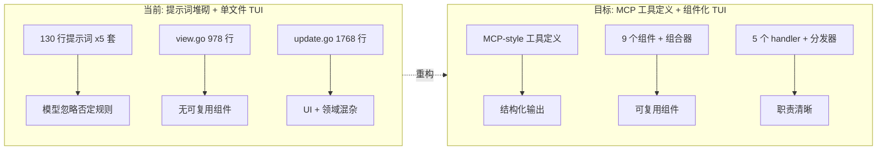

# GitDex 死循环修复 + 提示词重构 + TUI 架构级重构（V3 优化版）

## 设计原则（基于行业深度研究）

基于对 8 个权威资源的深入研究，本次重构遵循明确的设计原则：

**提示词工程**:

- **EASYTOOL (NAACL 2025)**: 精简工具描述显著提升 Agent 性能；冗余指令反而降低准确率。将冗长工具文档 "purify" 为统一、精简的工具指令
- **MCP Tool Definition (Anthropic)**: 工具应使用 `name` + `description` + `inputSchema` (JSON Schema) 结构化定义，而非自然语言描述
- **Cursor Agent 架构**: 代码层保障优于提示词堆砌；用 tool schema 强制结构。CLAUDE.md < 200 行且只含 "hard rules"
- **mitsuhiko/agent-prompts**: 每个 Agent 用 `<sections>` 分层：Role/Process/Delegation/Quality Assurance，分工明确
- **DAIR-AI Reliability**: BRTR 框架（Background-Role-Task-Requirements）；提供 ground truth 减少幻觉；否定提示效果差
- **x1xhlol/system-prompts**: Devin/Cursor/Replit 等顶级产品的提示词均采用「角色 → 能力 → 约束 → 输出格式」四段式结构

**TUI 架构** (基于 gh-dash 源码深度分析):

- **组件化**: gh-dash 有 91 个 Go 文件分布在 17 个 component 包中，每个组件职责单一
- **ProgramContext**: 集中式上下文 `context.ProgramContext` 传递尺寸/样式/配置/任务
- **Styles 集中**: `context.InitStyles(theme)` 统一初始化所有组件样式（248 行），不允许内联样式
- **Section 接口**: `section.Section` 组合了 Identifier + Component + Table + Search + PromptConfirmation 五个子接口
- **ListViewport**: 封装 `charm.land/bubbles/v2/viewport`，管理 item 级别的滚动（上下边界追踪）
- **Footer**: 独立组件，使用 `bbHelp.Model` + `key.Binding` 自动生成上下文帮助
- **Tabs/Carousel**: 基于 carousel 组件的 section 切换，支持溢出指示器
- **KeyMap**: 集中式键绑定，支持配置文件覆盖 + 自定义命令绑定

**核心策略转变**:




---

## 一、提示词全面重构（Phase 1.1-1.3）

### 现状分析

当前 `internal/llm/promptv2/` 目录包含 5 套提示词：

- `prompt_a.go` — Helper: 维护知识文件选择（已精简，~35 行，结构良好）
- `prompt_b.go` — Planner: 维护建议生成（**~125 行，严重膨胀**）
- `prompt_c.go` — Helper: 目标知识文件选择（已精简，~41 行，结构良好）
- `prompt_d.go` — Planner: 目标建议生成（**~131 行，严重膨胀**）
- `prompt_e.go` — Planner: 创造性目标生成（~59 行，中等）
- `common.go` — 共享平台指引（**~62 行，大量重复**）

**核心问题**: prompt_b 和 prompt_d 各 ~130 行，其中 ~80 行是否定规则和平台指引，这些规则：

1. 与 `common.go` 重复
2. 模型经常忽略 "NEVER/DO NOT" 否定指令
3. 应由代码层保障（执行器验证、幂等性、错误分类）

### Phase 1.1: 工具定义标准化

**新建**: `internal/llm/promptv2/tools.go`

按照 MCP Tool Definition 规范，将 GitDex 的 5 种工具类型提取为结构化定义。这些定义可以：

1. 被注入到 system prompt 中（作为 `## Available Tools` 节）
2. 用于代码层的 `action.Type` 验证
3. 作为 golden test 的 schema 验证源

```go
package promptv2

type ToolDef struct {
    Name        string            `json:"name"`
    Description string            `json:"description"`
    InputSchema map[string]any    `json:"inputSchema"`
}

var Tools = []ToolDef{
    {
        Name:        "git_command",
        Description: "Execute a git CLI command. One command per suggestion.",
        InputSchema: map[string]any{
            "type": "object",
            "properties": map[string]any{
                "command": map[string]any{
                    "type": "string",
                    "description": "Complete git command string, e.g. git fetch --all --prune",
                },
            },
            "required": []string{"command"},
        },
    },
    {
        Name:        "shell_command",
        Description: "Execute a build/test/utility command (e.g. go test ./..., npm run build).",
        InputSchema: map[string]any{
            "type": "object",
            "properties": map[string]any{
                "command": map[string]any{
                    "type": "string",
                    "description": "Complete command string. Shell operators (&&, |, ;) are NOT supported.",
                },
            },
            "required": []string{"command"},
        },
    },
    {
        Name:        "file_write",
        Description: "Create, update, delete, or append to a file.",
        InputSchema: map[string]any{
            "type": "object",
            "properties": map[string]any{
                "file_path":      map[string]any{"type": "string"},
                "file_content":   map[string]any{"type": "string"},
                "file_operation": map[string]any{"type": "string", "enum": []string{"create", "update", "delete", "append", "mkdir"}},
            },
            "required": []string{"file_path", "file_operation"},
        },
    },
    {
        Name:        "file_read",
        Description: "Read file content. Returns content in stdout.",
        InputSchema: map[string]any{
            "type": "object",
            "properties": map[string]any{
                "file_path": map[string]any{"type": "string"},
            },
            "required": []string{"file_path"},
        },
    },
    {
        Name:        "github_op",
        Description: "Execute a GitHub CLI (gh) command.",
        InputSchema: map[string]any{
            "type": "object",
            "properties": map[string]any{
                "command": map[string]any{
                    "type": "string",
                    "description": "Complete gh command string, e.g. gh issue create --title \"...\"",
                },
            },
            "required": []string{"command"},
        },
    },
}

// RenderToolDefs formats tool definitions for injection into system prompts.
func RenderToolDefs() string { ... }
```

### Phase 1.2: 全部 5 套提示词重写

按 BRTR 框架（Background-Role-Task-Requirements）重写，采用四段式结构：

**通用模板结构**（所有 prompt 共用）:

```
[Role]: 一句话定义角色
[Task]: 2-3 句话定义具体任务
[Tools]: RenderToolDefs() 输出（结构化工具定义）
[Execution Model]: 3 行 — exec.Command, 不是 shell, 每次一条命令
[Output Format]: JSON schema
[Rules]: 最多 5 条正向引导规则
```

#### prompt_a.go 重写（维护知识选择）— 保持不变

已经是精简结构（~35 行），符合标准。

#### prompt_b.go 重写（维护建议）— 从 ~125 行精简到 ~45 行

```
Role: Git repository maintenance planner.

Task: Analyse repository state and execution log. Produce 1-3 ordered maintenance
actions to make the repository clean, synced, and healthy.

Scope: sync upstream/downstream, clean working tree/staging/HEAD, resolve conflicts
and abnormal states, prune merged branches and stale references.

${RenderToolDefs()}

Execution: Commands run via exec.Command (no shell). No pipes, no &&, no env vars.
Each suggestion = exactly one action.

Rules:
- Review [OK] and [FAIL] entries in the execution log before suggesting any action.
- If repository is already clean, return empty suggestions.
- Respond with concrete values only.

Output: ${JSON_SCHEMA}
Respond in ${LANGUAGE}.
```

**删除的内容**（改由代码层保障）:

- 所有 "NEVER use sed/awk/perl" → `rejectShellOperators` + `unixToolDenylist`
- 所有 "Do NOT repeat commands that FAILED" → 执行器签名去重 + FAILED COMMANDS 置顶
- 所有 HTTP 状态码处理 → `classifyGHError` 生成 DIAGNOSIS
- 所有 "BEFORE suggesting gh release/label" → 执行器预检
- COMMAND FORMAT 示例 → 工具定义的 description 已包含
- GITHUB_OP RULES 全部 → 代码层 `classifyGHError` 已完整覆盖
- `common.go` 中重复的 FILE MODIFICATION RULES, GIT COMMIT RULES, GITHUB_OP FAILURE HANDLING
- Windows 可用命令列表 → `allowedCommands` 白名单

#### prompt_c.go 重写（目标知识选择）— 保持不变

已经是精简结构（~41 行），符合标准。

#### prompt_d.go 重写（目标建议）— 从 ~131 行精简到 ~50 行

与 prompt_b 相同的精简方式，增加 Goal + Todo List 部分：

```
Role: Goal-execution planner for a Git repository.

Task: Produce 1-3 ordered actions that advance the user's goal while maintaining
repository health. Focus on the current active goal and address one to-do item at a time.

Scope: Same as maintenance + goal-specific operations (PR, CI, docs, deployment, etc.).

${RenderToolDefs()}

Execution: Commands run via exec.Command (no shell). No pipes, no &&, no env vars.
Each suggestion = exactly one action.

Rules:
- Review [OK] and [FAIL] entries in the execution log before suggesting any action.
- If goal and all to-do items are done and repo is clean, return empty suggestions.
- Respond with concrete values only.

Output: ${JSON_SCHEMA}
Respond in ${LANGUAGE}.
```

#### prompt_e.go 重写（创造性目标）— 从 ~59 行精简到 ~40 行

删除 CI/CD 特定规则（改为代码层在 goal 验证中处理），保留核心职责：

```
Role: Creative goal generator for a Git repository and its GitHub ecosystem.

Task: Analyse repository state, existing goals, GitHub issues/PRs, and propose
valuable new goals in two categories:
A. Gitdex-actionable (executable via git/GitHub operations)
B. Creative/strategic (insights for the user, not executed)

Rules:
- Do not duplicate existing or recently completed goals.
- Prioritise high-impact, low-effort goals.
- If no good goals exist, return empty arrays.

Output: ${JSON_SCHEMA}
Respond in ${LANGUAGE}.
```

#### common.go 重写 — 从 ~62 行精简到 ~15 行

只保留 `platformGuidance()` 的操作系统标识和一行平台说明：

```go
func platformGuidance() string {
    switch runtime.GOOS {
    case "windows":
        return "PLATFORM: Windows. Use file_read/file_write for file operations."
    default:
        return "PLATFORM: Unix/Linux/macOS. Prefer file_read/file_write for file modifications."
    }
}
```

其余 ~47 行全部删除（由代码层保障）。

### Phase 1.3: 提示词 Golden Tests

**文件**: `promptv2_test.go`

新增测试：

1. **Token 计数断言**: 每套 system prompt 的 token 数不超过上限
  - prompt_a/c (helper): <= 200 tokens
  - prompt_b/d (planner): <= 400 tokens
  - prompt_e (creative): <= 300 tokens
2. **结构完整性**: 每套 prompt 必须包含 "Role"/"Task"/"Output" 关键段
3. **无否定规则泄漏**: 扫描 system prompt 确保不包含 "NEVER"/"DO NOT"/"FORBIDDEN" 等否定词（这些应在代码层）
4. **工具定义 schema 验证**: `RenderToolDefs()` 输出必须包含所有 5 种工具名

---

## 二、死循环代码层修复（Phase 1.4-1.6）

### Phase 1.4: 输出管线修复

**文件**: [output.go](internal/dotgitdex/output.go), [budget.go](internal/llm/budget/budget.go)

4 处代码修改，不依赖提示词：

1. **file_read stdout 摘要化** (`output.go` L101): 当 `ActionType == "file_read"` 且 `len(Stdout) > 500`，截取前 10 行 + `[file_read: N lines total]`
2. **文件操作纳入 FAILED COMMANDS** (`output.go` L86-88): 当 `Command == ""` 且 `FilePath != ""`，用 `ActionType + " " + FileOp + " " + FilePath` 构造失败条目
3. **FAILED COMMANDS 置顶** (`budget.go` L254): 改 `text = failedBlock + "\n\n" + text`
4. **FAILED COMMANDS 独立预算** (`budget.go`): 预留 200 token，`TruncateToTokens` 时保护此块

### Phase 1.5: 执行器防护

**文件**: [runner.go](internal/executor/runner.go)

4 处代码修改：

1. **file_read 幂等性** (`idempotencyKey`): `case "file_read": return hashKey("file_read|" + action.FilePath)`
2. **同路径连续读取阻断**: `recentFileReads map[string]bool`（每轮重置），已读则跳过
3. **action 签名去重**: 计算 `type|command|filepath|fileop` 签名，与本轮已执行集合比对
4. **tool_type 校验**: 在 `ExecuteSuggestion` 入口验证 `action.Type` 必须是 `tools.go` 中定义的 5 种之一

### Phase 1.6: 断路器与无进展检测

**文件**: [update.go](internal/tui/update.go)

2 处代码修改：

1. **断路器**: `const maxConsecutiveReplans = 8`，到达上限后暂停
2. **无进展检测**: `lastSuggestionSignatures []string`，连续相同则提前触发

---

## 三、TUI 组件化重构（Phase 2.1-2.7）

### 现状 vs gh-dash 差距

当前 GitDex TUI 与 gh-dash 的差距在阅读完整源码后更加明确：

- gh-dash `ui.go` Model 只有 65 行字段定义，实际逻辑分散在 17 个组件包中
- gh-dash 有 `context.ProgramContext`（49 行）+ `context.Styles`（248 行）统一管理
- gh-dash 每个面板是一个 `section.Section` 实现，有完整的 Table/Search/PromptConfirmation 子接口
- gh-dash `listviewport.go`（146 行）封装了 viewport + item 边界追踪
- gh-dash `sidebar.go`（110 行）独立管理预览面板
- gh-dash `footer.go`（205 行）独立管理底部栏 + view switcher + help
- gh-dash `tabs.go`（185 行）基于 carousel 实现 section 切换
- gh-dash `keys.go`（324 行）集中管理所有键绑定，支持配置覆盖

GitDex 当前：`view.go`（1333 行）+ `update.go`（1768 行）两个巨型文件包含一切。

### Phase 2.1: ProgramContext + 集中 Styles

**新建**: `internal/tui/context/context.go`, `internal/tui/context/styles.go`

对齐 gh-dash `context` 包（文件: `reference_project/gh-dash/internal/tui/context/`）:

```go
// context.go
type ProgramContext struct {
    ScreenWidth      int
    ScreenHeight     int
    MainContentWidth int
    MainContentHeight int
    SidebarOpen      bool
    Config           *config.Config
    Theme            theme.Theme
    Styles           Styles
    View             ViewType // maintain / goal / creative / config
    StartTask        func(Task) tea.Cmd
}

// styles.go — 对齐 gh-dash 的 InitStyles 结构
type Styles struct {
    Common   CommonStyles
    Section  SectionStyles
    Sidebar  SidebarStyles
    Table    TableStyles
    Tabs     TabStyles
    Help     HelpStyles
    Footer   FooterStyles
    Panel    PanelStyles
    Input    InputStyles
}

func InitStyles(th theme.Theme) Styles { ... }
```

**删除**: `view.go` 中的 40+ 内联 style helper 函数（`ts()`, `s()`, `sb()`, `titleStyle()` 等全部）。

### Phase 2.2: Section 接口 + ListViewport

**新建**: `internal/tui/components/section/section.go`, `internal/tui/components/listviewport/listviewport.go`

对齐 gh-dash 的 `section.Section` 接口（文件: `reference_project/gh-dash/internal/tui/components/section/section.go`）:

```go
// section.go — 简化版，适配 GitDex 场景
type Section interface {
    ID() string
    Title() string
    Update(tea.Msg) (Section, tea.Cmd)
    View(*context.ProgramContext) string
    SetDimensions(w, h int)
    UpdateProgramContext(*context.ProgramContext)
    GetIsLoading() bool
}
```

对齐 gh-dash 的 `listviewport.Model`（文件: `reference_project/gh-dash/internal/tui/components/listviewport/listviewport.go`）:

```go
// listviewport.go — 封装 viewport + item 边界追踪
type Model struct {
    ctx           context.ProgramContext
    viewport      viewport.Model
    topBoundId    int
    bottomBoundId int
    currId        int
    ListItemHeight int
    NumItems      int
}

func (m *Model) NextItem() int { ... }  // 含边界检查 + viewport 滚动
func (m *Model) PrevItem() int { ... }
func (m *Model) FirstItem() int { ... }
func (m *Model) LastItem() int { ... }
```

### Phase 2.3: Panel + Sidebar 组件

**新建**: `internal/tui/components/panel/panel.go`, `internal/tui/components/sidebar/sidebar.go`

对齐 gh-dash `sidebar.Model`（文件: `reference_project/gh-dash/internal/tui/components/sidebar/sidebar.go`）:

```go
// sidebar.go
type Model struct {
    IsOpen   bool
    viewport viewport.Model
    ctx      *context.ProgramContext
}

func (m Model) View() string {
    // 使用 ctx.Styles.Sidebar + ctx.DynamicPreviewWidth
    // 显示 viewport + 滚动百分比
}
func (m *Model) UpdateProgramContext(ctx *context.ProgramContext) {
    // 更新 viewport 尺寸
}
```

### Phase 2.4: 拆分 view.go 为组件

将 1333 行拆分为独立组件，每个组件有自己的 `View(*context.ProgramContext) string` 方法：

- `components/header/header.go` — 顶部状态栏（模式 pill + 上下文指标 + 流程状态）
- `components/inputbar/inputbar.go` — 输入栏（composer + slash hint）
- `components/suggestions/suggestions.go` — 建议面板（Section 实现，使用 ListViewport）
- `components/gitpanel/gitpanel.go` — Git 状态面板（Section 实现，表格化）
- `components/goalpanel/goalpanel.go` — 目标面板（Section 实现，进度条 + 图标）
- `components/logpanel/logpanel.go` — 日志面板（Section 实现，含 detail pane）
- `components/palette/palette.go` — 命令面板（slash 命令自动补全）
- `components/help/help.go` — 帮助覆盖层

`view.go` 精简为 ~100 行的组合器：

```go
func (m Model) View() string {
    header := m.header.View(m.ctx)
    content := m.activeSection().View(m.ctx)
    sidebar := m.sidebar.View()
    input := m.inputbar.View(m.ctx)
    footer := m.footer.View()
    // 使用 lipgloss.JoinVertical/JoinHorizontal 组合
}
```

### Phase 2.5: 拆分 update.go 为 handlers

将 1768 行拆分为 5 个 handler 文件：

- `handlers/input.go` — 键盘/鼠标事件路由
- `handlers/config.go` — 配置页面逻辑
- `handlers/flow.go` — 流程编排（maintain/goal/creative/cruise）
- `handlers/navigation.go` — 焦点/滚动/面板切换
- `handlers/commands.go` — 斜杠命令解析与执行

`update.go` 精简为 ~200 行的分发器：

```go
func (m Model) Update(msg tea.Msg) (tea.Model, tea.Cmd) {
    switch msg := msg.(type) {
    case tea.KeyMsg, tea.MouseMsg:
        return m.handleInput(msg)
    case flowRoundMsg, suggestionExecMsg:
        return m.handleFlow(msg)
    case configUpdateMsg:
        return m.handleConfig(msg)
    case tea.WindowSizeMsg:
        return m.handleResize(msg)
    // ...
    }
}
```

### Phase 2.6: 焦点栈 + 滚动钳位 + Tab/Carousel

**改造**: `focus_scroll_engine.go`

- 焦点栈 `[]FocusZone` 替代简单循环（借鉴 lazygit ContextMgr）
- `Push(zone)` / `Pop()` 支持侧边栏/面板叠加
- 滚动钳位：由 ListViewport 的边界追踪自动保证

**新建**: `components/tabs/tabs.go`, `components/carousel/carousel.go`

对齐 gh-dash `tabs.Model`（文件: `reference_project/gh-dash/internal/tui/components/tabs/tabs.go`）:

```go
type Model struct {
    sections []section.Section
    carousel carousel.Model
    ctx      *context.ProgramContext
}
```

### Phase 2.7: KeyMap + Footer 组件

**新建**: `internal/tui/keys/keys.go`

对齐 gh-dash `keys` 包（文件: `reference_project/gh-dash/internal/tui/keys/keys.go`）:

```go
type KeyMap struct {
    Up, Down, FirstLine, LastLine        key.Binding
    TogglePreview, OpenGithub            key.Binding
    Refresh, PageDown, PageUp            key.Binding
    NextSection, PrevSection             key.Binding
    Search, Help, Quit                   key.Binding
    RunAll, RunNext, Accept, Skip        key.Binding // GitDex 特有
    SwitchMode, SwitchFlow               key.Binding // GitDex 特有
}

var Keys = &KeyMap{
    Up:   key.NewBinding(key.WithKeys("up", "k"), key.WithHelp("k/up", "move up")),
    Down: key.NewBinding(key.WithKeys("down", "j"), key.WithHelp("j/down", "move down")),
    // ...
}

func (k KeyMap) FullHelp() [][]key.Binding { ... }
func Rebind(keybindings []config.Keybinding) error { ... }
```

**新建**: `internal/tui/components/footer/footer.go`

对齐 gh-dash `footer.Model`（文件: `reference_project/gh-dash/internal/tui/components/footer/footer.go`）:

```go
type Model struct {
    ctx      *context.ProgramContext
    help     bbHelp.Model
    ShowAll  bool
}

func (m Model) View() string {
    // view switcher (maintain | goal | creative) + spacing + help indicator
    // 按 ? 展开完整帮助
}
```

---

## 四、命令执行层加固（Phase 3.1）

### Phase 3.1: CmdObj Builder + Platform 抽象

**新建**: `internal/executor/cmdobj.go`, `internal/executor/platform.go`

借鉴 lazygit `oscommands`：

```go
type CmdObj struct {
    binary  string
    args    []string
    workDir string
    env     []string
    dontLog bool
}

func NewCmdObj(binary string, args ...string) *CmdObj { ... }
func (c *CmdObj) SetWd(dir string) *CmdObj { ... }
func (c *CmdObj) AddEnv(k, v string) *CmdObj { ... }
func (c *CmdObj) DontLog() *CmdObj { ... }
func (c *CmdObj) Run(ctx context.Context) (stdout, stderr string, err error) { ... }

type Platform struct {
    OS, Shell, ShellArg string
    Quote               func(string) string
}
func DetectPlatform() Platform { ... }
```

---

## 五、视觉精细化（Phase 4.1）

### Phase 4.1: 对齐 gh-dash 视觉品质

对齐 gh-dash 的视觉设计模式（基于源码分析）:

- **边框**: `lipgloss.RoundedBorder()` 替代当前简单边框（参考 gh-dash `Autocomplete.PopupStyle`）
- **pill 徽章**: `Border{Left: "", Right: ""}` 样式（参考 gh-dash `PrView.PillStyle`）
- **表格**: `table.Model` 列对齐 + 颜色编码，选中行高亮（参考 gh-dash `Table.SelectedCellStyle`）
- **Tab 样式**: 活跃 tab bold + background，非活跃 faint（参考 gh-dash `Tabs.ActiveTab/Tab`）
- **Sidebar 边框**: 仅左边框 `│`，使用 `BorderForeground(theme.PrimaryBorder)`
- **Markdown**: 引入 `charm.land/glamour` + 自定义 theme（参考 gh-dash `markdown/theme.go`）
- **View Switcher**: footer 中的视图切换按钮，活跃视图 bold+background（参考 gh-dash `ViewSwitcher`）
- **Help**: `bbHelp.Styles` 使用 theme 色值，`?` 展开完整帮助

---

## 六、文件变更清单

### Phase 1（提示词重构 + 死循环修复，9 个文件）

- 新建: `internal/llm/promptv2/tools.go` — MCP-style 工具定义
- 重写: `internal/llm/promptv2/prompt_b.go` — ~125 行 → ~45 行
- 重写: `internal/llm/promptv2/prompt_d.go` — ~131 行 → ~50 行
- 重写: `internal/llm/promptv2/prompt_e.go` — ~59 行 → ~40 行
- 重写: `internal/llm/promptv2/common.go` — ~62 行 → ~15 行
- 增强: `internal/llm/promptv2/promptv2_test.go` — golden tests
- 修改: `internal/dotgitdex/output.go` — stdout 摘要 + FAILED COMMANDS
- 修改: `internal/llm/budget/budget.go` — FAILED COMMANDS 置顶
- 修改: `internal/executor/runner.go` — 幂等性 + 签名去重
- 修改: `internal/tui/update.go` — 断路器 + 无进展检测

### Phase 2（TUI 组件化重构，新建 20+ 文件，改造 5 文件）

- 新建: `tui/context/context.go`, `tui/context/styles.go`
- 新建: `tui/components/section/section.go`
- 新建: `tui/components/listviewport/listviewport.go`
- 新建: `tui/components/panel/panel.go`
- 新建: `tui/components/sidebar/sidebar.go`
- 新建: `tui/components/header/header.go`
- 新建: `tui/components/inputbar/inputbar.go`
- 新建: `tui/components/suggestions/suggestions.go`
- 新建: `tui/components/gitpanel/gitpanel.go`
- 新建: `tui/components/goalpanel/goalpanel.go`
- 新建: `tui/components/logpanel/logpanel.go`
- 新建: `tui/components/palette/palette.go`
- 新建: `tui/components/help/help.go`
- 新建: `tui/components/tabs/tabs.go`
- 新建: `tui/components/carousel/carousel.go`
- 新建: `tui/components/footer/footer.go`
- 新建: `tui/keys/keys.go`
- 新建: `tui/handlers/input.go`, `config.go`, `flow.go`, `navigation.go`, `commands.go`
- 改造: `tui/model.go`, `tui/view.go`, `tui/update.go`, `tui/focus_scroll_engine.go`

### Phase 3（命令执行层，2 新文件 + 1 改造）

- 新建: `executor/cmdobj.go`, `executor/platform.go`
- 改造: `executor/runner.go`

### Phase 4（视觉精细化）

- 新依赖: `charm.land/glamour`
- 新建: `tui/markdown/theme.go`
- 改造: 所有新建组件文件

