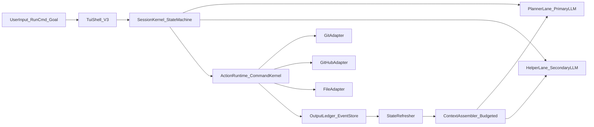
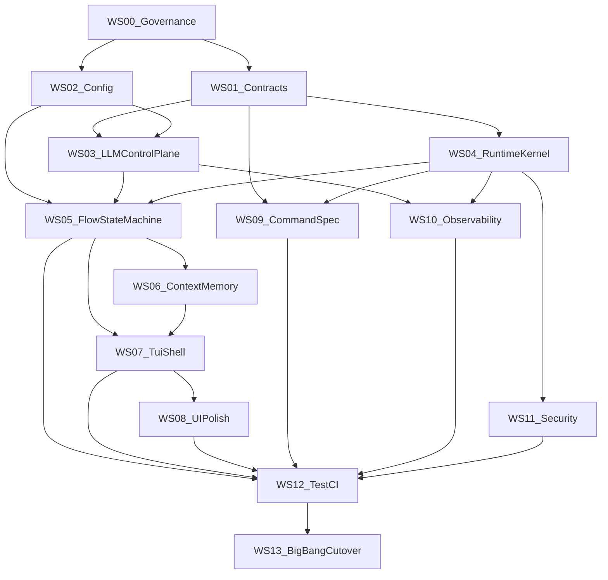

# GitDex V3 全面对齐重构总规划（Big Bang）

## 目标与边界

- 目标是一次性重构切换到 V3 主干，而非渐进替换。
- 对齐范围包含两层：
  - 架构与规范：组件边界、配置系统、执行内核、状态机、接口契约、消息流。
  - 关键能力与体验：gh-dash/lazygit 的核心交互能力 + gh-dash 风格 UI 精细化。
- 约束：
  - 全平台一致可运行（Windows / Linux / macOS）。
  - 执行层必须保持“原子动作 + 可诊断 + 可回放 + 可恢复”。
  - 所有关键链路必须有可量化 SLO/KPI。

## 参考基线（四个项目）

- [reference_project/gh-dash](reference_project/gh-dash)：Bubble Tea 组件化、Section 架构、配置与键位体系、信息密度与视觉完成度。
- [reference_project/lazygit](reference_project/lazygit)：Context-Controller 分层、命令执行策略、配置迁移与校验、跨平台处理成熟度。
- [reference_project/diffnav](reference_project/diffnav)：双面板焦点管理、滚动/分页/鼠标区域、diff 展示模型。
- [reference_project/octo.nvim](reference_project/octo.nvim)：Object-Action 命令规范、状态同步与 polling、GitHub 工作流抽象。

## 目标架构（V3）

## 重构工作流（按能力域）

### 1) 契约层与模块边界重建

- 新建统一契约层：
  - [internal/contract](internal/contract)（新增）
  - 包含 Suggestion、Round、ActionResult、RecoveryAction、TraceMetadata 等 DTO 与接口。
- 解耦当前跨包直接结构体访问：
  - [internal/flow/orchestrator.go](internal/flow/orchestrator.go)
  - [internal/planner/types.go](internal/planner/types.go)
  - [internal/executor/runner.go](internal/executor/runner.go)

### 2) 配置系统 V3（强校验 + 迁移 + 可提示）

- 升级配置管线：Defaults -> Global -> Project -> Env -> CLI 的显式优先级与冲突报告。
- 引入配置迁移器（对齐 lazygit 风格）：
  - [internal/config/config.go](internal/config/config.go)
  - [internal/config/save.go](internal/config/save.go)
  - [internal/config/validate.go](internal/config/validate.go)
- 增加 Schema 文档与 IDE 补全：
  - [configs/schema.gitdexrc.json](configs/schema.gitdexrc.json)（新增）
  - [docs/CONFIG_SCHEMA.md](docs/CONFIG_SCHEMA.md)（新增）
- 明确禁止项目级明文 API key；保留兼容解析并给出迁移警告。

### 3) LLM 控制平面（角色路由、健康探针、降级策略）

- 固化角色语义：Planner=Primary，Helper=Secondary，UI/持久化/测试全部一致。
- 增加 Provider 健康状态机与原因码（非仅 nil/ok）。
- 保留 secondary->primary 提升机制，但写入结构化诊断事件。
- 关键文件：
  - [internal/llmfactory/factory.go](internal/llmfactory/factory.go)
  - [internal/llm/router.go](internal/llm/router.go)
  - [internal/app/app.go](internal/app/app.go)
  - [internal/tui/update.go](internal/tui/update.go)

### 4) 执行内核 V3（命令、文件、GitHub、恢复）

- 将执行器拆为 Runtime Kernel + Adapters：
  - [internal/executor/runner.go](internal/executor/runner.go) 拆分为 runtime、policy、diagnostics、sanitizer 子模块。
- 动作执行标准化：
  - 原子动作、前置检查、幂等键、失败分类、恢复建议。
- GitHub 操作引入完整 preflight 与“不可重试判定”矩阵。
- whitespace/换行/编码问题统一由 FileSanitizer 子系统处理，并接入 `git add`/`git commit` 双阶段。

### 5) 三流程状态机重构（Maintain/Goal/Creative）

- 用显式状态机替换分散布尔标志与分支跳转。
- 为每个 round 增加 RoundID、AttemptID、SliceID，保证回放与可追踪。
- 将 replan 重试策略改为指数退避 + 断路器（避免高频死循环）。
- 关键文件：
  - [internal/flow/orchestrator.go](internal/flow/orchestrator.go)
  - [internal/tui/update.go](internal/tui/update.go)
  - [internal/dotgitdex/output.go](internal/dotgitdex/output.go)

### 6) TUI Shell 重构（组件化）

- 对齐 gh-dash 组件边界：Shell / Sections / Sidebar / Footer / Input。
- 拆分当前巨型 update/view：
  - [internal/tui/model.go](internal/tui/model.go)
  - [internal/tui/update.go](internal/tui/update.go)
  - [internal/tui/view.go](internal/tui/view.go)
- 新增消息定义中心：
  - [internal/tui/messages.go](internal/tui/messages.go)（新增）
- 每个 Section 独立处理自己的滚动、分页、焦点与热键。

### 7) UI/UX 精细化（对齐 gh-dash 视觉与交互）

- 保持“完整文本换行显示”，禁用省略号截断策略。
- 字体密度、行距、色彩层级、状态图标统一规范。
- 增加键位帮助面板、焦点可视化、鼠标滚轮一致性行为。
- 关键文件：
  - [internal/tui/view.go](internal/tui/view.go)
  - [internal/tui/theme](internal/tui/theme)
  - [docs/UI_GUIDELINES.md](docs/UI_GUIDELINES.md)（新增）

### 8) 接口规范与命令语义统一

- 对齐 octo.nvim 的 object-action 语义，定义 GitDex 命令命名规范。
- 统一 `/` 命令、TUI 操作、内部 action 三层的语义映射表。
- 输出协议版本化：Prompt 输入/输出 schema 增加版本与兼容层。

### 9) 观测与诊断体系

- 统一 TraceID 贯穿：LLM请求、执行动作、UI日志、output ledger。
- 增加指标：
  - llm_call_latency_ms
  - command_success_rate
  - replan_attempt_count
  - provider_availability
- 文件：
  - [internal/tui/oplog/log.go](internal/tui/oplog/log.go)
  - [internal/executor/logger.go](internal/executor/logger.go)
  - [internal/dotgitdex/output.go](internal/dotgitdex/output.go)

### 10) 测试与质量门禁

- 单测：配置、路由、执行器、状态机、TUI 组件。
- 集成测：目标流程（manual/auto/cruise）+ 失败恢复。
- 跨平台矩阵：Windows/Linux/macOS 必跑。
- 新增回归基线：whitespace、404、provider unavailable、重复资源创建。

## Big Bang 切换策略

- 在 `v3` 分支完成所有能力域后一次性切换主执行路径。
- 切换前必须通过：
  - 全量测试
  - 三平台 CI
  - 回归场景集
  - 性能与稳定性基线
- 切换后保留短期回滚通道（按 tag 回滚，不采用长期双运行）。

## 验收标准（核心 KPI）

- LLM 可用性：启动后 provider 误判为不可用的比例 < 0.1%。
- 执行稳定性：同类错误重复触发率下降 80%+。
- 跨平台一致性：三平台关键流程通过率 100%。
- TUI 可用性：所有核心面板支持键盘与鼠标滚动；文本完整显示（不省略）。
- 任务闭环率：auto/cruise 模式下“无动作却未完成目标”的轮次占比 < 2%。

## 关键参考源码（规划期间持续对照）

- gh-dash：
  - [reference_project/gh-dash/internal/tui/ui.go](reference_project/gh-dash/internal/tui/ui.go)
  - [reference_project/gh-dash/internal/tui/components](reference_project/gh-dash/internal/tui/components)
  - [reference_project/gh-dash/internal/config](reference_project/gh-dash/internal/config)
- lazygit：
  - [reference_project/lazygit/pkg/gui](reference_project/lazygit/pkg/gui)
  - [reference_project/lazygit/pkg/config](reference_project/lazygit/pkg/config)
  - [reference_project/lazygit/pkg/commands/oscommands](reference_project/lazygit/pkg/commands/oscommands)
- diffnav：
  - [reference_project/diffnav/pkg/ui/tui.go](reference_project/diffnav/pkg/ui/tui.go)
  - [reference_project/diffnav/pkg/ui/panes](reference_project/diffnav/pkg/ui/panes)
- octo.nvim：
  - [reference_project/octo.nvim/lua/octo/commands.lua](reference_project/octo.nvim/lua/octo/commands.lua)
  - [reference_project/octo.nvim/lua/octo/config.lua](reference_project/octo.nvim/lua/octo/config.lua)
  - [reference_project/octo.nvim/lua/octo/polling.lua](reference_project/octo.nvim/lua/octo/polling.lua)

## 深度补充规划（系统级）

### 设计原则（彻底改造约束）

- 单一事实源：角色映射、协议版本、状态机定义、错误分类必须有唯一定义处，不允许多处分叉。
- 显式状态：所有流程状态必须可枚举、可追踪、可回放，禁止“隐式布尔组合驱动流程”。
- 先验证后执行：命令、配置、协议、上下文都先通过校验层，再进入执行层。
- 失败可恢复：每个失败都要落地恢复动作（重试/跳过/人工确认/回滚）之一，不允许黑盒失败。
- 跨平台优先：所有路径、命令、终端行为都以 Windows/Linux/macOS 三平台一致性为验收标准。
- UI 不隐藏信息：禁止文本省略号截断，必须完整换行展示并保持视觉层级清晰。

### 目标体系重构（从“功能堆叠”到“三平面架构”）

#### 控制平面（Control Plane）

- 目标：统一配置、LLM 路由、流程状态机、策略控制，避免分散逻辑。
- 涉及主文件：
  - [internal/config/config.go](internal/config/config.go)
  - [internal/config/validate.go](internal/config/validate.go)
  - [internal/llmfactory/factory.go](internal/llmfactory/factory.go)
  - [internal/flow/orchestrator.go](internal/flow/orchestrator.go)
  - [internal/contract](internal/contract)
- 关键输出：
  - 协议与状态机规范文档
  - 角色映射单一事实源
  - 可解释的配置生效链路

#### 执行平面（Runtime Plane）

- 目标：统一动作执行内核，做到可预检、可幂等、可诊断、可回放。
- 涉及主文件：
  - [internal/executor/runner.go](internal/executor/runner.go)
  - [internal/executor/logger.go](internal/executor/logger.go)
  - [internal/git/cli](internal/git/cli)
  - [internal/platform](internal/platform)
- 关键输出：
  - Runtime + Adapter 拆分
  - 执行快照与重放机制
  - whitespace 与编码统一清洗流水线

#### 交互平面（Interaction Plane）

- 目标：组件化 TUI Shell，统一消息总线、焦点引擎、滚动引擎、帮助系统。
- 涉及主文件：
  - [internal/tui/model.go](internal/tui/model.go)
  - [internal/tui/update.go](internal/tui/update.go)
  - [internal/tui/view.go](internal/tui/view.go)
  - [internal/tui/theme](internal/tui/theme)
  - [internal/tui/oplog](internal/tui/oplog)
- 关键输出：
  - Section 组件树
  - 命令面板与帮助浮层
  - gh-dash 级视觉层级与信息密度

### 14 条工作流（系统化拆解）

#### WS00 治理与架构基线

- 产出架构宪章、RFC 模板、合入门禁与切换否决条件。
- 避免“边实现边改方向”的重构漂移问题。

#### WS01 契约层与协议版本化

- 新建 [internal/contract](internal/contract)，收敛跨层 DTO。
- 为 Round/Suggestion/ActionResult 建立版本化协议和兼容规则。
- 增加契约校验器与 golden 数据集。

#### WS02 配置系统 V3

- 重构优先级引擎和配置来源追踪。
- 增加迁移引擎、配置 lint 与生效差异报告。
- 完成 [configs/schema.gitdexrc.json](configs/schema.gitdexrc.json) 与文档联动。

#### WS03 LLM 控制平面

- 固化角色语义（Planner=Primary、Helper=Secondary）。
- 引入 provider 健康状态机与诊断码。
- 运行时重载必须是“事务化切换”。

#### WS04 执行内核 V3

- runner 解耦为 runtime/policy/adapter。
- 落地 preflight + idempotency + recovery 三件套。
- 完成 whitespace/换行/编码清洗流水线。

#### WS05 三流程状态机化

- maintain/goal/creative 全部变为显式状态机。
- 引入 AttemptID/SliceID 与退避+断路器策略。
- 去除“高频重规划死循环”。

#### WS06 上下文与记忆系统

- 重构 context assembler 与预算分配。
- 建立 output ledger 窗口化策略与 knowledge 缓存。
- 落地“先查后做”规则，清除假记忆行为。

#### WS07 TUI Shell 组件化

- 引入消息总线与区域调度器。
- Suggestions/Git/Goals/Log/Config 组件独立。
- 焦点和滚动统一引擎，键鼠行为一致。

#### WS08 UI/UX 精修

- 布局 token + 主题 token 双系统。
- 完整换行渲染策略（不省略）。
- 状态图标、层级色、输入区体验全面提升。

#### WS09 命令语义与接口规范

- 对齐 object-action 语义与 slash 命令映射。
- Prompt schema 升级到 V3 并版本化。
- 建立 adapter capability contract。

#### WS10 观测体系

- trace_id 贯穿 LLM/flow/executor/tui/oplog。
- 指标化：延迟、成功率、重试、可用性、失败分类。
- debug 模式标准化。

#### WS11 安全边界

- 路径+符号链接逃逸防护。
- 危险动作审批门禁。
- secret redaction 与权限边界测试。

#### WS12 测试与 CI 矩阵

- 契约 golden、故障注入、流程集成、TUI 交互、混沌演练。
- Windows/Linux/macOS 三平台门禁。
- 高频事故回归集（whitespace/404/provider unavailable）。

#### WS13 Big Bang 切换

- 并行验证、切换脚本、前滚/回滚手册、SLO 观察窗。
- 切换后的稳定性守护和发布后审计。

### 工作流依赖图（深度版）

### 波次里程碑（Big Bang 交付节奏）

#### Wave-0 设计冻结

- 完成 WS00 + WS01 + WS02 的规范冻结。
- 所有协议、配置、状态机定义通过评审。

#### Wave-1 内核重建

- 完成 WS03 + WS04 + WS05。
- 执行与流程主链切换到新内核。

#### Wave-2 数据闭环

- 完成 WS06 + WS09。
- 形成“上下文组装 -> 规划 -> 执行 -> 回流”的稳定闭环。

#### Wave-3 交互重构

- 完成 WS07 + WS08。
- UI 体验与交互能力达到对齐目标。

#### Wave-4 稳定化与切换

- 完成 WS10 + WS11 + WS12 + WS13。
- 通过门禁后执行一次性切换。

### 强制验收门槛（必须全部满足）

- 架构门槛：
  - 巨型函数拆解完成，[internal/tui/update.go](internal/tui/update.go) 不再承担全部流程逻辑。
  - 契约层收敛完成，跨层传递不再直接依赖业务内部结构体。
- 稳定性门槛：
  - 无无限 replan 死循环。
  - provider unavailable 误判率显著下降并可被诊断。
- 安全门槛：
  - 路径逃逸测试、权限边界测试、secret 脱敏测试全部通过。
- 体验门槛：
  - 文本完整展示（不省略）。
  - 核心面板键盘和鼠标滚动均稳定可用。
- 平台门槛：
  - 三平台 CI 全绿，关键回归集全通过。

### 交付完成定义（DoD）

- 每个 WS 的 To-Do 完成后必须同时满足：
  - 代码：主链路实现+回归通过。
  - 测试：新增测试覆盖关键风险点。
  - 文档：对应规范和使用说明更新。
  - 观测：关键日志与指标可见。

