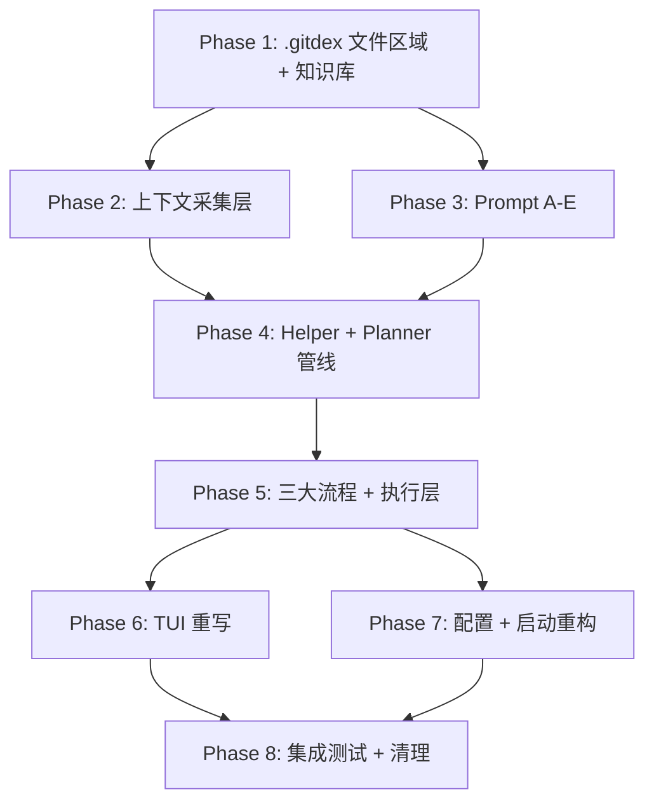

# GitDex 全面架构重写计划

## 当前状态 vs 目标架构

**当前**：单一 `pipeline.Analyze()` → 单次 LLM 调用 → 建议列表 → 执行，所有逻辑混在 TUI update 循环中。

**目标**：三大流程（仓库维护 / 目标完成 / 创造性）× 双 LLM 角色（Helper + Planner）× 三种模式（手动 / 自动 / 巡航），状态持久化到 `.gitdex/` 文件区域。

## 新 `internal/` 包结构

```
internal/
├── app/                    # 应用启动（简化）
├── config/                 # 配置（三种模式）
├── dotgitdex/              # .gitdex/ 文件区域管理
├── collector/              # 上下文采集（Git + GitHub）
├── knowledge/              # 知识库管理（提取 + 索引 + 读取）
├── llm/                    # LLM 层（provider + prompt A-E）
│   ├── provider.go         # LLMProvider 接口（复用）
│   ├── generate.go         # GenerateText（复用）
│   ├── ollama/             # Ollama provider（复用）
│   ├── openai/             # OpenAI/DeepSeek provider（复用）
│   └── prompt/             # 5 套 prompt 模板（新建）
├── helper/                 # Helper LLM 管线（新建）
├── planner/                # Planner 管线（新建）
├── executor/               # 统一执行层（重构）
├── flow/                   # 三大流程引擎（新建）
├── git/                    # Git 层（复用）
│   ├── types.go            # 核心类型（简化）
│   ├── cli/                # CLI 执行器（复用）
│   ├── parser/             # 输出解析器（复用）
│   └── status/             # 状态采集器（复用）
├── i18n/                   # 国际化（复用）
├── platform/               # 平台适配器（简化复用）
└── tui/                    # TUI 层（重写）
    ├── model.go, update.go, view.go
    ├── components/, oplog/, theme/
```

---

## Phase 1: 基础设施 — .gitdex 文件区域 + 知识库提取

### 1.1 新建 `internal/dotgitdex/` 包

创建 `.gitdex/` 目录管理器，负责三个子目录和所有文件的读写：

**新文件**: `internal/dotgitdex/manager.go`

```go
type Manager struct {
    Root string // .gitdex/ 绝对路径
}

func New(repoRoot string) *Manager
func (m *Manager) Init() error // 创建 maintain/ goal-list/ proposal/ 目录
func (m *Manager) MaintainDir() string
func (m *Manager) GoalListDir() string
func (m *Manager) ProposalDir() string
```

**新文件**: `internal/dotgitdex/gitcontent.go`

- `WriteGitContent(state *status.GitState) error` — 将 GitState 序列化为结构化文本写入 `maintain/git-content.txt`
- `ReadGitContent() (string, error)` — 读取文本内容供 LLM 使用
- 格式对应用户规范中的 schema：repo_id, current branch, per-branch status, remotes, ahead-behind, conflict flags 等

**新文件**: `internal/dotgitdex/output.go`

- `OutputLog` 结构体，管理 `maintain/output.txt`
- `AppendRound(round Round) error` — 追加一轮执行日志
- `ReadRecent(maxRounds int) (string, error)` — 读取最近 N 轮（默认 3）
- `Round` 包含: session_id, round_id, mode, suggestion_sequence_id, 每步的 command/result/stdout/stderr/exit_code/time

**新文件**: `internal/dotgitdex/index.go`

- `WriteIndex(entries []IndexEntry) error` — 写入 `maintain/index.yaml`
- `ReadIndex() ([]IndexEntry, error)` — 读取索引
- `IndexEntry`: knowledge_id, path, title, short_description, tags[], domain, priority, trust_level

**新文件**: `internal/dotgitdex/goallist.go`

- `ParseGoalList(content string) ([]Goal, error)` — 解析 markdown 格式的 goal-list.md
- `WriteGoalList(goals []Goal) error` — 写入 goal-list.md
- `PendingGoals(goals []Goal) []Goal` — 过滤出未完成项
- `Goal`: title, completed bool, todos []Todo; `Todo`: title, completed bool

**新文件**: `internal/dotgitdex/proposal.go`

- `AppendCreativeProposal(items []string) error`
- `AppendDiscardedProposal(items []string) error`
- `ReadCreativeProposals() ([]string, error)`
- `ReadDiscardedProposals() ([]string, error)`

### 1.2 知识库提取到磁盘

**新文件**: `internal/knowledge/extract.go`

- 将当前 `//go:embed data/knowledge/*.yaml` 中的 9 个 YAML 文件在 `Init()` 时提取到 `.gitdex/maintain/knowledge/` 目录
- 同时生成 `index.yaml`，每个 scenario 生成一条 IndexEntry
- 保留 `data/knowledge/*.yaml` 作为嵌入源，但运行时以磁盘文件为准

**新文件**: `internal/knowledge/reader.go`

- `ReadByPaths(paths []string) (string, error)` — 根据 helper LLM 给出的路径列表，读取文件内容并拼接为 knowledge context
- 即用户规范中的"knowledge 文件清单读取器"

**可复用**: 现有 `internal/engine/context/data/knowledge/*.yaml` 的 YAML 文件内容

### 1.3 清理旧代码

删除以下旧包及其所有文件（Phase 1 结束时）：

- `internal/engine/` 整个目录（pipeline, dedup, verifier, repair, llm_parser, suggestion_convert, trace, conflict, recovery, commit_msg, sanitize, json_repair, command_validate, file_context, analyzer/ 等）
- `internal/memory/` — 被 `.gitdex/` 文件区域替代
- `internal/llm/prompt/` — 旧的 builder.go 及所有相关文件
- `internal/llm/context/` — 旧的 budget.go
- `internal/llm/response/` — 旧的 validator.go
- `internal/llmfactory/` — 工厂模式简化
- `internal/tui/` — 整个目录后续重写（Phase 6）

**注意**：在删除前先将需要复用的逻辑（git CLI executor, filesystem operations, LLM providers, platform adapters）迁移到新位置。

---

## Phase 2: 上下文采集层

### 2.1 Git 上下文采集器

**新文件**: `internal/collector/git.go`

复用现有 `internal/git/status/watcher.go` 的 `StatusWatcher.GetStatus()` 逻辑，但输出改为写入 `git-content.txt`：

```go
type GitCollector struct {
    watcher *status.StatusWatcher
    store   *dotgitdex.Manager
}

func (c *GitCollector) Collect(ctx context.Context) (*status.GitState, error)
func (c *GitCollector) Refresh(ctx context.Context) error // 采集 + 写入 git-content.txt
```

包含所有分支的三区信息、origin/upstream/远端分支/refs/状态、stash、submodules、worktrees、reflog 等——复用现有 `watcher.go` 的全部 enrich 函数。

### 2.2 GitHub 上下文采集器

**新文件**: `internal/collector/github.go`

专用于创造性流程：

```go
type GitHubCollector struct {
    // 使用现有 platform/github/client.go 的 API 能力
}

type GitHubContext struct {
    Issues        []IssueSummary  // 最新10 + 最旧10 + 中间10 = 30条
    PullRequests  []PRSummary     // Open+Closed: 最新10 + 最旧10 + 中间10 = 30条
    LocalREADME   string          // 本仓库 README
    UpstreamREADME string         // 上游仓库 README（如果有 upstream）
}

func (c *GitHubCollector) Collect(ctx context.Context, state *status.GitState) (*GitHubContext, error)
```

Issue/PR 采样策略：GraphQL 优先（单次查询），REST fallback（多页拉取）。复用现有 `internal/platform/github/` 的 client 和 transport 能力。

### 2.3 保留和迁移的 Git 层

以下包保持原位不变，仅做必要的接口清理：

- [internal/git/cli/executor.go](internal/git/cli/executor.go) — `GitCLI` 接口和实现
- [internal/git/parser/](internal/git/parser/) — 所有解析器
- [internal/git/status/](internal/git/status/) — `GitState`, `StatusWatcher`, 各 inspector
- [internal/git/types.go](internal/git/types.go) — 简化：只保留 `Suggestion`（重命名为 `Action`）, `FileStatus`, `BranchInfo`, `ExecutionResult` 等核心类型

---

## Phase 3: LLM Prompt 系统 (Prompts A-E)

### 3.1 Prompt 模板设计

**新目录**: `internal/llm/prompt/` — 5 个独立的 prompt 构建器

**Prompt A** (`prompt_a.go`): Helper — 仓库维护知识选择

- 输入：git-content.txt 内容 + output.txt 最近3轮 + index.yaml 全文
- 输出格式：JSON `{"selected_knowledge": ["path1", "path2", ...]}`
- 系统提示：你是知识库索引助手，根据仓库当前状态从索引中选择最相关的 knowledge 文件

**Prompt B** (`prompt_b.go`): Planner — 仓库维护建议

- 输入：git-content.txt + output.txt + knowledge context（由 Prompt A 选择后拼接）
- 输出格式：JSON `{"suggestions": [{"name": "...", "action": {...}, "reason": "..."}]}`
- action 结构：`{"type": "git_command"|"file_write"|"github_op", "command": [...], "file_path": "...", "file_content": "..."}`
- 系统提示：你是 Git 仓库维护规划器，确保仓库所有分支三区干净、与远端同步、无异常状态

**Prompt C** (`prompt_c.go`): Helper — 目标完成知识选择

- 输入：git-content.txt + output.txt + index.yaml + goal + todo list
- 输出格式：同 Prompt A

**Prompt D** (`prompt_d.go`): Planner — 目标完成建议

- 输入：git-content.txt + output.txt + knowledge context + goal + todo list
- 输出格式：同 Prompt B
- 系统提示：你是目标执行规划器，在保持仓库维护约束的前提下推进目标完成

**Prompt E** (`prompt_e.go`): Planner — 创造性目标生成

- 输入：git-content.txt + output.txt + index.yaml + 现有目标 + todo list + GitHub 上下文
- 输出格式：JSON `{"gitdex_goals": ["...", "..."], "creative_goals": ["...", "..."]}`
- 系统提示：你是创造性目标生成器，综合仓库状态和 GitHub 生态信息提出有价值的新目标

### 3.2 LLM Provider 层

以下完整复用，仅做包路径调整：

- [internal/llm/provider.go](internal/llm/provider.go) — `LLMProvider` 接口、`GenerateRequest/Response`
- [internal/llm/generate_text.go](internal/llm/generate_text.go) — `GenerateText()` 函数
- [internal/llm/ollama/](internal/llm/ollama/) — Ollama client
- [internal/llm/openai/](internal/llm/openai/) — OpenAI/DeepSeek client

新增配置项：允许为 Helper 和 Planner 指定不同模型

```yaml
llm:
  helper:
    provider: ollama
    model: qwen2.5:7b
  planner:
    provider: openai
    model: gpt-4o
```

---

## Phase 4: Helper & Planner 管线

### 4.1 Helper LLM 管线

**新目录**: `internal/helper/`

`**select_knowledge.go`** — 知识选择

```go
type KnowledgeSelector struct {
    llm       llm.LLMProvider
    store     *dotgitdex.Manager
}

// SelectForMaintain 使用 Prompt A 选择知识文件
func (ks *KnowledgeSelector) SelectForMaintain(ctx context.Context, gitContent, output, index string) ([]string, error)

// SelectForGoal 使用 Prompt C 选择知识文件
func (ks *KnowledgeSelector) SelectForGoal(ctx context.Context, gitContent, output, index, goal, todoList string) ([]string, error)
```

`**maintain_goals.go**` — Goal-list 维护

```go
// UpdateGoalCompletion 根据执行结果更新 goal-list.md 中的完成状态
func UpdateGoalCompletion(ctx context.Context, helperLLM llm.LLMProvider, store *dotgitdex.Manager, gitContent, output string) error
```

`**review_proposals.go**` — 创造性目标审批与分流

```go
// ReviewProposals 对 Planner 产出的目标进行去重、质量检查、分类
func ReviewProposals(ctx context.Context, helperLLM llm.LLMProvider, store *dotgitdex.Manager,
    gitdexGoals, creativeGoals []string, existingGoals []dotgitdex.Goal) (*ReviewResult, error)

type ReviewResult struct {
    ApprovedGitdexGoals []string // → goal-list.md
    ApprovedCreative    []string // → creative-proposal.md
    Discarded           []string // → discarded-proposal.md
}
```

### 4.2 Planner 管线

**新目录**: `internal/planner/`

`**maintain.go`** — 仓库维护建议

```go
type MaintenancePlanner struct {
    llm llm.LLMProvider
}

type SuggestionItem struct {
    Name   string       `json:"name"`
    Action ActionSpec   `json:"action"`
    Reason string       `json:"reason"`
}

type ActionSpec struct {
    Type        string   `json:"type"` // git_command, file_write, github_op
    Command     []string `json:"command,omitempty"`
    FilePath    string   `json:"file_path,omitempty"`
    FileContent string   `json:"file_content,omitempty"`
    FileOp      string   `json:"file_operation,omitempty"` // create, update, delete, append
}

func (p *MaintenancePlanner) Plan(ctx context.Context, gitContent, output, knowledgeCtx string) ([]SuggestionItem, string, error)
// 返回：建议序列、分析文本、错误
```

`**goal.go**` — 目标完成建议

```go
type GoalPlanner struct {
    llm llm.LLMProvider
}

func (p *GoalPlanner) Plan(ctx context.Context, gitContent, output, knowledgeCtx, goal, todoList string) ([]SuggestionItem, string, error)
```

`**creative.go**` — 创造性目标生成

```go
type CreativePlanner struct {
    llm llm.LLMProvider
}

type CreativeOutput struct {
    GitdexGoals   []string `json:"gitdex_goals"`
    CreativeGoals []string `json:"creative_goals"`
    Analysis      string   `json:"analysis"`
}

func (p *CreativePlanner) Generate(ctx context.Context, gitContent, output, index, goals, todoList, githubCtx string) (*CreativeOutput, error)
```

---

## Phase 5: 三大流程引擎 + 执行层

### 5.1 统一执行层

**新目录**: `internal/executor/`

复用现有 [internal/engine/executor/executor.go](internal/engine/executor/executor.go) 的核心逻辑，扩展为：

```go
type Runner struct {
    gitCLI   cli.GitCLI
    store    *dotgitdex.Manager
    logger   *ExecutionLogger
}

// ExecuteSuggestion 根据 ActionSpec 类型分发执行
func (r *Runner) ExecuteSuggestion(ctx context.Context, item planner.SuggestionItem) (*ExecutionResult, error)

type ExecutionResult struct {
    Command  []string
    Stdout   string
    Stderr   string
    ExitCode int
    Success  bool
    Duration time.Duration
}
```

`**logger.go**` — 执行日志记录器

```go
type ExecutionLogger struct {
    store     *dotgitdex.Manager
    sessionID string
    roundID   int
    mode      string
}

func (l *ExecutionLogger) LogStep(seqID int, item planner.SuggestionItem, result *ExecutionResult)
func (l *ExecutionLogger) Flush() error // 写入 output.txt
func (l *ExecutionLogger) NextRound()   // roundID++
```

### 5.2 三大流程引擎

**新目录**: `internal/flow/`

`**maintain.go`** — 仓库维护流程

```go
type MaintainFlow struct {
    collector   *collector.GitCollector
    helper      *helper.KnowledgeSelector
    planner     *planner.MaintenancePlanner
    runner      *executor.Runner
    store       *dotgitdex.Manager
    knReader    *knowledge.Reader
}

// Run 执行一个完整轮次：采集→helper选择knowledge→planner生成建议→返回建议序列
func (f *MaintainFlow) Run(ctx context.Context) (*FlowRound, error)

// IsClean 判断仓库是否已干净（停止条件）
func (f *MaintainFlow) IsClean(ctx context.Context) bool

type FlowRound struct {
    Suggestions []planner.SuggestionItem
    Analysis    string
    GitContent  string // 本轮使用的 git 上下文快照
}
```

`**goal.go**` — 目标完成流程

```go
type GoalFlow struct {
    collector    *collector.GitCollector
    helper       *helper.KnowledgeSelector
    goalHelper   *helper.GoalMaintainer
    planner      *planner.GoalPlanner
    runner       *executor.Runner
    store        *dotgitdex.Manager
    knReader     *knowledge.Reader
}

// Run 执行一个完整轮次
func (f *GoalFlow) Run(ctx context.Context) (*FlowRound, error)

// UpdateGoalProgress 执行后更新 goal-list.md
func (f *GoalFlow) UpdateGoalProgress(ctx context.Context) error

// IsComplete 检查所有目标是否完成且仓库是否干净
func (f *GoalFlow) IsComplete(ctx context.Context) bool
```

`**creative.go**` — 创造性流程

```go
type CreativeFlow struct {
    gitCollector *collector.GitCollector
    ghCollector  *collector.GitHubCollector
    planner      *planner.CreativePlanner
    reviewer     *helper.ProposalReviewer
    store        *dotgitdex.Manager
}

// Run 执行创造性流程：采集全部上下文→Planner生成目标→审批分流→写入文件
func (f *CreativeFlow) Run(ctx context.Context, humanReview bool) (*CreativeResult, error)

type CreativeResult struct {
    NewGitdexGoals []string
    NewCreative    []string
    Discarded      []string
}
```

### 5.3 编排器

`**orchestrator.go**` — 模式驱动的流程编排

```go
type Orchestrator struct {
    maintain  *MaintainFlow
    goal      *GoalFlow
    creative  *CreativeFlow
    runner    *executor.Runner
    store     *dotgitdex.Manager
    mode      string // manual, auto, cruise
    interval  time.Duration // 巡航间隔
}

// RunSession 根据模式执行完整会话
func (o *Orchestrator) RunSession(ctx context.Context) error

// ExecuteRound 执行一轮：获取建议→根据模式执行→刷新状态
func (o *Orchestrator) ExecuteRound(ctx context.Context, round *FlowRound) (*RoundResult, error)

type RoundResult struct {
    Executed  []ExecutedItem
    Skipped   []string
    HasError  bool
    NeedReplan bool
}
```

编排逻辑：

```
手动/自动模式：
  1. 仓库维护流程 → 建议序列 → 执行
  2. 目标完成流程 → 建议序列 → 执行
  3. 循环直到：仓库干净 && 目标完成

巡航模式（每次 interval 到达时）：
  1. 创造性流程 → 更新 goal-list.md
  2. 目标完成流程 → 建议序列 → 执行
  3. 仓库维护流程 → 建议序列 → 执行
  4. 循环直到：goal-list 全完成 && 仓库干净
  5. 等待下一个 interval
```

---

## Phase 6: TUI 重写 — 流式呈现

### 6.1 新 Model 结构

```go
type Model struct {
    // 布局
    width, height int
    ready         bool

    // 模式
    mode string // manual, auto, cruise

    // 依赖
    orchestrator *flow.Orchestrator
    store        *dotgitdex.Manager

    // 流程状态
    activeFlow    string // maintain, goal, creative, idle
    currentRound  *flow.FlowRound
    roundResult   *flow.RoundResult
    roundHistory  []CompressedRound // 完成的轮次，仅保留命令

    // 建议状态（当前轮次的建议序列）
    suggestions   []SuggestionDisplay
    suggIdx       int

    // 目标
    goals         []dotgitdex.Goal
    activeGoal    string

    // 输入
    composerText  string
    composerFocus bool

    // 日志
    opLog         *oplog.Log

    // UI 状态
    scrollOffset  int
    expanded      bool

    // 配置
    llmConfig     config.LLMConfig
    automation    config.AutomationConfig
}

type SuggestionDisplay struct {
    Item     planner.SuggestionItem
    Status   SuggestionStatus // pending, executing, done, failed, skipped
    Output   string
}

type CompressedRound struct {
    Commands []string // 完成后仅保留命令列表
    Flow     string   // maintain/goal/creative
}
```

### 6.2 流式呈现

用户规范要求的呈现方式：

- 建议提出时出现，完成时消失（压缩为仅命令留存）
- 有明确的等待/执行中/完成标注
- 目标执行完成后压缩整轮记录

```
┌─ Gitdex ─────────────────────────────────────────┐
│ 模式: 自动 | 流程: 目标完成 | 目标: 创建新分支...    │
├──────────────────────────────────────────────────┤
│                                                   │
│ ● [执行中] git switch -c feature-branch           │
│   → 创建功能分支用于新特性开发                        │
│                                                   │
│ ○ [等待] git add newfile.txt                      │
│   → 将新文件添加到暂存区                             │
│                                                   │
│ ○ [等待] git commit -m "feat: add newfile"        │
│   → 提交新文件                                     │
│                                                   │
│ ─── 已完成 ────────────────────────────────────── │
│ ✓ git fetch upstream                              │
│ ✓ git merge upstream/main                         │
│                                                   │
├──────────────────────────────────────────────────┤
│ 目标进度: [■■■□□] 2/5                              │
│ > 输入目标或 /run accept | /run all | /mode        │
└──────────────────────────────────────────────────┘
```

### 6.3 关键消息类型

```go
type flowRoundMsg struct {
    flow  string
    round *flow.FlowRound
    err   error
}

type executionResultMsg struct {
    index  int
    result *executor.ExecutionResult
    err    error
}

type goalProgressMsg struct {
    goals []dotgitdex.Goal
}

type cruiseTickMsg struct{}
```

### 6.4 Update 逻辑

核心状态机：

- `flowRoundMsg` → 展示建议序列 → 根据模式自动/等待执行
- `executionResultMsg` → 更新建议状态 → 推进下一条或重规划
- `goalProgressMsg` → 更新目标显示
- `cruiseTickMsg` → 触发巡航轮次

手动模式：

- `/run accept` → 执行当前建议 → 展示结果 → 等待
- `/run all` → 顺序执行所有建议

自动模式：

- 建议到达后自动顺序执行
- 执行失败 → 重新采集上下文 → 重新规划
- 全部完成 → 检查停止条件 → 继续或停止

巡航模式：

- 定时器触发 → 创造性流程 → 目标流程 → 维护流程 → 等待

---

## Phase 7: 配置与应用启动重构

### 7.1 配置简化

`internal/config/config.go` 简化为：

```go
type Config struct {
    LLM        LLMConfig
    Mode       string // manual, auto, cruise
    Cruise     CruiseConfig
    Theme      ThemeConfig
    I18n       I18nConfig
}

type LLMConfig struct {
    Helper  ModelConfig // helper LLM 配置
    Planner ModelConfig // planner 配置
}

type CruiseConfig struct {
    Interval int // 秒，默认 2400
}
```

删除旧的 `AutomationConfig` 中大量子字段（`ApprovalPolicy`, `TrustPolicy`, `Concurrency`, `Escalation` 等）。

### 7.2 应用启动

简化 `internal/app/app.go`：

```go
func (a *Application) Run() error {
    cfg := config.Load()
    store := dotgitdex.New(repoRoot)
    store.Init()
    knowledge.Extract(store) // 提取知识库到磁盘

    gitCLI := cli.NewCLIExecutor()
    watcher := status.NewStatusWatcher(gitCLI)
    helperLLM := buildLLMProvider(cfg.LLM.Helper)
    plannerLLM := buildLLMProvider(cfg.LLM.Planner)

    orch := flow.NewOrchestrator(flow.OrchestratorConfig{
        GitCollector: collector.NewGitCollector(watcher, store),
        GHCollector:  collector.NewGitHubCollector(...),
        HelperLLM:    helperLLM,
        PlannerLLM:   plannerLLM,
        Store:        store,
        Mode:         cfg.Mode,
        Interval:     cfg.Cruise.Interval,
    })

    model := tui.NewModel(orch, store, cfg)
    return tea.NewProgram(model).Run()
}
```

---

## Phase 8: 集成测试与清理

### 8.1 测试策略

- **单元测试**：每个新包（dotgitdex, collector, knowledge, helper, planner, flow, executor）独立测试
- **集成测试**：`test/integration/` 下测试完整流程（使用 mock LLM）
- **E2E 测试**：使用真实 git repo 测试手动/自动/巡航模式

### 8.2 清理

- 删除所有旧的 `internal/` 包代码（在各 Phase 中逐步替换后）
- 更新 `.gitignore` 添加 `.gitdex/` 目录
- 更新文档和 README
- 确保 `go build ./...` 和 `go test ./...` 全部通过

---

## 文件变更总览

**新建约 25-30 个核心 Go 文件**：

- `internal/dotgitdex/`: manager.go, gitcontent.go, output.go, index.go, goallist.go, proposal.go
- `internal/collector/`: git.go, github.go
- `internal/knowledge/`: extract.go, reader.go
- `internal/llm/prompt/`: prompt_a.go, prompt_b.go, prompt_c.go, prompt_d.go, prompt_e.go
- `internal/helper/`: select_knowledge.go, maintain_goals.go, review_proposals.go
- `internal/planner/`: maintain.go, goal.go, creative.go
- `internal/executor/`: runner.go, logger.go
- `internal/flow/`: maintain.go, goal.go, creative.go, orchestrator.go
- `internal/tui/`: model.go, update.go, view.go (重写)

**完整复用（仅路径可能调整）**：

- `internal/git/cli/`, `internal/git/parser/`, `internal/git/status/`, `internal/git/types.go`
- `internal/llm/provider.go`, `internal/llm/generate_text.go`
- `internal/llm/ollama/`, `internal/llm/openai/`
- `internal/i18n/`
- `internal/tui/theme/`, `internal/tui/oplog/`

**删除**：

- `internal/engine/` 全部
- `internal/memory/` 全部
- `internal/llm/prompt/` 旧版 (builder.go 等)
- `internal/llm/context/`, `internal/llm/response/`
- `internal/llmfactory/`
- `internal/tui/` 旧版（约 60 个文件）

---

## 实施依赖关系




Phase 1-3 可部分并行，Phase 4 依赖 2+3，Phase 5 依赖 4，Phase 6-7 依赖 5，Phase 8 收尾。