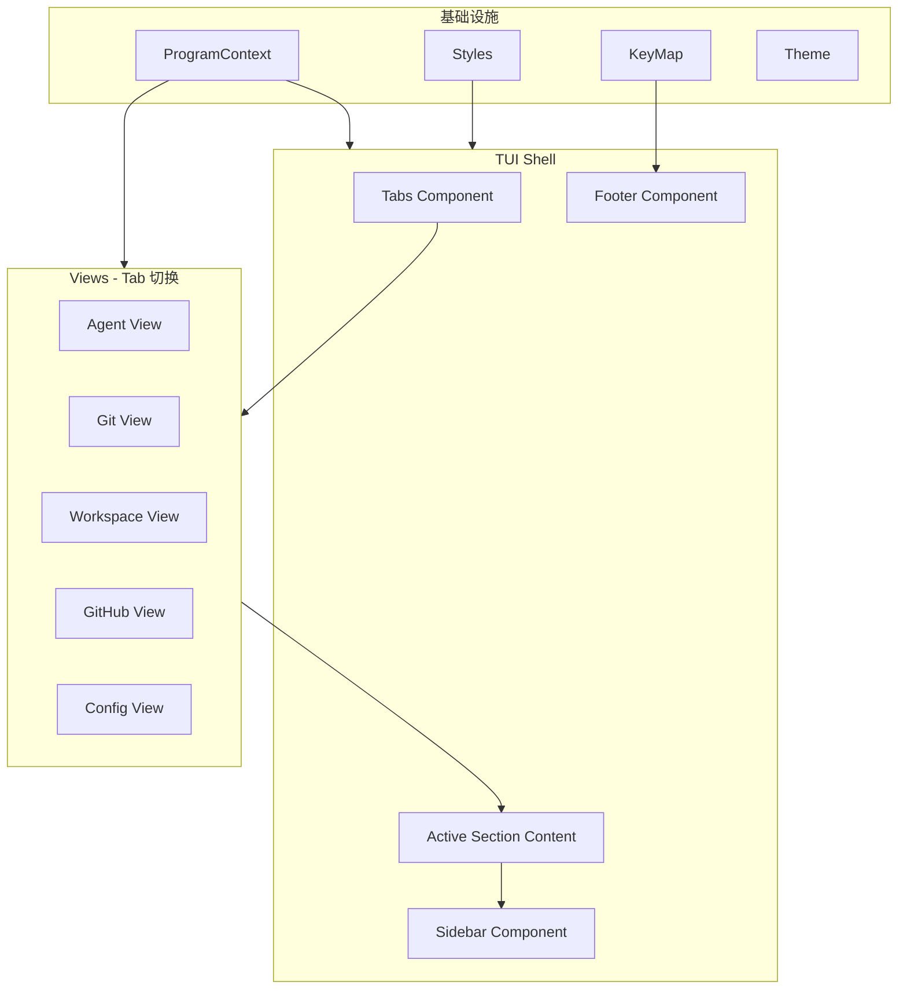
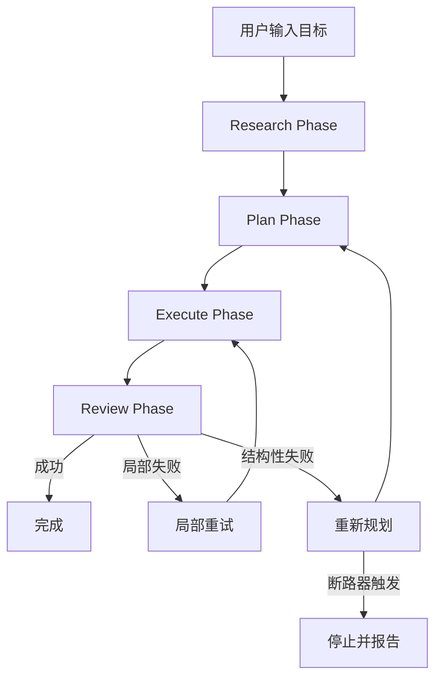
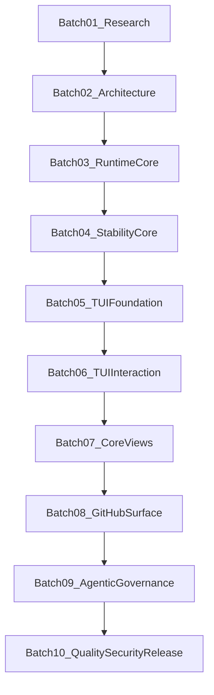
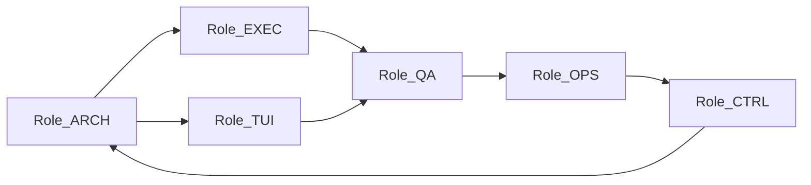

# GitDex V4 终极重构规划

## 设计目标

GitDex V4 是一个部署在本地终端的 AI 原生 Git 工作台，其核心能力：

- 全自动本地工作目录管理与仓库清洁
- 全自动 Git 操作（commit/push/pull/merge/rebase/stash/tag/branch 等全部功能）
- 全自动 GitHub 协作（Issues/PRs/Discussions/Releases/Actions/Pages 等全部功能）
- AI 驱动的目标规划与执行（Research -> Plan -> Execute -> Review）
- gh-dash 级别的沉浸式终端交互体验

## 参考基线与设计原则

### 参考项目（架构与交互借鉴，不引用代码）

- **gh-dash** (91 Go 文件, 17 组件包)：Tab+Table+Sidebar 沉浸式 TUI 范式、ProgramContext 集中上下文、Section 接口体系、ListViewport 滚动管理、集中式 KeyMap 与配置覆盖、glamour Markdown 渲染
- **lazygit**：CmdObj Builder+Platform 命令抽象、Context 栈式导航、Controller-Context 分层、Per-repo 状态管理、HelperCommon 共享逻辑
- **diffnav**：双面板焦点路由、zone-based 鼠标支持、Diff 缓存策略
- **octo.nvim**：Object-Action 命令语义、GitHub 工作流抽象、状态轮询

### 权威技术参考

- **MCP (Model Context Protocol) 规范 2025-03-26 / 2025-11-25**：Tool Definition 使用 JSON Schema `inputSchema`、JSON-RPC 2.0 消息格式
- **Bubble Tea v2 (2026)**：声明式 View API (`tea.View` struct)、`tea.Context` 上下文感知、`tea.NewView()` 替代字符串返回
- **lipgloss v2**：`lipgloss.JoinHorizontal/Vertical`、`Border` 系统、自适应终端配色
- **glamour v2 (2025)**：`charm.land/glamour/v2`、自定义 JSON 主题、ANSI hyperlink 支持
- **EASYTOOL (NAACL 2025)**：精简工具描述提升 Agent 性能，冗余指令降低准确率
- **BRTR 框架 (DAIR-AI)**：Background-Role-Task-Requirements 四段式提示词结构
- **Cursor/Devin/Replit Agent 提示词逆向 (x1xhlol/system-prompts)**：角色->能力->约束->输出格式 四段式
- **Agentic Workflow (Tyler Burleigh 2026, Sherlock arXiv 2511.00330, TDFlow arXiv 2510.23761)**：Research->Plan->Execute->Review 标准循环、每阶段产出书面工件、新上下文窗口隔离
- **kaptinlin/jsonrepair (Go)**：LLM 输出 JSON 自动修复（trailing comma, missing quotes, Python constants）
- **lazygit oscommands**：`CmdObj` Builder + `Platform` 抽象、`ICmdObjRunner` 接口

### 设计原则

- **单一视图全屏**：任何时刻只有一个视图占据主屏幕（Tab 切换），不再使用多面板硬编码布局
- **组件化**：每个 UI 元素是独立包，通过 ProgramContext 共享状态，通过 Section 接口统一交互
- **代码层保障优先**：命令校验、幂等性、错误分类等由执行器代码保障，不依赖提示词
- **文件隔离执行**：所有含文本参数的命令（commit message、issue body 等）通过临时文件传参
- **零硬编码**：所有路径、URL、二进制名、阈值均通过配置或运行时检测获取
- **三平台一致**：Windows/Linux/macOS 全部通过 CI 验证

---

## 一、核心痛点根治（Phase 1）

### 1.1 JSON 自动修复

**问题**：LLM 输出经常包含 trailing comma、缺失引号、Python 常量（True/False/None）等非法 JSON，导致解析失败并触发死循环重规划。

**方案**：

- 引入 `kaptinlin/jsonrepair` 库（`go get github.com/kaptinlin/jsonrepair`）
- 在所有 `json.Unmarshal` 调用前，先通过 `jsonrepair.Repair(raw)` 清洗
- 清洗覆盖范围：trailing comma, missing quotes, single-to-double quotes, Python constants, 注释剥离, JSONP 剥离
- 清洗位置：`internal/planner/maintain.go`、`internal/planner/goal.go`、`internal/planner/creative.go`、`internal/helper/*.go`

**关键代码位置**：

- `internal/planner/maintain.go` — `cleanJSON()` 函数增强
- `internal/planner/goal.go` — 同上
- `internal/planner/creative.go` — 同上

### 1.2 文件隔离执行（彻底解决 Whitespace）

**问题**：当前通过字符串拼接构造 `git commit -m "message"`，特殊字符/换行符/空格在不同平台的 shell 解释不一致，导致 "trailing whitespace" 错误反复出现。

**方案**：

- 所有含文本参数的命令，强制使用文件传参：
  - `git commit -m "..."` --> 写入 `.gitdex/tmp/commit-msg.txt`，执行 `git commit -F .gitdex/tmp/commit-msg.txt`
  - `gh issue create --title "..." --body "..."` --> 写入 `.gitdex/tmp/issue-body.md`，执行 `gh issue create --title "..." -F .gitdex/tmp/issue-body.md`
  - `gh pr create --body "..."` --> 同理用 `-F`
- 临时文件写入时自动执行 `stripTrailingWhitespace()` 清洗
- 执行完毕后自动清理临时文件

**关键代码位置**：

- `internal/executor/runner.go` — `execGitCommand()` 和 `execGitHubOp()` 改造
- 新建 `internal/executor/tempfile.go` — 临时文件管理器

### 1.3 CmdObj Builder 重构

**参考**：lazygit `pkg/commands/oscommands/` 的 `CmdObj` + `CmdObjBuilder` + `Platform` 模式

**方案**：

- 新建 `internal/executor/cmdobj.go`

```
CmdObj struct:
  binary   string      // "git", "gh", or absolute path
  args     []string    // argument list
  workDir  string      // working directory
  env      []string    // extra env vars
  dontLog  bool        // suppress logging
  stream   bool        // stream stdout
  tempFile string      // temp file path (auto-cleanup)

Methods:
  NewGitCmd(args ...string) *CmdObj
  NewGhCmd(args ...string) *CmdObj
  NewShellCmd(binary string, args ...string) *CmdObj
  SetWd(dir string) *CmdObj
  AddEnv(k, v string) *CmdObj
  WithMessageFile(content string) *CmdObj  // <-- 核心：自动写临时文件并添加 -F 参数
  DontLog() *CmdObj
  Run(ctx context.Context) (stdout string, stderr string, err error)
  CombinedRun(ctx context.Context) (string, error)
```

- 新建 `internal/executor/platform.go`

```
Platform struct:
  OS       string          // runtime.GOOS
  Shell    string          // detected shell
  ShellArg string          // "-c" or "/C"
  Quote    func(string) string  // platform-specific quoting
  GitBin   string          // resolved git binary path
  GhBin    string          // resolved gh binary path

DetectPlatform() Platform  // runtime detection, no hardcoding
```

### 1.4 硬编码清除

当前发现的硬编码及修复方案：

- `http://localhost:11434` (Ollama URL) --> 配置字段 `llm.ollama.base_url`，默认值从 `config/defaults.go` 读取
- `https://api.openai.com/v1` (OpenAI URL) --> 配置字段 `llm.openai.base_url`
- `https://api.deepseek.com` (DeepSeek URL) --> 配置字段 `llm.deepseek.base_url`
- `"git"`, `"gh"` 二进制名 --> `Platform.GitBin`, `Platform.GhBin`，由 `DetectPlatform()` 运行时解析
- `"catppuccin"` 默认主题 --> 配置字段 `tui.theme`
- `900` 秒巡航间隔 --> 配置字段 `cruise.interval`
- `200` oplog 条目 --> 配置字段 `tui.log_entries`

---

## 二、TUI 架构全面升级（Phase 2）

### 2.0 总体架构




**目标布局**（与 gh-dash 一致）：

```
+-----------------------------------------------------------+
| Tabs: [ Agent | Git | Workspace | GitHub | Config ]  Logo |
+-------------------------------+---------------------------+
| Section Content (Table/List)  | Sidebar (Preview/Detail)  |
|                               |                           |
| - Search bar (optional)      | - Markdown rendered       |
| - Column headers              | - Diff view               |
| - Scrollable rows             | - Log viewer              |
| - Selected row highlight     | - Scroll percentage       |
|                               |                           |
+-------------------------------+---------------------------+
| Footer: view-switcher | context help | ? help | q quit   |
+-----------------------------------------------------------+
```

### 2.1 ProgramContext + Styles

**参考**：gh-dash `context/context.go` (77 行) + `context/styles.go` (247 行)

新建 `internal/tui/context/context.go`：

```
ProgramContext struct:
  ScreenWidth, ScreenHeight       int
  MainContentWidth, MainContentHeight int
  DynamicPreviewWidth              int
  SidebarOpen                      bool
  Config                           *config.Config
  Theme                            *theme.Theme
  Styles                           Styles
  View                             ViewType  // Agent/Git/Workspace/GitHub/Config
  StartTask                        func(Task) tea.Cmd
  User                             string
  RepoPath                         string
  Version                          string
  Error                            error

ViewType: Agent(0), Git(1), Workspace(2), GitHub(3), Config(4)
```

新建 `internal/tui/context/styles.go`：

```
Styles struct:
  Colors      ColorsStyles      // PR/Issue/Success/Warning/Danger 色值
  Common      CommonStyles      // MainText, Faint, Error, Success 基础样式
  Section     SectionStyles     // Container, Focused, Spinner, EmptyState
  Table       TableStyles       // Cell, SelectedCell, Header, Row, Title, SingleRuneWidth, Compact
  Sidebar     SidebarStyles     // Border, Pager, Content
  Tabs        TabStyles         // Tab, ActiveTab, Overflow, Separator
  Footer      FooterStyles      // Container, ViewSwitcher, Help
  Input       InputStyles       // Prompt, Text, Cursor
  Autocomplete AutocompleteStyles // Popup, Selected

InitStyles(th *theme.Theme) Styles  // 从主题一次性初始化所有样式
```

### 2.2 Table 组件

**参考**：gh-dash `components/table/table.go` (401 行) + `components/listviewport/listviewport.go` (145 行)

新建 `internal/tui/components/table/table.go`：

```
Column struct:
  Title    string
  Width    *int    // nil = auto-grow
  Hidden   bool
  Grow     *bool   // fill remaining space

Model struct:
  Columns      []Column
  Rows         []Row
  EmptyMessage string
  IsLoading    bool
  ctx          *context.ProgramContext
  listVP       listviewport.Model   // 封装滚动

Methods:
  NewModel(ctx, columns, rows, dimensions, emptyMessage) Model
  SetRows(rows []Row)
  GetCurrItem() Row
  NextItem() int
  PrevItem() int
  FirstItem() int
  LastItem() int
  View() string              // renderHeader + renderRows
  renderHeader() string
  renderRow(row, idx, isSelected) string
  SetDimensions(w, h int)
  UpdateProgramContext(*ProgramContext)
```

新建 `internal/tui/components/listviewport/listviewport.go`：

```
Model struct:
  ctx              *context.ProgramContext
  topBoundIdx      int
  bottomBoundIdx   int
  currIdx          int
  numItems         int
  listItemHeight   int    // rows per item
  totalHeight      int    // visible area height

Methods:
  SetDimensions(w, h int)
  SetNumItems(n int)
  NextItem() int      // 含边界检查 + viewport 滚动
  PrevItem() int
  FirstItem() int
  LastItem() int
  PageDown() int
  PageUp() int
  GetCurrItem() int
  RenderItems(renderFn func(idx int) string) string
```

### 2.3 Sidebar 组件

**参考**：gh-dash `components/sidebar/sidebar.go` (109 行) + `markdown/` 包

新建 `internal/tui/components/sidebar/sidebar.go`：

```
Model struct:
  IsOpen    bool
  viewport  viewport.Model    // charm bubbles viewport
  ctx       *context.ProgramContext
  renderer  *glamour.TermRenderer   // glamour v2

Methods:
  New(ctx) Model
  SetContent(markdown string)          // 渲染 Markdown 并设置 viewport 内容
  SetRawContent(text string)           // 设置纯文本内容
  ScrollDown() (Model, tea.Cmd)
  ScrollUp() (Model, tea.Cmd)
  PageDown() (Model, tea.Cmd)
  PageUp() (Model, tea.Cmd)
  View() string                        // 带边框 + 滚动百分比
  SetDimensions(w, h int)
  UpdateProgramContext(*ProgramContext)
```

新建 `internal/tui/markdown/renderer.go`：

```
NewRenderer(width int) *glamour.TermRenderer   // 使用自定义 dark theme
```

新建 `internal/tui/markdown/theme.go`：

```
自定义 glamour JSON 主题，与 GitDex theme 色值对齐
```

### 2.4 Tabs/Carousel 组件

**参考**：gh-dash `components/tabs/tabs.go` (184 行) + `components/carousel/carousel.go` (407 行)

新建 `internal/tui/components/tabs/tabs.go`：

```
Model struct:
  views     []ViewTab           // {Title, Icon, ViewType}
  carousel  carousel.Model
  ctx       *context.ProgramContext
  counts    map[ViewType]int    // 每个 Tab 的计数（如 Issue 数量）
  loading   map[ViewType]bool   // 每个 Tab 的加载状态

Methods:
  New(ctx, views) Model
  Next() (Model, tea.Cmd)        // 切换到下一个 Tab
  Prev() (Model, tea.Cmd)        // 切换到上一个 Tab
  SetCounts(map[ViewType]int)
  SetLoading(ViewType, bool)
  CurrentView() ViewType
  View(w int) string             // Logo + Tab 标签 + 计数/spinner
  UpdateProgramContext(*ProgramContext)
```

### 2.5 Footer 组件

**参考**：gh-dash `components/footer/footer.go` (204 行)

新建 `internal/tui/components/footer/footer.go`：

```
Model struct:
  ctx       *context.ProgramContext
  ShowAll   bool                     // 展开完整帮助
  width     int
  bindings  []keys.Binding           // 当前上下文的快捷键

Methods:
  New(ctx) Model
  SetBindings(bindings []keys.Binding)  // 根据当前视图/焦点更新
  ToggleHelp()
  View() string
    - 左侧：view switcher pills (Agent | Git | Workspace | GitHub)
    - 中间：spacer
    - 右侧：上下文快捷键帮助
  SetDimensions(w int)
  UpdateProgramContext(*ProgramContext)
```

### 2.6 Section 接口

**参考**：gh-dash `components/section/section.go` (509 行)

新建 `internal/tui/components/section/section.go`：

```
Section interface:
  // 标识
  ID() string
  Title() string
  ViewType() context.ViewType

  // Bubble Tea 生命周期
  Update(msg tea.Msg) (Section, tea.Cmd)
  View() string

  // 状态查询
  GetIsLoading() bool
  GetTotalCount() int
  GetCurrItem() any              // 当前选中项（用于 sidebar 预览）
  GetPagerContent() string       // 侧边栏内容

  // 上下文管理
  SetDimensions(w, h int)
  UpdateProgramContext(*ProgramContext)
```

### 2.7 集中式 KeyMap

**参考**：gh-dash `keys/keys.go` (323 行) + 视图专用键位文件

新建 `internal/tui/keys/keys.go`：

```
Binding struct:
  Keys []string
  Help string
  Desc string
  Enabled func() bool

KeyMap struct:
  // 全局导航
  Up, Down, Left, Right          Binding
  FirstLine, LastLine             Binding
  PageDown, PageUp                Binding
  NextSection, PrevSection        Binding
  NextView, PrevView              Binding

  // 全局操作
  TogglePreview, Refresh          Binding
  Help, Quit, Escape              Binding
  Search, Enter, Tab              Binding

  // Agent 视图
  RunAll, RunNext, Accept, Skip   Binding
  SwitchMode                      Binding

  // Git 视图
  Push, Pull, Fetch, Merge        Binding
  Rebase, Stash, Checkout         Binding
  Commit, Amend                   Binding

  // GitHub 视图
  CreateIssue, CreatePR           Binding
  Comment, Approve, Close         Binding
  MergePR, AssignReviewer         Binding

Keys *KeyMap   // 全局单例

FullHelp() [][]Binding            // 分组帮助
Rebind(overrides []config.KeyOverride) error  // 配置覆盖
```

---

## 三、视图实现（Phase 3）

### 3.1 Agent 视图

Agent 视图是 GitDex 的核心控制台，用户在此输入目标并观察 AI 执行过程。

**布局**：

```
+-----------------------------------------------------------+
| Tabs: [*Agent*| Git | Workspace | GitHub | Config ]       |
+-------------------------------+---------------------------+
| Plan Steps (Table)            | Execution Log (Sidebar)   |
| #  Status  Action  Tool       | [Step 3 Detail]           |
| 1  OK      fetch   git       | $ git fetch --all         |
| 2  RUN     add     git       | stdout: ...               |
| 3  WAIT    commit  git       | stderr: ...               |
|                               | Duration: 1.2s            |
|-------------------------------| Token: 2.1k/19.7k (10%)  |
| Input: /goal <text>          |                           |
+-------------------------------+---------------------------+
| manual | ctx[2.1k/19.7k 10%] | enter:detail a:accept ?:help |
+-----------------------------------------------------------+
```

**Table 列定义**：

- `#` (序号, width=3)
- `Status` (pill badge: OK/RUN/ERR/WAIT/SKIP, width=6)
- `Action` (名称, grow=true)
- `Tool` (tool_type pill, width=12)
- `Duration` (执行时长, width=8)

**Sidebar 内容**：选中步骤的完整执行详情（command + stdout + stderr + trace_id），使用 Markdown 格式渲染。

**输入区**：底部 InputBox，支持 `/goal`, `/run`, `/mode`, `/config`, `/help` 等 slash 命令。

### 3.2 Git 视图

本地仓库管理的全功能界面。

**子 Tab（Section 切换）**：

- **Branches**：本地 + 远端分支列表
  - 列：`Current`(星号), `Name`, `Upstream`, `Ahead`, `Behind`, `LastCommit`
  - 操作：checkout(Enter), merge(m), rebase(r), delete(d), push(P)
  - Sidebar：选中分支的最近 commit 历史
- **Commits**：当前分支 commit 历史
  - 列：`Hash`(短), `Author`, `Date`, `Message`
  - 操作：cherry-pick(c), revert(v), diff(Enter)
  - Sidebar：选中 commit 的 diff（glamour 渲染）
- **Status**：工作区 + 暂存区文件变更
  - 列：`Stage`(标记), `Status`(M/A/D/R), `Path`
  - 操作：stage(s), unstage(u), discard(d), diff(Enter)
  - Sidebar：选中文件的 diff
- **Stash**：stash 列表
  - 列：`Index`, `Message`, `Date`
  - 操作：apply(a), pop(p), drop(d)
  - Sidebar：选中 stash 的内容
- **Remotes**：远端配置
  - 列：`Name`, `Fetch URL`, `Push URL`

### 3.3 GitHub 视图

GitHub 远端协作的全功能界面，通过 `gh` CLI 对接。

**子 Tab（Section 切换）**：

- **Pull Requests**：
  - 列：`#`, `Status`(open/closed/merged), `Title`, `Author`, `CI`, `Reviews`, `Updated`
  - 操作：view(Enter), checkout(c), merge(m), approve(a), comment(C), close(x), diff(d)
  - Sidebar：PR 详情（描述 + checks + reviews + comments），glamour 渲染
- **Issues**：
  - 列：`#`, `Status`, `Title`, `Author`, `Labels`, `Assignees`, `Updated`
  - 操作：view(Enter), create(c), comment(C), close(x), assign(a), label(l)
  - Sidebar：Issue 详情（描述 + comments），glamour 渲染
- **Notifications**：
  - 列：`Type`, `Title`, `Repo`, `Updated`, `Reason`
  - 操作：view(Enter), mark-read(r), unsubscribe(u)
- **Releases**：
  - 列：`Tag`, `Name`, `Date`, `Draft`, `PreRelease`
  - 操作：view(Enter), create(c), download assets(d)
- **Actions**：
  - 列：`Workflow`, `Status`, `Branch`, `Event`, `Duration`, `Updated`
  - 操作：view(Enter), re-run(r), cancel(x), view-logs(l)

---

## 四、Agentic 工作流引擎（Phase 4）

### 4.1 架构概览




### 4.2 废除旧流程

删除以下模块/概念：

- `Maintain -> Goal -> Creative` 三循环（`internal/flow/orchestrator.go` 的 `RunMaintainRound`, `RunGoalRound`, `RunCreativeRound`）
- `creativeRanThisSlice` 时间切片标志
- `cruiseCycleActive` 巡航循环状态
- 三套独立的 Planner prompt (prompt_b/d/e) --> 合并为单一 Planner prompt

### 4.3 新工作流

**统一 Planner Prompt（<50 行）**：

```
Role: Git/GitHub operations planner.

Task: Given the repository state and user's goal, produce 1-5 ordered actions.

Available Tools:
${RenderToolDefs()}  // MCP JSON Schema 格式

Output Format:
{"actions": [{"name": "...", "tool_type": "...", "command": "...", "reason": "..."}]}

Rules:
- Check execution log for [FAIL] entries before suggesting.
- Return empty actions if goal is met and repo is clean.
- One command per action.
```

**统一 Helper Prompt（<30 行）**：

```
Role: Knowledge file selector.

Task: From the index, select relevant knowledge files for the current task.

Output: {"files": ["path1", "path2"]}
```

### 4.4 MCP Tool Schema

5 种工具定义，严格遵循 MCP 2025-03-26 规范：

```json
{
  "name": "git_command",
  "description": "Execute a git CLI command.",
  "inputSchema": {
    "type": "object",
    "properties": {
      "command": {"type": "string", "description": "Complete git command"}
    },
    "required": ["command"]
  }
}
```

类似定义 `shell_command`, `file_write`, `file_read`, `github_op`。

### 4.5 循环控制

- **局部重试**：单个 action 失败时，将失败信息注入上下文，让 Planner 生成修复 action（而非重规划整个 round）
- **断路器**：连续 5 次相同签名的 action 失败 --> 停止并向用户报告
- **无进展检测**：连续 3 轮 Planner 输出相同 action 签名集合 --> 停止
- **Plan 持久化**：当前 Plan 步骤写入 `.gitdex/plan.yaml`，支持断点恢复

---

## 五、配置系统 + 可观测性（Phase 5）

### 5.1 配置系统

**优先级链**（lazygit 风格）：

```
Defaults < Global (~/.config/gitdex/config.yaml)
         < Project (.gitdexrc)
         < Environment Variables (GITDEX_*)
         < CLI Flags (--mode, --language)
```

**配置结构**：

```yaml
tui:
  theme: catppuccin
  language: zh
  log_entries: 200
  sidebar_width: 40    # percentage

llm:
  primary:
    provider: deepseek
    model: deepseek-chat
    base_url: https://api.deepseek.com
    api_key_env: DEEPSEEK_API_KEY
  secondary:
    provider: ollama
    model: qwen2.5:3b
    base_url: http://localhost:11434

mode: manual    # manual / auto / cruise
cruise:
  interval: 900

keybindings:
  - key: ctrl+p
    command: push

github:
  host: github.com     # 支持 GitHub Enterprise
```

### 5.2 可观测性

- **结构化 oplog**：每条日志包含 `timestamp`, `trace_id`, `round_id`, `action_type`, `status`, `duration_ms`, `command`, `stdout_len`, `stderr_len`
- **全链路 trace_id**：从 LLM 请求到执行到 UI 展示，贯穿同一个 UUID
- **核心指标**：`llm_call_latency_ms`, `command_success_rate`, `replan_count`, `provider_availability`
- **LLM Provider 健康状态机**：`up` -> `degraded` -> `down`，含自动恢复探测
- **Debug 模式**：`GITDEX_DEBUG=1` 输出完整 prompt、raw LLM response、执行快照

### 5.3 CI 矩阵

- Windows (cmd + PowerShell) / Linux (bash) / macOS (zsh)
- `go build ./...` + `go test ./...` + `go vet ./...`
- 回归测试集：whitespace, JSON parse, 404, provider unavailable, 重复资源创建

---

## 六、文件变更清单

### Phase 1 (核心修复, ~8 文件)

- 新增依赖: `github.com/kaptinlin/jsonrepair`
- 改造: `internal/planner/maintain.go`, `goal.go`, `creative.go` — JSON repair 集成
- 新建: `internal/executor/cmdobj.go` — CmdObj Builder
- 新建: `internal/executor/platform.go` — Platform 检测
- 新建: `internal/executor/tempfile.go` — 临时文件管理
- 改造: `internal/executor/runner.go` — 文件隔离执行
- 改造: `internal/config/defaults.go` — 硬编码清除

### Phase 2 (TUI 框架, ~15 文件)

- 重建: `internal/tui/context/context.go` — ProgramContext V4
- 重建: `internal/tui/context/styles.go` — Styles V4
- 新建: `internal/tui/components/table/table.go`
- 新建: `internal/tui/components/listviewport/listviewport.go`
- 新建: `internal/tui/components/sidebar/sidebar.go`
- 新建: `internal/tui/components/tabs/tabs.go`
- 新建: `internal/tui/components/carousel/carousel.go`
- 新建: `internal/tui/components/footer/footer.go`
- 新建: `internal/tui/components/section/section.go`
- 新建: `internal/tui/components/inputbox/inputbox.go`
- 新建: `internal/tui/components/search/search.go`
- 重建: `internal/tui/keys/keys.go` — KeyMap V4
- 新建: `internal/tui/markdown/renderer.go`
- 新建: `internal/tui/markdown/theme.go`
- 新增依赖: `charm.land/glamour/v2`

### Phase 3 (视图实现, ~12 文件)

- 新建: `internal/tui/views/agent/agent.go` — Agent Section
- 新建: `internal/tui/views/agent/plan_table.go`
- 新建: `internal/tui/views/git/branches.go` — Branches Section
- 新建: `internal/tui/views/git/commits.go` — Commits Section
- 新建: `internal/tui/views/git/status.go` — Status Section
- 新建: `internal/tui/views/git/stash.go` — Stash Section
- 新建: `internal/tui/views/github/prs.go` — PRs Section
- 新建: `internal/tui/views/github/issues.go` — Issues Section
- 新建: `internal/tui/views/github/notifications.go`
- 新建: `internal/tui/views/github/actions.go`
- 新建: `internal/tui/views/config/config.go`
- 重建: `internal/tui/ui.go` — 根模型 (<300 行)

### Phase 4 (工作流引擎, ~6 文件)

- 重建: `internal/flow/orchestrator.go` — Agentic 循环
- 合并: `internal/llm/promptv2/prompt_b.go` + `prompt_d.go` + `prompt_e.go` --> `prompt_planner.go` (<50 行)
- 精简: `internal/llm/promptv2/common.go` --> 删除冗余
- 新建: `internal/flow/plan.go` — Plan 持久化
- 改造: `internal/dotgitdex/output.go` — 结构化日志

### Phase 5 (配置+可观测性, ~5 文件)

- 改造: `internal/config/config.go` — 优先级链
- 新建: `internal/config/schema.go` — 配置 schema
- 改造: `internal/observability/metrics.go` — 核心指标
- 改造: `internal/tui/oplog/log.go` — 结构化日志格式
- 新建: `.github/workflows/ci.yml` — 三平台 CI

---

## 七、验收标准

- TUI 布局：任何终端尺寸（>=80x24）下不出现格式错位
- Whitespace：commit/issue/PR 操作 100% 不出现 trailing whitespace 错误
- JSON 解析：LLM 输出包含 trailing comma, Python constants 时自动修复
- 死循环：连续相同 action 签名 >=5 次自动停止
- 跨平台：Windows/Linux/macOS 三平台 `go build` + `go test` 全通过
- 硬编码：`compliance_test.go` 扫描确认零硬编码路径/URL
- 提示词：每套 system prompt token 数 <400
- GitHub 功能：Issues/PRs/Actions/Releases/Notifications 全部可操作

---

## 八、资料研究工程（硬门槛：500-1000 条）

### 8.1 资料范围与配额

- 官方文档（MCP、Git、GitHub、Bubble Tea、Lipgloss、Glamour、Go 标准库、GitHub REST/GraphQL、OAuth、OpenAPI）：**>= 220 条**
- 顶级开源仓库源码与设计文档（gh-dash/lazygit/diffnav/octo.nvim + 同类高质量项目）：**>= 160 条**
- 权威论文与技术报告（Agentic Workflow、Prompt Reliability、Tool Use、Context Compression、Verification）：**>= 120 条**
- RFC/标准/Issue 复盘/生产事故复盘：**>= 80 条**
- 合计目标：**>= 580 条**，执行上限扩展到 **1000 条**

### 8.2 资料入库规范

- 每条资料必须具备：`id`、`title`、`url`、`source_type`、`publish_date`、`retrieved_date`、`trust_level`、`summary`、`applicable_modules`、`actionable_rules`
- 每条资料至少提炼 3 条“可执行规则”，并映射到 GitDex 模块（Executor/TUI/Flow/Config/Observability）
- 每条资料标注“采用/不采用/延后采用”决策与理由，避免仅收集不落地

### 8.3 研究输出物（作为实施前置门禁）

- `docs/research/REFERENCE_INDEX.md`：资料总索引（500-1000 条）
- `docs/research/ADOPTION_MATRIX.md`：资料 -> 设计决策映射矩阵
- `docs/research/ANTI_PATTERNS.md`：禁止沿用的旧设计与反模式清单
- `docs/research/GAP_REPORT.md`：GitDex 当前状态与目标架构差距报告

### 8.4 研究阶段 To-Do（新增）

- 完成资料采样策略与优先级模型（官方文档 > 源码实现 > 论文 > 社区实践）
- 完成 reference_project 四项目逐目录逐文件研读记录
- 完成 500 条基础资料入库并形成第一版 Adoption Matrix
- 扩展至 800 条并覆盖 GitHub 全功能面（PR/Issue/Actions/Pages/Discussions/Projects）
- 收敛到 1000 条上限或达到“信息增益趋零”阈值

---

## 九、系统级深度重构 WBS（全量 To-Do 矩阵）

### 9.1 Track A：架构与边界

- A1. 建立 `Domain/Application/Infra/TUI` 四层目录与依赖方向约束
- A2. 定义 `ports` 接口（git/github/fs/llm/clock/logger）
- A3. 清理旧 `Maintain/Goal/Creative` 共享状态耦合路径
- A4. 引入模块边界测试（禁止反向依赖）
- A5. 输出架构决策记录（ADR）至少 20 条

### 9.2 Track B：执行器与命令编排

- B1. CmdObj Builder 全量替换原有命令拼接
- B2. Platform 运行时探测（Windows cmd/powershell, Linux bash, macOS zsh）
- B3. 文本参数命令统一 `-F <temp-file>` 管道
- B4. 命令预检查（binary、repo state、auth、network）与快速失败
- B5. 命令结果标准化（exit_code/stdout/stderr/classification/recovery_hint）
- B6. shell_command 安全策略（禁危险操作符 + 平台替代建议）

### 9.3 Track C：JSON 与输出鲁棒性

- C1. 在所有 Planner/Helper 解析点接入 JSON repair
- C2. 统一 fenced code 与杂质文本剥离流程
- C3. 建立解析失败回退链（repair -> strict parse -> structured error）
- C4. 输出契约校验（tool_type/action schema/reason 非空）
- C5. 解析可观测性指标（repair_rate/parse_fail_rate）

### 9.4 Track D：记忆、幂等与反死循环

- D1. 资源存在性前置检查（branch/tag/file/issue/pr/release）
- D2. action 签名去重（轮次内 + 近期窗口）
- D3. failed-pattern memory（错误模式学习与规避）
- D4. 局部修复策略库（针对 404/402/auth/exists/conflict）
- D5. 熔断策略（重复失败 N 次停止并给出人工介入建议）

### 9.5 Track E：上下文预算与压缩

- E1. 建立分区预算（repo/output/goal/knowledge/failures）
- E2. 失败块优先级前置（FAILED COMMANDS 置顶）
- E3. 语义压缩替代字符截断，禁止 `...` 造成语义断裂
- E4. TUI 实时显示 `used/max`、压缩率、裁剪原因
- E5. 长日志分层视图（raw/cleaned/summary）

### 9.6 Track F：TUI 壳层与组件协议

- F1. 单视图全屏壳层（Tabs + Main + Sidebar + Footer）
- F2. Table 组件（列宽策略、高亮、排序、过滤）
- F3. ListViewport 组件（行级滚动 + PgUp/PgDn）
- F4. Sidebar 组件（Markdown/Diff/日志三模式）
- F5. Footer 组件（动态键位提示 + view switcher）
- F6. Search/Input/Prompt/Autocomplete 组件标准化

### 9.7 Track G：交互系统（键鼠一致性）

- G1. 焦点状态机（view -> section -> widget）
- G2. PgUp/PgDn 在所有可滚动区域一致生效
- G3. 鼠标滚轮在聚焦区域优先消费，未聚焦时自动路由
- G4. 统一点击命中测试与 zone 管理
- G5. 快捷键冲突检测与配置覆盖

### 9.8 Track H：视图族重建

- H1. Agent 视图（目标输入、计划表、执行详情）
- H2. Git 视图（branches/commits/status/stash/remotes/worktrees）
- H3. Workspace 视图（文件树、编辑、diff、批处理）
- H4. GitHub 视图（issues/prs/notifications/actions/releases）
- H5. Config 视图（provider/model/theme/keybindings/diagnostics）

### 9.9 Track I：GitHub 全功能面

- I1. REST + GraphQL 双通道能力边界定义
- I2. gh CLI 失败分类（auth/rate-limit/not-found/validation）
- I3. PR 生命周期全链路（create/review/checks/merge/revert）
- I4. Issue 生命周期全链路（create/comment/label/close/reopen）
- I5. Actions/Pages/Discussions/Projects/Secrets/Variables 支持清单
- I6. GitHub Enterprise Host 兼容

### 9.10 Track J：Agentic Loop 与提示词治理

- J1. 统一 Planner Prompt（BRTR + MCP Tool Schema）
- J2. 统一 Helper Prompt（知识选择最小输出）
- J3. Prompt Golden Tests（长度、禁用反模式、输出稳定性）
- J4. 计划执行复盘闭环（Research -> Plan -> Execute -> Review）
- J5. 多模型路由与角色隔离（planner/helper 独立 provider）

### 9.11 Track K：配置、可观测与运维

- K1. 配置优先级链 + 自动迁移
- K2. provider 健康状态机 + 自动回退策略
- K3. 结构化日志 + trace_id 贯穿
- K4. 运行指标面板（latency/success/replan/context）
- K5. 故障 Runbook（whitespace/404/auth/provider down）

### 9.12 Track L：测试、安全与发布

- L1. 单元测试覆盖率目标（核心模块 >= 85%）
- L2. 跨平台 E2E（Windows/Linux/macOS）真实命令回归
- L3. 混沌测试（网络抖动、API 限流、命令失败）
- L4. 安全测试（凭据泄露、路径穿越、命令注入）
- L5. 双轨发布 + 灰度 + 一键回滚

---

## 十、里程碑与门禁（Go/No-Go）

### M0 研究门禁

- 条件：完成 >= 500 条资料入库 + Adoption Matrix + Gap Report
- 未达标：禁止进入架构改造编码阶段

### M1 核心引擎门禁

- 条件：CmdObj/Platform/TempFile/JSON repair 全链路可用
- 条件：whitespace 与 JSON 解析错误回归集 100% 通过

### M2 TUI 壳层门禁

- 条件：单视图布局稳定，PgUp/PgDn/滚轮在所有 section 可用
- 条件：80x24 到 240x70 尺寸区间无错位

### M3 视图能力门禁

- 条件：Agent/Git/Workspace/GitHub 四视图全部可操作
- 条件：Sidebar Markdown/Diff/日志渲染一致

### M4 工作流门禁

- 条件：Research -> Plan -> Execute -> Review 闭环运行
- 条件：重复失败熔断与局部修复生效

### M5 发布门禁

- 条件：三平台 CI 全绿，E2E 回归全绿，安全扫描通过
- 条件：发布 Runbook、回滚 Runbook、运维手册齐备

---

## 十一、旧系统桎梏清单（必须彻底丢弃）

- 丢弃旧三循环强耦合：`Maintain -> Goal -> Creative` 固化流程
- 丢弃字符串拼接命令执行：任何含文本参数命令不得使用 `-m "..."` 直拼
- 丢弃静态多面板硬编码布局：禁止手动拼接 Left/Right/Top/Bottom 固定比例
- 丢弃提示词兜底执行安全：执行安全只能由代码契约保证
- 丢弃“重规划代替修复”策略：优先局部修复，禁止无意义全局重规划
- 丢弃不可观测链路：任何动作必须可追踪（trace_id + structured log）
- 丢弃平台偏置实现：所有命令必须通过跨平台探测与适配层

---

## 十二、按迭代批次执行的实施顺序（26 Todo 映射，无固定时间）

### 12.1 执行规则（AI 快速迭代）

- 节奏单位：以“迭代批次”而非自然周推进，任一批次可在短窗口内完成。
- WIP 限制：同一时刻最多 2 个顶层 todo 并行，避免上下文污染与冲突放大。
- 门禁优先：未通过 `M0/M1/M2` 门禁，不允许进入后续阶段编码。
- 变更纪律：每个批次必须保留可回滚快照（代码、配置、数据、脚本）。
- 验收方式：按批次使用 DoD 打勾验收，未满足项不可标记完成。

### 12.2 批次化顺序（Batch 01 -> Batch 10）

- Batch 01（研究基座）
  - `v4-research-corpus`
  - `v4-reference-full-read`
- Batch 02（边界重建）
  - `v4-architecture-boundary`
- Batch 03（执行器核心）
  - `v4-core-fixes`
  - `v4-runtime-command-dsl`
- Batch 04（稳定性内核）
  - `v4-runtime-idempotency`
  - `v4-runtime-context-budget`
- Batch 05（TUI 底座）
  - `v4-tui-framework`
  - `v4-tui-shell`
- Batch 06（TUI 交互）
  - `v4-tui-components`
  - `v4-tui-keymap-mouse`
- Batch 07（核心视图）
  - `v4-view-agent`
  - `v4-view-git`
  - `v4-view-workspace`
  - `v4-view-git-workspace`
- Batch 08（GitHub 能力面）
  - `v4-view-github`
  - `v4-github-full-surface`
- Batch 09（Agentic 与治理）
  - `v4-agentic-workflow`
  - `v4-prompt-minimalism`
  - `v4-tool-schema-governance`
- Batch 10（可观测、质量、安全、发布）
  - `v4-config-observability`
  - `v4-config-migration`
  - `v4-observability-slo`
  - `v4-quality-matrix`
  - `v4-security-compliance`
  - `v4-release-migration`

### 12.3 Mermaid 顺序图（无日期版）



---

## 十三、26 个顶层 Todo 的 DoD（完成定义）

### 13.1 Phase 0

- `v4-research-corpus`
  - DoD-1：`REFERENCE_INDEX` 入库条目 >= 500（目标 580-1000），字段完整率 100%。
  - DoD-2：每条资料至少 3 条可执行规则，并完成模块映射。
  - DoD-3：形成 `ADOPTION_MATRIX` 且通过 M0 评审。
- `v4-reference-full-read`
  - DoD-1：`gh-dash/lazygit/diffnav/octo.nvim` 逐目录逐文件阅读记录完成。
  - DoD-2：形成“可借鉴模式 vs 禁止模式”双清单。
  - DoD-3：输出 `GAP_REPORT` 并标注优先级 P0/P1/P2。
- `v4-architecture-boundary`
  - DoD-1：四层边界（Domain/Application/Infra/TUI）在代码目录和依赖规则中生效。
  - DoD-2：完成 20+ ADR 并落地接口约束（ports/adapters）。
  - DoD-3：边界测试通过，禁止反向依赖。

### 13.2 Phase 1

- `v4-core-fixes`
  - DoD-1：JSON repair、临时文件传参、硬编码清理全部落地。
  - DoD-2：whitespace 回归测试 100% 通过。
  - DoD-3：`compliance_test` 无硬编码违规项。
- `v4-runtime-command-dsl`
  - DoD-1：四类动作（git/shell/github/file）统一 command object 契约。
  - DoD-2：执行结果结构化（exit/status/classification/recovery_hint）。
  - DoD-3：跨平台命令构建一致性测试通过。
- `v4-runtime-idempotency`
  - DoD-1：重复动作签名去重可用（轮次内 + 窗口内）。
  - DoD-2：`already exists` 类错误在预检查阶段被拦截。
  - DoD-3：重复失败熔断与局部修复策略可验证。
- `v4-runtime-context-budget`
  - DoD-1：上下文分区预算生效，FAILED COMMANDS 高优先级注入。
  - DoD-2：TUI 展示 `used/max` 与压缩原因。
  - DoD-3：上下文超限场景无死循环并可恢复。

### 13.3 Phase 2

- `v4-tui-framework`
  - DoD-1：ProgramContext/Styles/Section/KeyMap 框架可运行。
  - DoD-2：主布局遵循单视图全屏范式。
  - DoD-3：组件基线测试通过。
- `v4-tui-shell`
  - DoD-1：Tabs/Main/Sidebar/Footer 壳层稳定无错位。
  - DoD-2：80x24 到 240x70 尺寸下渲染通过快照校验。
  - DoD-3：焦点状态机可追踪可复现。
- `v4-tui-components`
  - DoD-1：Table/ListViewport/Sidebar/Input/Search/Prompt 全部组件化。
  - DoD-2：组件 API 稳定并具备文档。
  - DoD-3：组件级单测覆盖率达标（>=85%）。
- `v4-tui-keymap-mouse`
  - DoD-1：PgUp/PgDn 在所有可滚动区一致生效。
  - DoD-2：滚轮在聚焦区域优先消费，点击路由正确。
  - DoD-3：键位冲突检测和配置覆盖通过。

### 13.4 Phase 3

- `v4-view-agent`
  - DoD-1：目标输入、计划表、执行详情、模式切换可用。
  - DoD-2：token 使用可视化与 LLM 状态指示可用。
  - DoD-3：Agent 视图 E2E 回归通过。
- `v4-view-git`
  - DoD-1：branches/commits/status/stash/remotes/worktrees/submodules 可浏览可操作。
  - DoD-2：关键动作（push/pull/rebase/merge/stash）闭环可用。
  - DoD-3：错误提示和恢复指引完备。
- `v4-view-workspace`
  - DoD-1：文件树、预览、diff、批量改写可用。
  - DoD-2：冲突导航和语义辅助编辑可用。
  - DoD-3：大仓库场景滚动与性能稳定。
- `v4-view-git-workspace`
  - DoD-1：Git 与 Workspace 双向联动（选中 -> 详情 -> 操作）可用。
  - DoD-2：跨视图焦点和键位一致。
  - DoD-3：集成回归通过且无格式错位。
- `v4-view-github`
  - DoD-1：Issues/PRs/Notifications/Actions/Releases 列表与详情可用。
  - DoD-2：create/comment/review/merge/close 等关键动作可执行。
  - DoD-3：404/402/auth/rate-limit 分类准确并可恢复。
- `v4-github-full-surface`
  - DoD-1：Discussions/Pages/Projects/Secrets/Variables/Rulesets/Codespaces 接入完成。
  - DoD-2：生成 GitHub 能力矩阵与缺口说明。
  - DoD-3：GitHub Enterprise host 兼容验证通过。

### 13.5 Phase 4

- `v4-agentic-workflow`
  - DoD-1：Research -> Plan -> Execute -> Review 闭环替换旧三循环。
  - DoD-2：局部重试优先、全局重规划次之的策略生效。
  - DoD-3：断路器/无进展检测可观测且可配置。
- `v4-prompt-minimalism`
  - DoD-1：Planner/Helper/System prompt 模板统一且精简。
  - DoD-2：每套 prompt token 预算满足门限（<400）。
  - DoD-3：golden tests 覆盖长度、结构、禁用反模式。
- `v4-tool-schema-governance`
  - DoD-1：MCP inputSchema 校验与版本协商机制可用。
  - DoD-2：运行期 schema lint 与回退策略可用。
  - DoD-3：工具契约变更具备向后兼容说明。

### 13.6 Phase 5/6/7/8

- `v4-config-observability`
  - DoD-1：配置优先级链 + 结构化日志 + trace_id 全链路可用。
  - DoD-2：provider 健康状态机可视化并可告警。
  - DoD-3：核心指标看板可用。
- `v4-config-migration`
  - DoD-1：旧配置自动迁移成功率 >= 99%。
  - DoD-2：迁移失败可自动回退并保留备份。
  - DoD-3：迁移诊断报告可读可追踪。
- `v4-observability-slo`
  - DoD-1：定义并实施 SLO（延迟、成功率、重规划率、失败率）。
  - DoD-2：SLO 违约触发告警与 runbook。
  - DoD-3：SLO 周报自动生成。
- `v4-quality-matrix`
  - DoD-1：单元/集成/E2E/回归/混沌/兼容测试矩阵落地。
  - DoD-2：三平台 CI 全绿并持续稳定。
  - DoD-3：关键路径测试可并行执行并产出报告。
- `v4-security-compliance`
  - DoD-1：凭据脱敏、命令白名单、路径沙箱全部启用。
  - DoD-2：供应链审计与安全扫描通过。
  - DoD-3：高风险问题（注入/泄露/越权）0 未关闭项。
- `v4-release-migration`
  - DoD-1：双轨运行、灰度发布、功能开关策略生效。
  - DoD-2：回滚预案演练成功（含数据/配置/流程）。
  - DoD-3：发布 Go/No-Go 最终评审通过。

---

## 十四、风险回滚脚本清单（可执行版）

### 14.1 脚本目录规范

- `scripts/rollback/common/`：通用快照、恢复、校验脚本
- `scripts/rollback/phases/`：分阶段回滚脚本
- `scripts/rollback/todos/`：todo 级入口脚本（调用 phase/common）

### 14.2 通用脚本（必须具备）

- `scripts/rollback/common/precheck.ps1` / `precheck.sh`
- `scripts/rollback/common/backup_code_state.ps1` / `backup_code_state.sh`
- `scripts/rollback/common/backup_config_state.ps1` / `backup_config_state.sh`
- `scripts/rollback/common/restore_code_state.ps1` / `restore_code_state.sh`
- `scripts/rollback/common/restore_config_state.ps1` / `restore_config_state.sh`
- `scripts/rollback/common/disable_feature_flags.ps1` / `disable_feature_flags.sh`
- `scripts/rollback/common/restore_dotgitdex_state.ps1` / `restore_dotgitdex_state.sh`
- `scripts/rollback/common/verify_recovery.ps1` / `verify_recovery.sh`

### 14.3 分阶段回滚脚本

- `scripts/rollback/phases/rb_phase0_research_docs_only.ps1|sh`
- `scripts/rollback/phases/rb_phase1_executor_runtime.ps1|sh`
- `scripts/rollback/phases/rb_phase1_context_budget.ps1|sh`
- `scripts/rollback/phases/rb_phase2_tui_shell_components.ps1|sh`
- `scripts/rollback/phases/rb_phase3_views_git_workspace.ps1|sh`
- `scripts/rollback/phases/rb_phase3_views_github.ps1|sh`
- `scripts/rollback/phases/rb_phase4_agentic_prompts.ps1|sh`
- `scripts/rollback/phases/rb_phase5_config_observability.ps1|sh`
- `scripts/rollback/phases/rb_phase6_quality_security.ps1|sh`
- `scripts/rollback/phases/rb_phase8_release_cutover.ps1|sh`

### 14.4 脚本执行约定（Windows / Linux / macOS）

- PowerShell：
  - `pwsh ./scripts/rollback/todos/rb_<todo_id>.ps1 -Snapshot <snapshot_id> -Reason "<reason>"`
- Bash/Zsh：
  - `bash ./scripts/rollback/todos/rb_<todo_id>.sh --snapshot <snapshot_id> --reason "<reason>"`
- 执行顺序：`precheck` -> `backup` -> `phase/todo rollback` -> `verify_recovery`

### 14.5 26 个 Todo 的回滚映射

- `v4-research-corpus` -> `rb_phase0_research_docs_only`
- `v4-reference-full-read` -> `rb_phase0_research_docs_only`
- `v4-architecture-boundary` -> `rb_phase0_research_docs_only` + `restore_code_state`
- `v4-core-fixes` -> `rb_phase1_executor_runtime`
- `v4-runtime-command-dsl` -> `rb_phase1_executor_runtime`
- `v4-runtime-idempotency` -> `rb_phase1_executor_runtime`
- `v4-runtime-context-budget` -> `rb_phase1_context_budget`
- `v4-tui-framework` -> `rb_phase2_tui_shell_components`
- `v4-tui-shell` -> `rb_phase2_tui_shell_components`
- `v4-tui-components` -> `rb_phase2_tui_shell_components`
- `v4-tui-keymap-mouse` -> `rb_phase2_tui_shell_components`
- `v4-view-agent` -> `rb_phase3_views_git_workspace`
- `v4-view-git` -> `rb_phase3_views_git_workspace`
- `v4-view-workspace` -> `rb_phase3_views_git_workspace`
- `v4-view-git-workspace` -> `rb_phase3_views_git_workspace`
- `v4-view-github` -> `rb_phase3_views_github`
- `v4-github-full-surface` -> `rb_phase3_views_github`
- `v4-agentic-workflow` -> `rb_phase4_agentic_prompts`
- `v4-prompt-minimalism` -> `rb_phase4_agentic_prompts`
- `v4-tool-schema-governance` -> `rb_phase4_agentic_prompts`
- `v4-config-observability` -> `rb_phase5_config_observability`
- `v4-config-migration` -> `rb_phase5_config_observability`
- `v4-observability-slo` -> `rb_phase5_config_observability`
- `v4-quality-matrix` -> `rb_phase6_quality_security`
- `v4-security-compliance` -> `rb_phase6_quality_security`
- `v4-release-migration` -> `rb_phase8_release_cutover`

### 14.6 回滚触发条件（统一）

- 连续 2 个迭代批次里程碑未达成且缺陷净增长 > 20%
- 关键路径回归失败率 > 10% 且在单个修复窗口内无法收敛
- 数据/配置迁移失败且恢复窗口超过 SLO 上限
- 安全高危问题出现且在当前迭代批次内无法修复

### 14.7 回滚演练要求

- 每个阶段上线前至少 1 次“全流程演练 + 记录归档”
- 演练输出：恢复时长、丢失风险、失败点、修复动作
- 未完成演练，不允许进入下一个里程碑

---

## 十五、AI 编组与角色分工（架构/执行器/TUI/测试/运维）

### 15.1 编组原则

- 采用“多角色 AI 协作”而非人力排班，按批次动态分配角色。
- 每个角色只对自己契约负责，跨角色通过标准交付物交接。
- 同一批次默认 5 角色并行，必要时由“总控角色”串行协调冲突。

### 15.2 角色定义与边界

- `Role-ARCH`（架构角色）
  - 目标：维护四层边界、接口契约、ADR 与依赖方向。
  - 输入：`ADOPTION_MATRIX`、`GAP_REPORT`、当前模块设计稿。
  - 输出：架构决策、接口定义、禁止依赖清单、重构分解任务。
  - 禁区：不直接实现业务细节，不改具体 UI 组件样式。
- `Role-EXEC`（执行器角色）
  - 目标：命令 DSL、CmdObj/Platform、幂等、回滚、错误分类。
  - 输入：动作 schema、失败日志、平台兼容约束。
  - 输出：执行链路代码、恢复策略、命令安全策略、回归用例。
  - 禁区：不定义产品交互策略，不改 TUI 视觉层。
- `Role-TUI`（交互角色）
  - 目标：TUI Shell、组件协议、焦点路由、键鼠一致性、渲染稳定。
  - 输入：视图需求、组件契约、主题规范。
  - 输出：UI 组件、视图联动、交互测试快照、可访问性修复。
  - 禁区：不修改执行器核心策略，不改运行时安全策略。
- `Role-QA`（测试角色）
  - 目标：单测/集成/E2E/回归/混沌与覆盖率守门。
  - 输入：代码变更、DoD、历史故障清单。
  - 输出：测试矩阵、失败报告、阻断结论、质量分级。
  - 禁区：不改架构边界定义，不直接更改发布策略。
- `Role-OPS`（运维角色）
  - 目标：配置迁移、可观测、SLO、告警、发布与回滚可操作性。
  - 输入：配置变更、日志指标、发布候选版本。
  - 输出：Runbook、回滚脚本、SLO 报告、发布门禁结论。
  - 禁区：不改产品功能语义，不改 Planner 任务意图。
- `Role-CTRL`（总控角色，可选）
  - 目标：跨角色冲突裁决与批次收敛。
  - 输入：五角色输出与阻塞项。
  - 输出：批次优先级、冲突决议、Go/No-Go 决策建议。

### 15.3 交接契约（Definition of Ready / Done）

- DoR（开始条件）
  - 需求条目可映射到一个顶层 todo 和至少一个 Track。
  - 输入上下文完整（目标、约束、回滚路径、验收标准）。
  - 依赖项状态明确（阻塞/可并行/已就绪）。
- DoD（交接完成）
  - 产物进入对应模板（PR/验收/复盘）且字段完整率 100%。
  - 回滚脚本映射已标注并验证至少 1 次。
  - QA/OPS 给出“可发布/需修复”明确结论。

### 15.4 角色协作流水线（无时间绑定）



---

## 十六、迭代产物模板（PR 模板 / 验收模板 / 风险复盘模板）

> 说明：模板名保留“每周”语义以兼容你原要求，但执行时按“迭代批次”触发，不绑定自然周。

### 16.1 PR 模板（`templates/iteration_pr_template.md`）

```md
# [PR] <batch_id> - <todo_id> - <short_title>

## 1) 目标与范围
- 顶层 Todo: <todo_id>
- 对应 Track: <track_id>
- 本次只解决:
  - <item_1>
  - <item_2>
- 明确不做:
  - <non_scope_1>

## 2) 设计与实现
- 关键设计决策:
  - <decision_1>
  - <decision_2>
- 关键文件变更:
  - <path_a>: <change_summary>
  - <path_b>: <change_summary>
- 兼容性说明:
  - Windows:
  - Linux:
  - macOS:

## 3) 测试与验证
- 单元测试:
- 集成测试:
- E2E/回归:
- 结果摘要:
  - pass:
  - fail:
  - unresolved:

## 4) 风险与回滚
- 风险等级: <low|medium|high>
- 触发条件:
- 回滚脚本:
  - <rb_script_id>
- 回滚验证结果:

## 5) DoD 勾选
- [ ] DoD-1
- [ ] DoD-2
- [ ] DoD-3

## 6) 审核结论
- Role-ARCH:
- Role-EXEC:
- Role-TUI:
- Role-QA:
- Role-OPS:
- Role-CTRL(可选):
```

### 16.2 验收模板（`templates/iteration_acceptance_template.md`）

```md
# [ACCEPTANCE] <batch_id> - <todo_id>

## 1) 验收上下文
- 顶层 Todo:
- 对应 DoD:
- 验收环境:
  - platform:
  - repo_state:
  - provider_state:

## 2) 验收清单
- 功能正确性:
  - [ ] 条目1
  - [ ] 条目2
- 稳定性:
  - [ ] 无死循环
  - [ ] 无 whitespace 误报
  - [ ] 错误可恢复
- 兼容性:
  - [ ] Windows
  - [ ] Linux
  - [ ] macOS
- 可观测性:
  - [ ] trace_id 可追踪
  - [ ] 指标齐全
  - [ ] 日志脱敏

## 3) 缺陷与偏差
- 发现缺陷:
  - <bug_1>
  - <bug_2>
- 偏差评估:
  - <impact>
- 处置策略:
  - <fix_now|defer|rollback>

## 4) 结论
- 验收结论: <pass|conditional_pass|fail>
- 是否允许进入下一批次: <yes|no>
- 必须前置修复项:
  - <must_fix_1>
```

### 16.3 风险复盘模板（`templates/iteration_risk_postmortem_template.md`）

```md
# [RISK_POSTMORTEM] <batch_id> - <incident_id>

## 1) 事件概览
- 事件类型: <runtime|ui|workflow|config|security|release>
- 触发场景:
- 影响范围:
- 发现方式:

## 2) 根因分析
- 直接根因:
- 深层根因:
- 为什么未被提前发现:
- 与历史问题关联:

## 3) 处置与回滚
- 即时处置动作:
- 是否触发回滚: <yes|no>
- 回滚脚本:
- 数据/配置恢复情况:

## 4) 修复与预防
- 永久修复项:
  - <fix_1>
  - <fix_2>
- 防复发机制:
  - <test_guard_1>
  - <monitor_guard_1>
  - <process_guard_1>

## 5) 复盘结论
- 教训:
- 可复用规则:
- 下个批次强制动作:
```

### 16.4 模板使用规约（强制）

- 每个顶层 todo 合并前必须至少提交 1 份 PR 模板与 1 份验收模板。
- 若触发回滚或高风险告警，必须补齐风险复盘模板。
- 模板字段缺失率 > 0 即视为“未完成交付”。

