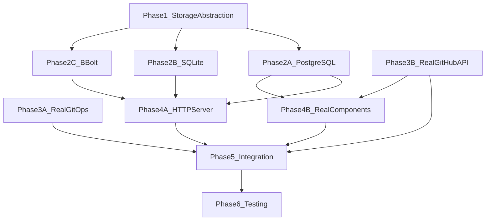

# Gitdex 全量生产化升级计划

## 当前状态

项目有 14 个 Store 接口全部使用内存实现，12 个核心组件（Syncer、HygieneExecutor、WorktreeManager、MutationEngine、ReleaseEngine、ExportEngine、RecoveryEngine、TaskController、EmergencyControls、QueryRouter、APIRouter、Daemon）全部是模拟/占位实现。无持久化、无 HTTP 服务器、无真实 Git/GitHub 操作。

## 架构决策

- **持久化**: 三种可插拔后端 — PostgreSQL（`pgx/v5`）、SQLite（`modernc.org/sqlite`）、BBolt（`go.etcd.io/bbolt`）
- **存储抽象**: 复用现有 14 个 Store 接口，每个后端实现一套，通过工厂函数按配置选择
- **数据库迁移**: PostgreSQL/SQLite 使用 `golang-migrate/migrate`，BBolt 无需迁移
- **HTTP 路由**: `go-chi/chi/v5`（轻量、兼容标准库）
- **Git 操作**: `os/exec` 调用 `git` CLI（比 go-git 更可靠地支持 worktree、gc、prune 等变更操作）
- **GitHub API**: 扩展现有 `go-github/v84` 客户端添加写入方法

## 依赖关系图




---

## Phase 1: 存储抽象层 + 配置

**目标**: 建立可插拔存储基础设施

**新文件**:

- [internal/storage/provider.go](internal/storage/provider.go) — 定义 `StorageProvider` 接口和工厂注册
- [internal/storage/config.go](internal/storage/config.go) — `StorageConfig` 结构体（Type、DSN、MaxConns 等）
- [internal/storage/factory.go](internal/storage/factory.go) — `NewProvider(cfg StorageConfig)` 按 type 选择后端

**修改文件**:

- [internal/platform/config/config.go](internal/platform/config/config.go) — `FileConfig` 增加 `Storage StorageConfig`
- [configs/gitdex.example.yaml](configs/gitdex.example.yaml) — 增加 storage 配置示例

**关键设计**: `StorageProvider` 接口返回各领域 Store：

```go
type StorageProvider interface {
    PlanStore() planning.PlanStore
    TaskStore() orchestrator.TaskStore
    AuditLedger() audit.AuditLedger
    PolicyBundleStore() policy.PolicyBundleStore
    IdentityStore() identity.IdentityStore
    ObjectStore() collaboration.ObjectStore
    ContextStore() collaboration.ContextStore
    CampaignStore() campaign.CampaignStore
    MonitorStore() autonomy.MonitorStore
    TriggerStore() autonomy.TriggerStore
    AutonomyStore() autonomy.AutonomyStore
    HandoffStore() autonomy.HandoffStore
    Close() error
    Migrate(ctx context.Context) error
}
```

---

## Phase 2A: PostgreSQL 后端

**新依赖**: `github.com/jackc/pgx/v5`, `github.com/golang-migrate/migrate/v4`

**新文件**（位于 `internal/storage/postgres/`）:

- `provider.go` — 连接池管理 + `PostgresProvider` 实现
- `migrations/` — SQL DDL 迁移文件（约 20 张表）
- `plan_store.go` — PlanStore 实现
- `task_store.go` — TaskStore 实现
- `audit_store.go` — AuditLedger 实现
- `policy_store.go` — PolicyBundleStore 实现
- `identity_store.go` — IdentityStore 实现
- `object_store.go` — ObjectStore 实现
- `context_store.go` — ContextStore 实现
- `campaign_store.go` — CampaignStore 实现
- `autonomy_store.go` — MonitorStore + TriggerStore + AutonomyStore + HandoffStore 实现

**核心表设计**（PostgreSQL 使用 JSONB 存复杂嵌套字段）:

- `plans` (plan_id PK, status, steps JSONB, risk_assessment JSONB, ...)
- `approval_records` (approval_id PK, plan_id FK, action, ...)
- `tasks` (task_id PK, correlation_id, status, result JSONB, ...)
- `task_events` (event_id PK, task_id FK, from_status, to_status, ...)
- `audit_entries` (entry_id PK, correlation_id, category, evidence JSONB, ...)
- `policy_bundles` (bundle_id PK, is_active, rules JSONB, ...)
- `identities` (identity_id PK, is_current, scopes JSONB, ...)
- `collaboration_objects` (object_id PK, owner, repo, number, ...)
- `task_contexts` (context_id PK, primary_object_ref UNIQUE, ...)
- `object_links` (source_ref, target_ref, link_type, ...)
- `campaigns` (campaign_id PK, status, target_repos JSONB, ...)
- `monitor_configs` (monitor_id PK, enabled, checks JSONB, ...)
- `monitor_events` (event_id PK, monitor_id FK, ...)
- `trigger_configs` (trigger_id PK, trigger_type, enabled, ...)
- `trigger_events` (event_id PK, trigger_id FK, ...)
- `autonomy_configs` (config_id PK, is_active, capabilities JSONB, ...)
- `handoff_packages` (package_id PK, task_id UNIQUE, context_data JSONB, ...)

---

## Phase 2B: SQLite 后端

**新依赖**: `modernc.org/sqlite`（纯 Go，无 CGO，Windows 友好）

**新文件**（位于 `internal/storage/sqlite/`）:

- `provider.go` — SQLite 连接管理 + `SQLiteProvider` 实现
- `migrations/` — SQLite DDL 迁移文件（与 PostgreSQL 类似，但使用 TEXT 替代 JSONB）
- 各 Store 实现文件（结构与 PostgreSQL 后端一致）

**SQLite 特殊处理**:

- JSONB → TEXT（JSON 字符串存储）
- 使用 `json_extract()` 函数查询 JSON 字段
- WAL 模式 + `PRAGMA journal_mode=WAL; PRAGMA busy_timeout=5000;`

---

## Phase 2C: BBolt 后端

**新依赖**: `go.etcd.io/bbolt`

**新文件**（位于 `internal/storage/bbolt/`）:

- `provider.go` — BBolt 数据库管理 + `BBoltProvider` 实现
- 各 Store 实现文件

**BBolt 特殊设计**:

- 每个 Store 对应一个 Bucket（如 `plans`、`tasks`、`audit_entries`）
- Key = ID 字符串，Value = JSON 序列化的结构体
- 二级索引通过额外 Bucket 实现（如 `tasks_by_correlation_id` → task_id）
- 无需迁移系统（schema-free），但需要版本标记 Bucket

---

## Phase 3A: 真实 Git 操作

架构要求所有 Git 写操作遵循完整管线：`fetch → worktree → diff/state → compile → policy → execute → validate → reconcile → archive`。Phase 3A 需要实现这条管线的所有基础组件。

### 3A-1: Git CLI 执行器（基础层）

**新文件**: [internal/gitops/exec.go](internal/gitops/exec.go)

现有 `Inspector.gitCmd()` 是一个无超时、无结构化输出的简单封装。需要创建生产级 `GitExecutor` 统一替代所有直接 `os/exec` 调用：

```go
type GitResult struct {
    Stdout   string
    Stderr   string
    ExitCode int
    Duration time.Duration
}

type GitExecutor struct {
    gitBinary    string            // 默认 "git"，可配置
    defaultEnv   []string          // GIT_TERMINAL_PROMPT=0 等
    timeout      time.Duration     // 默认 60s
}

func (e *GitExecutor) Run(ctx context.Context, repoPath string, args ...string) (*GitResult, error)
func (e *GitExecutor) RunWithInput(ctx context.Context, repoPath string, stdin io.Reader, args ...string) (*GitResult, error)
```

- 所有命令通过此执行器运行，注入 `GIT_TERMINAL_PROMPT=0` 防止交互式提示挂起
- 捕获 stdout + stderr 分离
- 解析常见错误模式（冲突、认证失败、lock 文件等）
- 支持 context 超时和取消（`cmd.Cancel = cmd.Process.Kill`）
- 记录每次执行的 `task_id` / `correlation_id`（用于审计）

**新文件**: [internal/gitops/errors.go](internal/gitops/errors.go)

```go
type GitError struct {
    Command  string
    ExitCode int
    Stderr   string
    Kind     GitErrorKind  // Conflict, AuthFailed, LockFailed, RefNotFound, ...
}

type GitErrorKind string
const (
    ErrKindConflict    GitErrorKind = "conflict"
    ErrKindAuth        GitErrorKind = "auth_failed"
    ErrKindLock        GitErrorKind = "lock_failed"
    ErrKindRefNotFound GitErrorKind = "ref_not_found"
    ErrKindDirtyTree   GitErrorKind = "dirty_worktree"
    ErrKindUnknown     GitErrorKind = "unknown"
)

func ClassifyGitError(stderr string, exitCode int) GitErrorKind
```

**修改文件**: [internal/gitops/inspector.go](internal/gitops/inspector.go)

- `Inspector` 改为注入 `*GitExecutor` 而不是自带 `gitCmd` 方法
- 所有现有 5 个 helper（`currentBranch`, `trackingBranch`, `aheadBehind`, `hasUncommittedChanges`, `hasUntrackedFiles`）改为调用 `e.executor.Run`
- 新增 `Inspect` 方法的超时支持（通过 `ctx` 透传）

### 3A-2: Syncer 真实实现

**修改文件**: [internal/gitops/syncer.go](internal/gitops/syncer.go)

当前 `Syncer.Execute` 对所有 action 返回硬编码字符串。需要替换为真实 Git 命令：

- `Syncer` 注入 `*GitExecutor`
- `Preview` 逻辑保持不变（已是纯计算）
- `Execute` 按 action 执行真实命令：


| Action            | 真实 Git 命令序列                                                                          | 回滚策略                                                    |
| ----------------- | ------------------------------------------------------------------------------------ | ------------------------------------------------------- |
| `none`            | 无操作                                                                                  | N/A                                                     |
| `fast_forward`    | `git fetch origin` → `git merge --ff-only origin/<branch>`                           | N/A（无损）                                                 |
| `push`            | `git push origin <branch>`                                                           | N/A（仅发送）                                                |
| `stash_and_pull`  | `git stash push -m "gitdex-sync-<task_id>"` → `git pull --ff-only` → `git stash pop` | 若 pop 冲突 → `git stash drop` 不执行，保留 stash，返回 conflict 结果 |
| `merge_or_rebase` | `git fetch origin` → `git merge origin/<branch>`                                     | 若冲突 → `git merge --abort`，返回冲突详情                        |


- `Execute` 返回值变更：`FilesChanged` 通过 `git diff --stat HEAD@{1}..HEAD` 计算
- 新增 `SyncResult.StashRef` 字段用于记录 stash 引用（回滚时需要）

**新增方法**:

- `(s *Syncer) fetchUpstream(ctx, repoPath, remote) error`
- `(s *Syncer) countChangedFiles(ctx, repoPath, fromRef, toRef) (int, error)`

### 3A-3: HygieneExecutor 真实实现

**修改文件**: [internal/gitops/hygiene_executor.go](internal/gitops/hygiene_executor.go)

当前 `Execute` 仅 sleep 50ms + 返回 mock 数据。需要替换为真实命令：

- `HygieneExecutor` 注入 `*GitExecutor`
- 按 action 执行：


| Action                   | 真实 Git 命令                                         | dry-run 预检                          | 结果解析                                                      |
| ------------------------ | ------------------------------------------------- | ----------------------------------- | --------------------------------------------------------- |
| `prune_remote_branches`  | `git fetch --prune --all`                         | `git remote prune --dry-run origin` | 解析 "pruning" 行计数                                          |
| `gc_aggressive`          | `git gc --aggressive --prune=now`                 | 无（安全操作）                             | 返回 `FilesAffected=0`，磁盘释放可通过前后 `git count-objects -vH` 计算 |
| `clean_untracked`        | `git clean -fd`                                   | `git clean -nd`（先预览要删除的文件）          | 解析 "Removing" 行和文件名                                       |
| `remove_merged_branches` | `git branch --merged` → 逐个 `git branch -d <name>` | 列出将被删除的分支名                          | 计数被删除分支                                                   |


- 新增 `DryRun` 方法：`DryRun(ctx, repoPath, action) (*HygienePreview, error)` — 不实际执行，只返回将受影响的文件/分支列表
- `HygieneResult` 新增字段 `DiskReclaimed string`（用于 gc）、`DeletedFiles []string`（用于 clean）、`DeletedBranches []string`（用于 branch 清理）

**保护逻辑**:

- `remove_merged_branches` 排除 `main`/`master`/`develop` 等保护分支
- `clean_untracked` 排除 `.gitignore` 匹配的文件（使用 `-x` 标志可选）
- 所有操作在执行前验证 `repoPath` 是有效 Git 仓库（`git rev-parse --git-dir`）

### 3A-4: WorktreeManager 真实实现

**修改文件**: [internal/gitops/worktree.go](internal/gitops/worktree.go)

当前 4 个方法全部是模拟。需要替换为真实 `git worktree` 命令：

- `WorktreeManager` 注入 `*GitExecutor`


| 方法                    | 真实 Git 命令                                                                                                          | 输出解析                                           |
| --------------------- | ------------------------------------------------------------------------------------------------------------------ | ---------------------------------------------- |
| `Create(ctx, config)` | `git worktree add <dir> <branch>` 或 `git worktree add -b <new-branch> <dir> <start-point>`                         | 验证目录创建成功，读取 worktree HEAD                      |
| `Inspect(ctx, dir)`   | `git -C <dir> status --porcelain` + `git -C <dir> rev-parse --abbrev-ref HEAD` + `git -C <dir> log -1 --format=%H` | 组装 `Worktree` 结构，计算 status（clean/dirty/active） |
| `Diff(ctx, dir)`      | `git -C <dir> diff` + `git -C <dir> diff --cached`                                                                 | 返回合并的 diff 文本                                  |
| `Discard(ctx, dir)`   | `git worktree remove <dir>` 或 `git worktree remove --force <dir>`                                                  | 验证目录已删除                                        |


**新增方法**:

- `List(ctx, repoPath) ([]*Worktree, error)` — `git worktree list --porcelain` 解析所有活跃 worktree
- `Lock(ctx, dir, reason) error` — `git worktree lock --reason <reason> <dir>`
- `Unlock(ctx, dir) error` — `git worktree unlock <dir>`

**新增数据字段**（`Worktree` 结构体扩展）:

- `HeadSHA string` — worktree 当前 HEAD commit
- `IsLocked bool` — 是否被锁定
- `LockReason string` — 锁定原因
- `UntrackedCount int` — 未跟踪文件数
- `ModifiedCount int` — 已修改文件数

**新增 CLI 命令**（修改 [internal/cli/command/repo.go](internal/cli/command/repo.go)）:

- `gitdex repo worktree list` — 列出所有活跃 worktree

### 3A-5: Single Writer Rule（并发安全）

**新文件**: [internal/gitops/writer_lock.go](internal/gitops/writer_lock.go)

架构要求 `single-writer-per-repo-ref`：同一个 repo 的同一个目标 ref 不允许多个 mutative task 并发执行。

```go
type WriterLock struct {
    mu    sync.Mutex
    locks map[string]lockEntry  // key = "owner/repo#ref"
}

type lockEntry struct {
    TaskID    string
    AcquiredAt time.Time
}

func (wl *WriterLock) Acquire(owner, repo, ref, taskID string) error
func (wl *WriterLock) Release(owner, repo, ref, taskID string) error
func (wl *WriterLock) IsLocked(owner, repo, ref string) (bool, string)
```

- Syncer、WorktreeManager、HygieneExecutor 在执行前必须获取写锁
- Campaign fan-out 时按 repo/ref 分区排队
- 写锁在执行完成、失败或取消时释放
- 写锁信息持久化到 Store（支持 daemon 重启后恢复）

### 3A-6: Managed Repo Mirror

**新文件**: [internal/gitops/mirror.go](internal/gitops/mirror.go)

架构要求背景自治任务不直接在开发者活 checkout 上运行，worktree 从 mirror 或受控 attached repo 派生：

```go
type MirrorManager struct {
    executor  *GitExecutor
    mirrorDir string  // ~/.gitdex/mirrors/
}

func (m *MirrorManager) EnsureMirror(ctx context.Context, cloneURL string) (mirrorPath string, err error)
func (m *MirrorManager) UpdateMirror(ctx context.Context, mirrorPath string) error
func (m *MirrorManager) MirrorPath(owner, repo string) string
func (m *MirrorManager) ListMirrors() ([]MirrorInfo, error)
func (m *MirrorManager) RemoveMirror(ctx context.Context, owner, repo string) error
```

- `EnsureMirror`: 若不存在则 `git clone --mirror <url> <path>`；若已存在则 `git remote update`
- `UpdateMirror`: `git -C <mirrorPath> remote update --prune`
- Mirror 目录约定: `~/.gitdex/mirrors/<owner>/<repo>.git`
- 所有 worktree 从 mirror 派生（`git -C <mirrorPath> worktree add ...`）

### 3A-7: Evidence Collector（执行证据收集）

**新文件**: [internal/gitops/evidence.go](internal/gitops/evidence.go)

架构要求所有执行结果归档到 Evidence Store：

```go
type EvidenceCollector struct {
    evidenceDir string  // ~/.gitdex/evidence/
}

type ExecutionEvidence struct {
    TaskID        string    `json:"task_id"`
    CorrelationID string    `json:"correlation_id"`
    Action        string    `json:"action"`
    RepoPath      string    `json:"repo_path"`
    Timestamp     time.Time `json:"timestamp"`
    Duration      time.Duration `json:"duration"`
    GitCommands   []GitCommandRecord `json:"git_commands"`
    DiffBefore    string    `json:"diff_before,omitempty"`
    DiffAfter     string    `json:"diff_after,omitempty"`
    Result        string    `json:"result"`   // success / failed / conflict
    ErrorDetail   string    `json:"error_detail,omitempty"`
}

type GitCommandRecord struct {
    Command  string `json:"command"`
    ExitCode int    `json:"exit_code"`
    Stdout   string `json:"stdout,omitempty"`
    Stderr   string `json:"stderr,omitempty"`
    Duration time.Duration `json:"duration"`
}

func (c *EvidenceCollector) Collect(evidence *ExecutionEvidence) error
func (c *EvidenceCollector) Get(taskID string) (*ExecutionEvidence, error)
func (c *EvidenceCollector) List(filter EvidenceFilter) ([]*ExecutionEvidence, error)
```

- Evidence 以 JSON 文件存储在 `~/.gitdex/evidence/<task_id>.json`
- `GitExecutor.Run` 每次执行自动记录到 `GitCommandRecord` 列表
- Syncer/Hygiene/Worktree 执行前后分别采集 diff snapshot

### 3A-8: Git Change Pipeline 编排

**新文件**: [internal/gitops/pipeline.go](internal/gitops/pipeline.go)

架构规定的完整 Git 变更管线实现：

```go
type GitPipeline struct {
    executor  *GitExecutor
    mirrors   *MirrorManager
    worktrees *WorktreeManager
    writerLock *WriterLock
    evidence  *EvidenceCollector
    inspector *Inspector
}

type PipelineRequest struct {
    TaskID        string
    CorrelationID string
    Owner         string
    Repo          string
    TargetRef     string
    Action        PipelineAction  // sync, hygiene, patch, branch_choreography
    Params        map[string]string
}

type PipelineResult struct {
    Success   bool
    Evidence  *ExecutionEvidence
    Rollback  RollbackType  // discard, revert, compensation, handoff
    Error     error
}

func (p *GitPipeline) Execute(ctx context.Context, req *PipelineRequest) (*PipelineResult, error)
```

`Execute` 按架构管线顺序执行：

1. **Acquire writer lock** — `writerLock.Acquire(owner, repo, ref, taskID)`
2. **Fetch / mirror sync** — `mirrors.EnsureMirror` + `mirrors.UpdateMirror`
3. **Create worktree** — `worktrees.Create` 从 mirror 派生
4. **Collect current state** — `inspector.Inspect` 在 worktree 中
5. **Execute git action** — 根据 `Action` 类型执行 sync/hygiene/patch
6. **Collect post-execution state** — 执行后 diff
7. **Archive evidence** — `evidence.Collect`
8. **Cleanup** — 成功则 `worktrees.Discard`；失败则保留到 quarantine 决策
9. **Release writer lock** — `writerLock.Release`

失败时按架构回滚语义分类：

- 未发布的 worktree 改动 → `discard`（销毁 worktree）
- 已提交但未合并 → `revert`（生成 revert commit 或新计划）
- 已写入 GitHub → `compensation`（补偿动作）
- 无法自动补偿 → `handoff`（生成 handoff pack 交人工）

### 3A-9: platform/git 增强

**修改文件**: [internal/platform/git/state.go](internal/platform/git/state.go)

现有 `ReadLocalState` 使用 go-git 进行只读状态读取，已是真实实现。增强：

- `LocalGitState` 新增字段：
  - `UntrackedCount int` — 未跟踪文件数
  - `StashCount int` — stash 条目数
  - `Tags []string` — 本地 tag 列表
  - `SubmoduleCount int` — 子模块数量
- 新增 `ReadWorktreeState(worktreeDir string) (*LocalGitState, error)` — 对 worktree 目录读取状态（go-git 支持 `EnableDotGitCommonDir`）

### 3A-10: Branch Choreography（分支编排）

**新文件**: [internal/gitops/branch.go](internal/gitops/branch.go)

架构 Execution Plane 明确列出 `branch choreography` 为 Git Executor 核心职能。需要封装所有分支相关操作：

```go
type BranchManager struct {
    executor *GitExecutor
}
```

**覆盖的 Git 命令**（参考 [git-scm.com Branching and Merging](https://git-scm.com/docs/git#_git_commands)）:


| 方法                                                    | Git 命令                                                                              | 用途        |
| ----------------------------------------------------- | ----------------------------------------------------------------------------------- | --------- |
| `ListBranches(ctx, repoPath, remote bool)`            | `git branch [-r] --format='%(refname:short) %(objectname:short) %(upstream:short)'` | 列出本地/远程分支 |
| `CreateBranch(ctx, repoPath, name, startPoint)`       | `git branch <name> [<start-point>]`                                                 | 创建新分支     |
| `DeleteBranch(ctx, repoPath, name, force)`            | `git branch -d/-D <name>`                                                           | 删除分支      |
| `RenameBranch(ctx, repoPath, oldName, newName)`       | `git branch -m <old> <new>`                                                         | 重命名分支     |
| `SwitchBranch(ctx, repoPath, name, create)`           | `git switch <name>` 或 `git switch -c <name>`                                        | 切换分支      |
| `MergeBranch(ctx, repoPath, source, opts)`            | `git merge [--ff-only/--no-ff] <source>`                                            | 合并分支      |
| `AbortMerge(ctx, repoPath)`                           | `git merge --abort`                                                                 | 中止合并      |
| `RebaseBranch(ctx, repoPath, onto, opts)`             | `git rebase [--onto <onto>] <upstream>`                                             | 变基        |
| `AbortRebase(ctx, repoPath)`                          | `git rebase --abort`                                                                | 中止变基      |
| `ContinueRebase(ctx, repoPath)`                       | `git rebase --continue`                                                             | 继续变基      |
| `CherryPick(ctx, repoPath, commits, opts)`            | `git cherry-pick <commit>...`                                                       | 拣选提交      |
| `AbortCherryPick(ctx, repoPath)`                      | `git cherry-pick --abort`                                                           | 中止拣选      |
| `ListTags(ctx, repoPath, pattern)`                    | `git tag -l [<pattern>]`                                                            | 列出标签      |
| `CreateTag(ctx, repoPath, name, ref, msg, annotated)` | `git tag [-a] [-m <msg>] <name> [<ref>]`                                            | 创建标签      |
| `DeleteTag(ctx, repoPath, name)`                      | `git tag -d <name>`                                                                 | 删除标签      |
| `MergeBase(ctx, repoPath, a, b)`                      | `git merge-base <a> <b>`                                                            | 查找共同祖先    |


**MergeOptions / RebaseOptions 结构体**:

```go
type MergeOptions struct {
    Strategy   string   // ort, recursive, resolve
    FFOnly     bool
    NoFF       bool
    NoCommit   bool
    SquashMsg  string
}

type RebaseOptions struct {
    Onto       string
    Interactive bool   // 仅用于生成 todo-list，不支持交互式
    Autosquash bool
}

type MergeResult struct {
    Success     bool
    FastForward bool
    Conflicts   []ConflictFile
    MergeCommit string  // new merge commit SHA
}

type ConflictFile struct {
    Path   string
    Status string  // both_modified, deleted_by_us, deleted_by_them, ...
}
```

**冲突检测**:

- `git merge` 退出码 1 + stderr 包含 "CONFLICT" → 解析冲突文件列表
- 使用 `git diff --name-only --diff-filter=U` 列出冲突文件
- `MergeResult.Conflicts` 提供精确冲突文件路径和类型

### 3A-11: Patch & Diff 操作

**新文件**: [internal/gitops/patch.go](internal/gitops/patch.go)

架构 Execution Plane 列出 `diff/patch/apply` 为核心职能。封装补丁和差异操作：

```go
type PatchManager struct {
    executor *GitExecutor
}
```

**覆盖的 Git 命令**（参考 [Patching](https://git-scm.com/docs/git#_git_commands) + [Basic Snapshotting - diff](https://git-scm.com/docs/git-diff)）:


| 方法                                                 | Git 命令                                          | 用途          |
| -------------------------------------------------- | ----------------------------------------------- | ----------- |
| `Diff(ctx, repoPath, opts)`                        | `git diff [--cached] [<commit>] [-- <path>...]` | 工作区/暂存区差异   |
| `DiffBetween(ctx, repoPath, from, to, paths)`      | `git diff <from>..<to> [-- <path>...]`          | 两个 ref 之间差异 |
| `DiffStat(ctx, repoPath, from, to)`                | `git diff --stat <from>..<to>`                  | 差异统计摘要      |
| `DiffNameOnly(ctx, repoPath, from, to)`            | `git diff --name-only <from>..<to>`             | 变更文件列表      |
| `DiffNumstat(ctx, repoPath, from, to)`             | `git diff --numstat <from>..<to>`               | 增删行统计       |
| `CreatePatch(ctx, repoPath, from, to, out)`        | `git format-patch <from>..<to> --stdout`        | 生成补丁        |
| `CreatePatchFiles(ctx, repoPath, from, to, dir)`   | `git format-patch -o <dir> <from>..<to>`        | 生成补丁文件      |
| `ApplyPatch(ctx, repoPath, patchPath, check)`      | `git apply [--check] <patch>`                   | 应用补丁        |
| `ApplyPatchFromStdin(ctx, repoPath, patch, check)` | `git apply [--check] -` (stdin)                 | 从内容应用补丁     |
| `RangeDiff(ctx, repoPath, base, rev1, rev2)`       | `git range-diff <base>..<rev1> <base>..<rev2>`  | 对比两个分支版本    |


**DiffOptions 结构体**:

```go
type DiffOptions struct {
    Cached     bool       // --cached (staged changes)
    NameOnly   bool       // --name-only
    Stat       bool       // --stat
    NumStat    bool       // --numstat
    Paths      []string   // -- <path>...
    ContextLines int      // -U<n>
    IgnoreWhitespace bool // -w
}

type DiffEntry struct {
    Path       string
    Status     string  // A (added), M (modified), D (deleted), R (renamed), C (copied)
    Additions  int
    Deletions  int
    OldPath    string  // for renames
}

type PatchResult struct {
    Files       []string
    TotalAdded  int
    TotalRemoved int
    PatchPath   string  // output file path when using CreatePatchFiles
}
```

### 3A-12: Worktree 内提交操作（Basic Snapshotting）

**新文件**: [internal/gitops/commit.go](internal/gitops/commit.go)

worktree 内执行受治理变更时，需要在隔离 worktree 中执行完整的 add → commit → push 流程：

```go
type CommitManager struct {
    executor *GitExecutor
}
```

**覆盖的 Git 命令**（参考 [Basic Snapshotting](https://git-scm.com/docs/git#_git_commands)）:


| 方法                                        | Git 命令                                               | 用途                        |
| ----------------------------------------- | ---------------------------------------------------- | ------------------------- |
| `Add(ctx, repoPath, paths)`               | `git add <path>...`                                  | 暂存文件                      |
| `AddAll(ctx, repoPath)`                   | `git add -A`                                         | 暂存所有变更                    |
| `Reset(ctx, repoPath, paths)`             | `git reset HEAD -- <path>...`                        | 取消暂存                      |
| `ResetHard(ctx, repoPath, ref)`           | `git reset --hard <ref>`                             | 硬重置到指定 ref                |
| `ResetSoft(ctx, repoPath, ref)`           | `git reset --soft <ref>`                             | 软重置（保留暂存）                 |
| `Restore(ctx, repoPath, paths, source)`   | `git restore [--source=<ref>] -- <path>...`          | 恢复文件                      |
| `RestoreStaged(ctx, repoPath, paths)`     | `git restore --staged -- <path>...`                  | 取消暂存（等价 reset HEAD）       |
| `Remove(ctx, repoPath, paths, cached)`    | `git rm [--cached] <path>...`                        | 从索引/工作区移除                 |
| `Move(ctx, repoPath, src, dst)`           | `git mv <src> <dst>`                                 | 移动/重命名                    |
| `Commit(ctx, repoPath, msg, opts)`        | `git commit -m <msg> [--allow-empty] [--author=...]` | 创建提交                      |
| `CommitAmend(ctx, repoPath, msg)`         | `git commit --amend -m <msg>`                        | 修改最近提交                    |
| `Revert(ctx, repoPath, commit, noCommit)` | `git revert [--no-commit] <commit>`                  | 撤销提交（架构 Rollback 语义第 2 类） |
| `AbortRevert(ctx, repoPath)`              | `git revert --abort`                                 | 中止撤销                      |


**CommitOptions 结构体**:

```go
type CommitOptions struct {
    AllowEmpty bool
    Author     string   // "Name <email>"
    Date       string   // ISO 8601
    Signoff    bool     // --signoff
    NoVerify   bool     // --no-verify (skip hooks)
    GPGSign    bool     // --gpg-sign
}

type CommitResult struct {
    SHA     string
    Short   string
    Summary string
    Author  string
    Date    time.Time
}
```

**关键安全约束**:

- `ResetHard` 仅允许在 gitdex 管理的 worktree 中执行，禁止在用户主工作区使用
- `CommitAmend` 仅允许在 worktree 中且未推送的提交上使用
- 所有提交操作自动注入 `--author="gitdex[bot] <gitdex[bot]@users.noreply.github.com>"` 除非显式覆盖

### 3A-13: History & Object Inspection（检查和比较）

**新文件**: [internal/gitops/history.go](internal/gitops/history.go)

提供对仓库历史、对象和元数据的只读检查能力：

```go
type HistoryInspector struct {
    executor *GitExecutor
}
```

**覆盖的 Git 命令**（参考 [Inspection and Comparison](https://git-scm.com/docs/git#_git_commands) + 部分 Plumbing）:


| 方法                                           | Git 命令                                                                  | 用途           |
| -------------------------------------------- | ----------------------------------------------------------------------- | ------------ |
| `Log(ctx, repoPath, opts)`                   | `git log [--oneline] [--format=<fmt>] [-n <count>] [<ref>] [-- <path>]` | 提交历史         |
| `LogBetween(ctx, repoPath, from, to)`        | `git log <from>..<to> --format=...`                                     | 两个 ref 之间的提交 |
| `Show(ctx, repoPath, ref)`                   | `git show <ref> --format=...`                                           | 查看对象详情       |
| `ShowFile(ctx, repoPath, ref, path)`         | `git show <ref>:<path>`                                                 | 查看指定版本文件内容   |
| `Describe(ctx, repoPath, ref)`               | `git describe [--tags] [--always] <ref>`                                | 最近标签描述       |
| `Shortlog(ctx, repoPath, from, to)`          | `git shortlog -sn <from>..<to>`                                         | 按作者统计        |
| `Blame(ctx, repoPath, path, opts)`           | `git blame [-L <start>,<end>] <path>`                                   | 逐行归因         |
| `LsFiles(ctx, repoPath, opts)`               | `git ls-files [--others] [--ignored] [--cached]`                        | 列出跟踪文件       |
| `LsTree(ctx, repoPath, ref, path)`           | `git ls-tree [-r] <ref> [<path>]`                                       | 列出 tree 对象内容 |
| `CatFile(ctx, repoPath, ref)`                | `git cat-file -t <ref>` / `git cat-file -p <ref>`                       | 查看对象类型/内容    |
| `ForEachRef(ctx, repoPath, pattern, format)` | `git for-each-ref [<pattern>] --format=<fmt>`                           | 枚举引用         |
| `ShowRef(ctx, repoPath, pattern)`            | `git show-ref [<pattern>]`                                              | 列出引用         |
| `RevParse(ctx, repoPath, args)`              | `git rev-parse <args>`                                                  | 解析引用/路径      |
| `CountObjects(ctx, repoPath)`                | `git count-objects -vH`                                                 | 对象数量和磁盘占用    |


**LogOptions / LogEntry 结构体**:

```go
type LogOptions struct {
    MaxCount   int
    Since      string     // --since
    Until      string     // --until
    Author     string     // --author
    Grep       string     // --grep
    Paths      []string   // -- <path>...
    FirstParent bool      // --first-parent
    Oneline    bool
    Format     string     // custom --format
}

type LogEntry struct {
    SHA       string
    ShortSHA  string
    Author    string
    AuthorEmail string
    Date      time.Time
    Subject   string
    Body      string
    Parents   []string
}

type ObjectInfo struct {
    Type string  // blob, tree, commit, tag
    Size int64
    Content string
}

type DiskUsage struct {
    Count       int
    Size        string  // human-readable
    InPack      int
    PackSize    string
    Prunable    int
    Garbage     int
}
```

### 3A-14: Repository Integrity & Recovery（仓库维护）

**新文件**: [internal/gitops/integrity.go](internal/gitops/integrity.go)

覆盖仓库健康检查、恢复和归档操作：

```go
type IntegrityChecker struct {
    executor *GitExecutor
}
```

**覆盖的 Git 命令**（参考 [Administration](https://git-scm.com/docs/git#_git_commands)）:


| 方法                                         | Git 命令                                              | 用途                                   |
| ------------------------------------------ | --------------------------------------------------- | ------------------------------------ |
| `Fsck(ctx, repoPath, full)`                | `git fsck [--full] [--no-dangling]`                 | 验证对象数据库完整性                           |
| `Reflog(ctx, repoPath, ref, count)`        | `git reflog [<ref>] -n <count>`                     | 查看引用日志                               |
| `ReflogExpire(ctx, repoPath, expire)`      | `git reflog expire --expire=<time> --all`           | 清理过期引用日志                             |
| `Prune(ctx, repoPath, expire)`             | `git prune [--expire=<time>]`                       | 清理不可达对象                              |
| `Repack(ctx, repoPath, aggressive)`        | `git repack [-a] [-d] [--depth=<n>] [--window=<n>]` | 重新打包对象                               |
| `PackRefs(ctx, repoPath)`                  | `git pack-refs --all`                               | 压缩引用                                 |
| `Maintenance(ctx, repoPath, task)`         | `git maintenance run --task=<task>`                 | 运行维护任务（gc/commit-graph/prefetch/...） |
| `Archive(ctx, repoPath, ref, format, out)` | `git archive --format=<fmt> <ref> -o <out>`         | 导出归档（tar/zip）                        |


**FsckResult 结构体**:

```go
type FsckResult struct {
    Clean       bool
    Dangling    []DanglingObject
    Missing     []string
    Corrupt     []string
    Warnings    []string
}

type DanglingObject struct {
    Type string  // blob, commit, tree, tag
    SHA  string
}

type ReflogEntry struct {
    SHA     string
    Action  string  // commit, checkout, merge, rebase, reset, ...
    Message string
    Date    time.Time
}
```

**与 HygieneExecutor 的关系**:

- `HygieneExecutor` 是面向用户的高层 CLI（`gitdex repo hygiene run`）
- `IntegrityChecker` 是低层基础设施，被 HygieneExecutor、ReconciliationController、daemon 健康检查调用
- `HygieneExecutor.Execute(gc_aggressive)` 内部调用 `IntegrityChecker.Repack` + `git gc`
- daemon 可定期运行 `IntegrityChecker.Fsck` 检测仓库损坏

### 3A-15: Remote & Clone 操作

**新文件**: [internal/gitops/remote.go](internal/gitops/remote.go)

覆盖远程仓库管理和克隆操作：

```go
type RemoteManager struct {
    executor *GitExecutor
}
```

**覆盖的 Git 命令**（参考 [Sharing and Updating Projects](https://git-scm.com/docs/git#_git_commands)）:


| 方法                                            | Git 命令                                                            | 用途       |
| --------------------------------------------- | ----------------------------------------------------------------- | -------- |
| `Clone(ctx, url, dir, opts)`                  | `git clone [--mirror] [--bare] [--depth=<n>] <url> <dir>`         | 克隆仓库     |
| `Fetch(ctx, repoPath, remote, refspec, opts)` | `git fetch [--prune] [--tags] [--depth=<n>] <remote> [<refspec>]` | 拉取远程     |
| `FetchAll(ctx, repoPath)`                     | `git fetch --all --prune`                                         | 拉取所有远程   |
| `Push(ctx, repoPath, remote, refspec, opts)`  | `git push [--force-with-lease] [--tags] <remote> <refspec>`       | 推送远程     |
| `PushDelete(ctx, repoPath, remote, ref)`      | `git push <remote> --delete <ref>`                                | 删除远程引用   |
| `ListRemotes(ctx, repoPath)`                  | `git remote -v`                                                   | 列出远程仓库   |
| `AddRemote(ctx, repoPath, name, url)`         | `git remote add <name> <url>`                                     | 添加远程     |
| `RemoveRemote(ctx, repoPath, name)`           | `git remote remove <name>`                                        | 删除远程     |
| `SetRemoteURL(ctx, repoPath, name, url)`      | `git remote set-url <name> <url>`                                 | 修改远程 URL |
| `LsRemote(ctx, repoPath, remote, pattern)`    | `git ls-remote [--heads] [--tags] <remote> [<pattern>]`           | 列出远程引用   |
| `Submodule(ctx, repoPath, action, opts)`      | `git submodule init/update/status/sync`                           | 子模块管理    |


**CloneOptions / FetchOptions / PushOptions**:

```go
type CloneOptions struct {
    Mirror   bool
    Bare     bool
    Depth    int     // shallow clone
    Branch   string  // --branch
    SingleBranch bool
}

type FetchOptions struct {
    Prune  bool
    Tags   bool
    Depth  int
    DryRun bool
}

type PushOptions struct {
    ForceWithLease bool  // --force-with-lease (安全强推)
    Force          bool  // --force (危险，需策略审批)
    Tags           bool
    DryRun         bool
    SetUpstream    bool  // --set-upstream
}

type RemoteInfo struct {
    Name     string
    FetchURL string
    PushURL  string
}

type RemoteRef struct {
    SHA  string
    Ref  string
    Type string  // commit, tag
}
```

**关键安全约束**:

- `Push(force=true)` 必须经过 PolicyEngine 策略审批，默认拒绝
- `Push(forceWithLease=true)` 允许在 worktree 中使用，记录审计日志
- `Clone(mirror=true)` 仅用于 `MirrorManager`，不暴露给 CLI
- `PushDelete` 需要策略审批

### 3A-16: Stash 操作

**在 [internal/gitops/commit.go](internal/gitops/commit.go) 中补充**:

Syncer 的 `stash_and_pull` 已部分覆盖 stash。补全完整 stash 管理：


| 方法                                                | Git 命令                            | 用途          |
| ------------------------------------------------- | --------------------------------- | ----------- |
| `StashPush(ctx, repoPath, msg, includeUntracked)` | `git stash push [-u] [-m <msg>]`  | 暂存当前修改      |
| `StashPop(ctx, repoPath, index)`                  | `git stash pop [stash@{<n>}]`     | 恢复并删除 stash |
| `StashApply(ctx, repoPath, index)`                | `git stash apply [stash@{<n>}]`   | 恢复但保留 stash |
| `StashDrop(ctx, repoPath, index)`                 | `git stash drop [stash@{<n>}]`    | 删除 stash 条目 |
| `StashList(ctx, repoPath)`                        | `git stash list`                  | 列出 stash 条目 |
| `StashShow(ctx, repoPath, index)`                 | `git stash show -p [stash@{<n>}]` | 查看 stash 内容 |
| `StashClear(ctx, repoPath)`                       | `git stash clear`                 | 清空所有 stash  |


### 3A-17: Reconciliation Controller（对账控制器）

**新文件**: [internal/gitops/reconciliation.go](internal/gitops/reconciliation.go)

架构要求 `reconciliation controller` 定期或事件驱动检查多种状态。这是 Git 层面的对账实现：

```go
type ReconciliationController struct {
    executor  *GitExecutor
    mirrors   *MirrorManager
    worktrees *WorktreeManager
    inspector *Inspector
    history   *HistoryInspector
    integrity *IntegrityChecker
}

type DriftReport struct {
    RepoPath    string
    Timestamp   time.Time
    Checks      []DriftCheck
    HasDrift    bool
    Summary     string
}

type DriftCheck struct {
    Name     string         // mirror_divergence, orphaned_worktree, ref_mismatch, ...
    Status   DriftStatus    // ok, drift, error
    Detail   string
    Severity string         // info, warning, critical
}

type DriftStatus string
const (
    DriftOK      DriftStatus = "ok"
    DriftDetected DriftStatus = "drift"
    DriftError   DriftStatus = "error"
)
```

**对账检查项**（对应架构 `Reconciliation Rules`）:


| 方法                                        | 检查内容              | Git 命令                                                     |
| ----------------------------------------- | ----------------- | ---------------------------------------------------------- |
| `CheckMirrorDivergence(ctx, repoPath)`    | mirror 与目标分支是否偏移  | `git fetch --dry-run` + `git rev-list --count`             |
| `CheckOrphanedWorktrees(ctx, repoPath)`   | 是否存在无主 worktree   | `git worktree list --porcelain` + 检查是否有对应活跃 task           |
| `CheckStaleLocks(ctx, repoPath)`          | 是否有残留的 `.lock` 文件 | `find .git -name '*.lock'` 等价逻辑                            |
| `CheckRefIntegrity(ctx, repoPath)`        | 引用是否指向有效对象        | `git fsck --no-dangling`                                   |
| `CheckBranchTracking(ctx, repoPath)`      | 上游跟踪是否正常          | `git for-each-ref --format='%(upstream:track)' refs/heads` |
| `CheckStaleRemoteBranches(ctx, repoPath)` | 远程已删除的跟踪分支        | `git remote prune --dry-run origin`                        |


**完整对账流程**:

```go
func (r *ReconciliationController) RunFullCheck(ctx context.Context, repoPath string) (*DriftReport, error)
func (r *ReconciliationController) Remediate(ctx context.Context, report *DriftReport) (*RemediationResult, error)
```

- `RunFullCheck` 运行所有检查项并生成 `DriftReport`
- `Remediate` 对可自动修复的 drift 执行补偿操作（如清理 orphaned worktree、prune stale remote branches）
- 对无法自动修复的 drift 标记为需要人工介入
- daemon 定期运行 `RunFullCheck`（默认 15 分钟间隔，对应架构 NFR "状态漂移 ≤15 min 被 reconciliation 发现"）

### 3A-18: GitExecutor 完整命令覆盖映射

汇总 Phase 3A 全部子阶段对 [Git 官方文档命令集](https://git-scm.com/docs/git#_git_commands) 的覆盖情况：

**High-level Porcelain — Main Commands**:


| Git 命令                        | 覆盖子阶段                                         | 方法                                                               |
| ----------------------------- | --------------------------------------------- | ---------------------------------------------------------------- |
| `git add`                     | 3A-12 CommitManager                           | `Add`, `AddAll`                                                  |
| `git branch`                  | 3A-10 BranchManager                           | `ListBranches`, `CreateBranch`, `DeleteBranch`, `RenameBranch`   |
| `git checkout` / `git switch` | 3A-10 BranchManager                           | `SwitchBranch`                                                   |
| `git cherry-pick`             | 3A-10 BranchManager                           | `CherryPick`, `AbortCherryPick`                                  |
| `git clean`                   | 3A-3 HygieneExecutor                          | `Execute(clean_untracked)`                                       |
| `git clone`                   | 3A-15 RemoteManager                           | `Clone`                                                          |
| `git commit`                  | 3A-12 CommitManager                           | `Commit`, `CommitAmend`                                          |
| `git describe`                | 3A-13 HistoryInspector                        | `Describe`                                                       |
| `git diff`                    | 3A-11 PatchManager                            | `Diff`, `DiffBetween`, `DiffStat`, `DiffNameOnly`, `DiffNumstat` |
| `git fetch`                   | 3A-15 RemoteManager                           | `Fetch`, `FetchAll`                                              |
| `git gc`                      | 3A-3 HygieneExecutor + 3A-14 IntegrityChecker | `Execute(gc_aggressive)`, `Maintenance`                          |
| `git log`                     | 3A-13 HistoryInspector                        | `Log`, `LogBetween`                                              |
| `git merge`                   | 3A-10 BranchManager                           | `MergeBranch`, `AbortMerge`                                      |
| `git mv`                      | 3A-12 CommitManager                           | `Move`                                                           |
| `git pull`                    | 3A-2 Syncer                                   | `Execute(fast_forward/stash_and_pull)`                           |
| `git push`                    | 3A-15 RemoteManager                           | `Push`, `PushDelete`                                             |
| `git range-diff`              | 3A-11 PatchManager                            | `RangeDiff`                                                      |
| `git rebase`                  | 3A-10 BranchManager                           | `RebaseBranch`, `AbortRebase`, `ContinueRebase`                  |
| `git reset`                   | 3A-12 CommitManager                           | `Reset`, `ResetHard`, `ResetSoft`                                |
| `git restore`                 | 3A-12 CommitManager                           | `Restore`, `RestoreStaged`                                       |
| `git revert`                  | 3A-12 CommitManager                           | `Revert`, `AbortRevert`                                          |
| `git rm`                      | 3A-12 CommitManager                           | `Remove`                                                         |
| `git shortlog`                | 3A-13 HistoryInspector                        | `Shortlog`                                                       |
| `git show`                    | 3A-13 HistoryInspector                        | `Show`, `ShowFile`                                               |
| `git stash`                   | 3A-16 (commit.go)                             | `StashPush/Pop/Apply/Drop/List/Show/Clear`                       |
| `git status`                  | 3A-1 Inspector (已存在)                          | `Inspect` → `hasUncommittedChanges`, `hasUntrackedFiles`         |
| `git submodule`               | 3A-15 RemoteManager                           | `Submodule`                                                      |
| `git tag`                     | 3A-10 BranchManager                           | `ListTags`, `CreateTag`, `DeleteTag`                             |
| `git worktree`                | 3A-4 WorktreeManager                          | `Create`, `Inspect`, `Diff`, `Discard`, `List`, `Lock`, `Unlock` |


**Porcelain — Ancillary/Administration**:


| Git 命令            | 覆盖子阶段                  | 方法                                                         |
| ----------------- | ---------------------- | ---------------------------------------------------------- |
| `git archive`     | 3A-14 IntegrityChecker | `Archive`                                                  |
| `git blame`       | 3A-13 HistoryInspector | `Blame`                                                    |
| `git fsck`        | 3A-14 IntegrityChecker | `Fsck`                                                     |
| `git maintenance` | 3A-14 IntegrityChecker | `Maintenance`                                              |
| `git pack-refs`   | 3A-14 IntegrityChecker | `PackRefs`                                                 |
| `git prune`       | 3A-14 IntegrityChecker | `Prune`                                                    |
| `git reflog`      | 3A-14 IntegrityChecker | `Reflog`, `ReflogExpire`                                   |
| `git remote`      | 3A-15 RemoteManager    | `ListRemotes`, `AddRemote`, `RemoveRemote`, `SetRemoteURL` |
| `git repack`      | 3A-14 IntegrityChecker | `Repack`                                                   |


**Low-level Plumbing Commands**:


| Git 命令              | 覆盖子阶段                              | 方法                                  |
| ------------------- | ---------------------------------- | ----------------------------------- |
| `git apply`         | 3A-11 PatchManager                 | `ApplyPatch`, `ApplyPatchFromStdin` |
| `git cat-file`      | 3A-13 HistoryInspector             | `CatFile`                           |
| `git count-objects` | 3A-13 HistoryInspector             | `CountObjects`                      |
| `git for-each-ref`  | 3A-13 HistoryInspector             | `ForEachRef`                        |
| `git format-patch`  | 3A-11 PatchManager                 | `CreatePatch`, `CreatePatchFiles`   |
| `git ls-files`      | 3A-13 HistoryInspector             | `LsFiles`                           |
| `git ls-remote`     | 3A-15 RemoteManager                | `LsRemote`                          |
| `git ls-tree`       | 3A-13 HistoryInspector             | `LsTree`                            |
| `git merge-base`    | 3A-10 BranchManager                | `MergeBase`                         |
| `git rev-list`      | 3A-1 Inspector (已存在)               | `aheadBehind`                       |
| `git rev-parse`     | 3A-13 HistoryInspector + Inspector | `RevParse`, `currentBranch`         |
| `git show-ref`      | 3A-13 HistoryInspector             | `ShowRef`                           |


**明确排除（不适用于 Gitdex 场景）**:

- `git am` / `git send-email` / `git request-pull` — 邮件补丁工作流，Gitdex 使用 GitHub PR
- `git svn` / `git p4` / `git cvsimport` — 外部 SCM 互操作，非目标
- `git bisect` — 交互式调试，不适合自动化
- `git gui` / `gitk` / `gitweb` — GUI 工具
- `git filter-branch` — 历史重写，过于危险
- `git daemon` — Git 协议服务器，Gitdex 使用 GitHub
- `git bundle` — 离线传输，非核心场景
- `git notes` — 附注，非核心
- `git sparse-checkout` — 稀疏检出，可后续扩展
- `scalar` — 大仓库优化，可后续扩展

### 3A 文件清单汇总

**新文件（12 个）**:

- `internal/gitops/exec.go` — Git CLI 执行器（3A-1）
- `internal/gitops/errors.go` — Git 错误分类和解析（3A-1）
- `internal/gitops/branch.go` — 分支编排：branch/merge/rebase/cherry-pick/tag（3A-10）
- `internal/gitops/patch.go` — 补丁和差异：diff/format-patch/apply/range-diff（3A-11）
- `internal/gitops/commit.go` — 提交操作 + stash：add/commit/reset/restore/revert/stash（3A-12 + 3A-16）
- `internal/gitops/history.go` — 历史检查：log/show/describe/blame/ls-files/cat-file（3A-13）
- `internal/gitops/integrity.go` — 仓库维护：fsck/reflog/prune/repack/archive/maintenance（3A-14）
- `internal/gitops/remote.go` — 远程操作：clone/fetch/push/remote/ls-remote/submodule（3A-15）
- `internal/gitops/reconciliation.go` — 对账控制器：drift 检测和修复（3A-17）
- `internal/gitops/writer_lock.go` — Single Writer Rule（3A-5）
- `internal/gitops/mirror.go` — Managed Repo Mirror（3A-6）
- `internal/gitops/evidence.go` — 执行证据收集（3A-7）
- `internal/gitops/pipeline.go` — Git Change Pipeline 编排（3A-8）

**修改文件（5 个）**:

- `internal/gitops/inspector.go` — 注入 GitExecutor，移除内联 gitCmd
- `internal/gitops/syncer.go` — 注入 GitExecutor + RemoteManager，替换全部模拟为真实 Git 命令
- `internal/gitops/hygiene_executor.go` — 注入 GitExecutor + IntegrityChecker，替换 sleep+mock 为真实 Git 命令
- `internal/gitops/worktree.go` — 注入 GitExecutor，替换全部模拟为真实 git worktree 命令
- `internal/platform/git/state.go` — 扩展 LocalGitState 字段

**测试文件（含新增和修改，~15 个）**:

- `internal/gitops/exec_test.go` — 基本命令执行、超时、取消、错误分类
- `internal/gitops/branch_test.go` — 分支创建/删除/合并/变基/拣选/标签/冲突检测
- `internal/gitops/patch_test.go` — diff 格式、补丁创建/应用、range-diff
- `internal/gitops/commit_test.go` — add/commit/reset/restore/revert/stash 全流程
- `internal/gitops/history_test.go` — log/show/describe/blame/ls-files 查询
- `internal/gitops/integrity_test.go` — fsck/reflog/count-objects/archive
- `internal/gitops/remote_test.go` — clone/fetch/push/remote 管理（使用 bare 仓库 fixture）
- `internal/gitops/reconciliation_test.go` — drift 检测和自动修复
- `internal/gitops/writer_lock_test.go` — 并发锁获取/释放/死锁检测
- `internal/gitops/mirror_test.go` — mirror 创建/更新/列出
- `internal/gitops/pipeline_test.go` — 完整管线端到端
- `test/integration/git_pipeline_test.go` — 完整管线集成测试（创建带 remote 的临时仓库对）
- 所有 `*_test.go` 使用 `initGitRepo(t, dir)` 创建真实临时仓库（复用 `state_test.go` 中已有的 fixture 模式）
- Worktree 测试需要创建多分支仓库，验证创建/检查/diff/删除全流程
- Remote 测试需要 bare + working 仓库对
- Branch 测试需要多分支 + 冲突场景仓库

---

## Phase 3B: 真实 GitHub API 集成

**修改文件**:

- [internal/platform/github/client.go](internal/platform/github/client.go) — 扩展写入方法

**新增 Client 方法**:

- `CreateIssue(ctx, owner, repo, title, body, labels, assignees)`
- `UpdateIssue(ctx, owner, repo, number, updates)`
- `CreateComment(ctx, owner, repo, number, body)`
- `AddLabels(ctx, owner, repo, number, labels)`
- `SetAssignees(ctx, owner, repo, number, assignees)`
- `CloseIssue/ReopenIssue(ctx, owner, repo, number)`
- `MergePullRequest(ctx, owner, repo, number, method)`
- `CreateRelease(ctx, owner, repo, tag, name, body, isDraft)`
- `ListReleases(ctx, owner, repo)`
- `GetCombinedStatus(ctx, owner, repo, ref)` — CI 状态
- `ListCheckRuns(ctx, owner, repo, ref)` — Check Runs

**修改文件**:

- [internal/collaboration/mutations.go](internal/collaboration/mutations.go) — 替换 `SimulatedMutationEngine` 为 `GitHubMutationEngine`
- [internal/collaboration/release.go](internal/collaboration/release.go) — 替换 `SimulatedReleaseEngine` 为 `GitHubReleaseEngine`

**新文件**:

- [internal/platform/github/webhook.go](internal/platform/github/webhook.go) — Webhook 接收和验签（`X-Hub-Signature-256`）
- [internal/platform/github/ratelimit.go](internal/platform/github/ratelimit.go) — 速率预算管理

---

## Phase 4A: HTTP 控制面守护进程

**新依赖**: `github.com/go-chi/chi/v5`

**新文件**（位于 `internal/daemon/`）:

- `server/server.go` — HTTP 服务器（chi 路由 + 中间件 + 优雅关闭）
- `server/middleware.go` — 日志、认证、错误恢复中间件
- `server/routes.go` — 路由注册（将 API 端点映射到 handlers）
- `handler/intent.go` — `POST /api/v1/intents` 提交结构化意图
- `handler/plan.go` — Plan CRUD API
- `handler/task.go` — Task 查询/控制 API
- `handler/campaign.go` — Campaign 管理 API
- `handler/audit.go` — Audit 查询 API
- `handler/export.go` — Export 触发 API
- `handler/webhook.go` — `POST /api/v1/webhooks/github` 接收 GitHub 事件

**修改文件**:

- [internal/daemon/service/run.go](internal/daemon/service/run.go) — 从占位 stub 升级为真实长运行守护进程
- [internal/api/endpoints.go](internal/api/endpoints.go) — 提交处理器写入真实 Store
- [internal/api/queries.go](internal/api/queries.go) — QueryRouter 从真实 Store 查询
- [internal/api/export.go](internal/api/export.go) — ExportEngine 收集真实数据生成报告

---

## Phase 4B: 真实自治/恢复/紧急组件

**修改文件**:

- [internal/autonomy/recovery.go](internal/autonomy/recovery.go) — `RecoveryEngine` 接入真实任务状态和执行器
- [internal/autonomy/task_control.go](internal/autonomy/task_control.go) — `TaskController` 信号传递到真实执行器
- [internal/emergency/controls.go](internal/emergency/controls.go) — `ControlEngine` 通过编排器实际暂停/杀死任务

**新文件**:

- [internal/autonomy/scheduler.go](internal/autonomy/scheduler.go) — 定时任务调度器（基于 `time.Ticker` + MonitorStore）

**关键集成点**:

- `TaskController.Execute` → 调用 `orchestrator.Executor` 的暂停/取消方法
- `RecoveryEngine.Execute` → 通过 `orchestrator.Executor` 重试或回滚
- `EmergencyControls.Execute` → 遍历活跃任务，调用 `TaskController.Execute(cancel)`
- `EmergencyControls` → 自动向 `AuditLedger.Append` 记录紧急事件

---

## Phase 5: 集成联调

**修改文件**:

- [internal/app/bootstrap/bootstrap.go](internal/app/bootstrap/bootstrap.go) — `App` 结构体增加 `StorageProvider`，bootstrap 时初始化
- [internal/cli/command/root.go](internal/cli/command/root.go) — 所有命令组从 `App.StorageProvider` 获取 Store 实例
- 所有 CLI 命令文件 — 替换全局 `var xxxStore = NewMemoryXxxStore()` 为注入式 Store

**关键联调**:

- `Emergency.Execute` → `AuditLedger.Append`（紧急→审计集成）
- `PlanReviewer.Approve` → `PolicyEngine.Evaluate`（全路径策略执行）
- `Trigger.Fire` → 检查 `AutonomyStore.GetActiveConfig()` 级别
- `ExportEngine` → 从 `PlanStore`/`TaskStore`/`AuditLedger`/`CampaignStore` 真实收集数据
- `QueryRouter` → 从真实 Store 查询，submit handlers 写入真实 Store
- `sync execute` → 经过 Plan compile → Policy evaluate → Task create 治理链

**Sprint Status 修复**:

- [_bmad-output/implementation-artifacts/sprint-status.yaml](_bmad-output/implementation-artifacts/sprint-status.yaml) — Story 1.1/1.2 状态更新为 `done`

---

## Phase 6: 测试与验证

**测试策略**:

- 每个 Store 后端：使用 `TestMain` + 真实数据库实例（PostgreSQL 使用 testcontainers 或跳过标记，SQLite 使用 `:memory:`，BBolt 使用临时文件）
- 真实 Git 操作：使用临时 Git 仓库 fixture
- 真实 GitHub API：使用 httptest 模拟服务器
- HTTP 服务器：使用 `httptest.Server` 端到端测试
- 集成测试：全链路测试（提交意图 → 编译计划 → 策略评估 → 审批 → 执行 → 审计）

**新文件**:

- `internal/storage/postgres/*_test.go`
- `internal/storage/sqlite/*_test.go`
- `internal/storage/bbolt/*_test.go`
- `internal/daemon/server/*_test.go`
- `internal/daemon/handler/*_test.go`
- `test/integration/storage_provider_test.go`（后端一致性测试）
- `test/integration/e2e_flow_test.go`（端到端流程测试）

---

## 新依赖汇总

```
github.com/jackc/pgx/v5           # PostgreSQL
modernc.org/sqlite                 # SQLite (pure Go)
go.etcd.io/bbolt                   # BoltDB
github.com/go-chi/chi/v5           # HTTP router
github.com/golang-migrate/migrate/v4  # DB migrations
```

## 估算规模

- 新文件: ~80-100 个
- 修改文件: ~30-40 个
- 新代码行数: ~15,000-20,000 行
- 新测试代码: ~8,000-10,000 行

