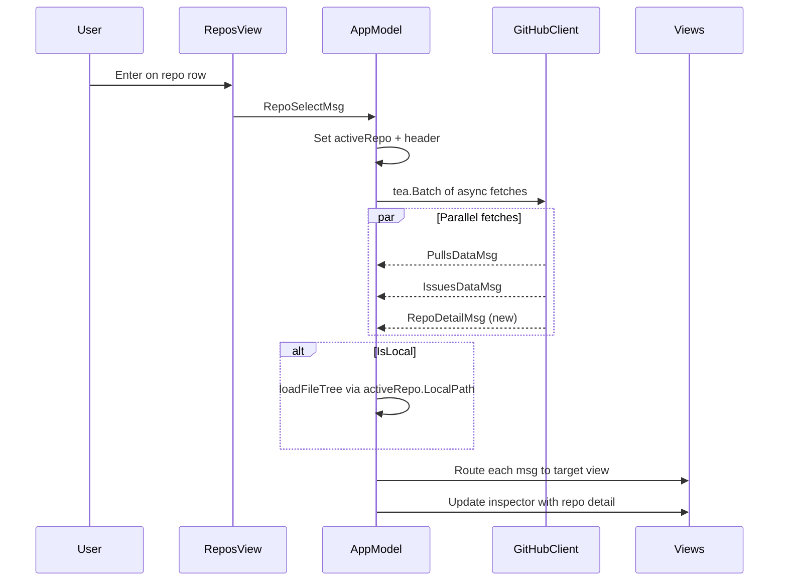

# TUI Data Flow, Inspector Pane and Layout Overhaul

## Problem Analysis

The root cause of most issues is a single line in `app.go`:

```342:358:internal/tui/app/app.go
case views.RepoSelectMsg:
    // ... sets activeRepo, header, chat message ...
    return m, nil    // <--- returns nil command, triggers NO data loading
```

Selecting a repo is **context-only** today. Nothing fetches PRs, issues, file trees, or status data for the newly-selected repository. The inspector pane never receives data because `StatusDataMsg` is only sent at CLI startup (if at all), not on repo selection.

## Architecture: Data Flow After Repo Selection




---

## Phase 1: Wire Data Loading on Repo Selection

**File: [internal/tui/app/app.go](internal/tui/app/app.go)**

### 1a. Add fetch methods

Add three new methods alongside existing `fetchRepos()`:

- `fetchRepoPRs(owner, name string) tea.Cmd` -- calls `ghClient.ListOpenPullRequests` and returns `views.PullsDataMsg`
- `fetchRepoIssues(owner, name string) tea.Cmd` -- calls `ghClient.ListOpenIssues` and returns `views.IssuesDataMsg`
- `fetchRepoDetail(owner, name string) tea.Cmd` -- calls `ghClient.GetRepository` and returns a new `views.RepoDetailMsg` with description, star count, fork count, topics, license, etc.

### 1b. Update RepoSelectMsg handler

Change the handler from `return m, nil` to:

```go
case views.RepoSelectMsg:
    // ... existing activeRepo/header/chat setup ...
    
    var cmds []tea.Cmd
    if m.ghClient != nil && msg.Repo.Owner != "" {
        cmds = append(cmds, m.fetchRepoPRs(msg.Repo.Owner, msg.Repo.Name))
        cmds = append(cmds, m.fetchRepoIssues(msg.Repo.Owner, msg.Repo.Name))
        cmds = append(cmds, m.fetchRepoDetail(msg.Repo.Owner, msg.Repo.Name))
    }
    if msg.Repo.IsLocal && msg.Repo.LocalPath != "" {
        cmds = append(cmds, m.loadFileTree())
    }
    return m, tea.Batch(cmds...)
```

### 1c. Add RepoDetailMsg handling

**File: [internal/tui/views/messages.go](internal/tui/views/messages.go)** -- add `RepoDetailMsg` struct.

**File: [internal/tui/app/app.go](internal/tui/app/app.go)** -- add case for `RepoDetailMsg` that updates the inspector pane with the repo info.

---

## Phase 2: Activate Inspector Pane as Repo Detail Panel

The right panel is always blank because `visible` defaults to `false` and no one toggles it. Transform it into a useful "repo context" panel.

**File: [internal/tui/panes/inspector.go](internal/tui/panes/inspector.go)**

### 2a. Add ModeRepoDetail

Add a new `ModeRepoDetail` (value 0, shifting others) that shows:

- Repo name (bold, primary)
- Description (wrapped, muted)
- Stats row: stars, forks, open PRs, open issues (with emoji)
- Language + license
- Default branch
- Topics (comma-separated)
- Local/remote status

### 2b. Auto-show on repo selection

In `app.go` `RepoSelectMsg` handler, call `m.inspectorPane.SetRepoDetail(detail)` and `m.inspectorPane.SetVisible(true)` so the panel appears when a repo is selected.

### 2c. Make inspector visible on Wide and Standard breakpoints

In [internal/tui/layout/responsive.go](internal/tui/layout/responsive.go), `ShowInspector()` already returns true for Standard+. The issue is that `inspector.IsVisible()` defaults false. Set it to `true` at startup in `New()`, so the right panel always shows on wide enough terminals.

---

## Phase 3: Fix Repos View Scroll and Multi-line Cards

**File: [internal/tui/views/repos.go](internal/tui/views/repos.go)**

### 3a. Fix pgup/pgdown to use viewport height

Change `v.height / 2` to use actual visible list height:

```go
case "pgup":
    pageSize := v.viewportHeight()
    v.cursor -= pageSize
    if v.cursor < 0 { v.cursor = 0 }
case "pgdown":
    pageSize := v.viewportHeight()
    v.cursor += pageSize
    // ... bounds check
```

Add `viewportHeight()` method that computes the same `viewH` logic as Render.

### 3b. Multi-line repo cards (2 lines per repo)

Convert each repo from 1-line to 2-line layout:

- **Line 1**: Name (bold) + language dot + stars + updated + status badge
- **Line 2**: Description (dim, truncated) or "No description" placeholder

This means `viewH` calculation must divide available space by 2 (lines per item), and the `start`/`end` logic must account for 2 lines per repo.

### 3c. Fix selected row visibility

Use `Width(v.width)` only when `v.width > 0`, and ensure the content is pre-truncated to fit within the width so lipgloss doesn't wrap unexpectedly.

---

## Phase 4: Fix F3/Explorer Auto-load

**File: [internal/tui/app/app.go](internal/tui/app/app.go)**

Currently F3 calls `switchView(ViewExplorer)` but does NOT load data. Fix:

```go
case key.Matches(msg, m.globalKeys.SwitchExplorer):
    m.switchView(views.ViewExplorer)
    var cmds []tea.Cmd
    if m.activeRepo != nil && m.activeRepo.IsLocal {
        cmds = append(cmds, m.loadFileTree())
    }
    if m.activeRepo != nil && m.ghClient != nil && m.activeRepo.Owner != "" {
        cmds = append(cmds, m.fetchRepoPRs(m.activeRepo.Owner, m.activeRepo.Name))
        cmds = append(cmds, m.fetchRepoIssues(m.activeRepo.Owner, m.activeRepo.Name))
    }
    return m, tea.Batch(cmds...)
```

---

## Phase 5: Dashboard Overview/Health wiring

The Overview and Health tabs display `RepoSummary` data. Currently `SetSummary()` is only called from the CLI at startup.

**File: [internal/tui/app/app.go](internal/tui/app/app.go)**

Add a `buildRepoSummary(owner, name string) tea.Cmd` that:

1. Uses the GitHub client to fetch basic repo health indicators (combined status, check runs, recent workflow runs)
2. Constructs a `repo.RepoSummary` from the results
3. Returns `views.StatusDataMsg{Summary: summary}`

Call this from the `RepoSelectMsg` handler alongside the other fetches.

---

## Files Changed Summary


| File                                | Changes                                                                                                            |
| ----------------------------------- | ------------------------------------------------------------------------------------------------------------------ |
| `internal/tui/app/app.go`           | Add fetchRepoPRs, fetchRepoIssues, fetchRepoDetail, buildRepoSummary; update RepoSelectMsg handler; fix F3 handler |
| `internal/tui/views/messages.go`    | Add RepoDetailMsg struct                                                                                           |
| `internal/tui/views/repos.go`       | Fix pgup/pgdown viewport; add viewportHeight(); convert to 2-line cards                                            |
| `internal/tui/panes/inspector.go`   | Add ModeRepoDetail; add SetRepoDetail method; render repo detail card                                              |
| `internal/tui/layout/responsive.go` | No changes needed (ShowInspector already works)                                                                    |


Tests to update: app_test.go (RepoSelectMsg now returns commands), repos scroll tests, inspector tests.