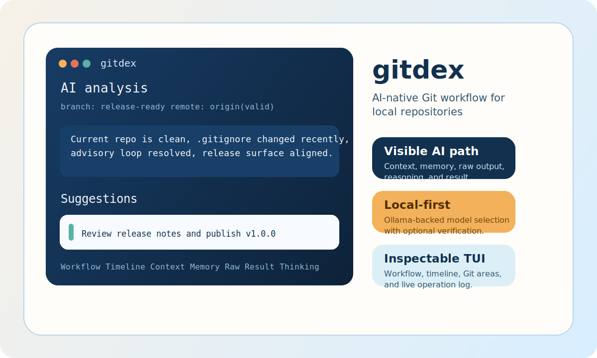
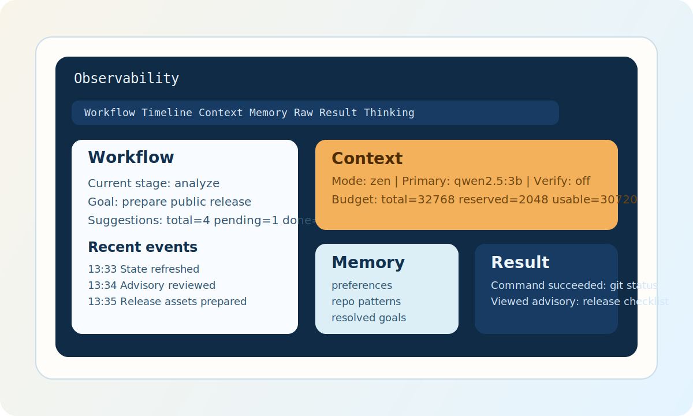
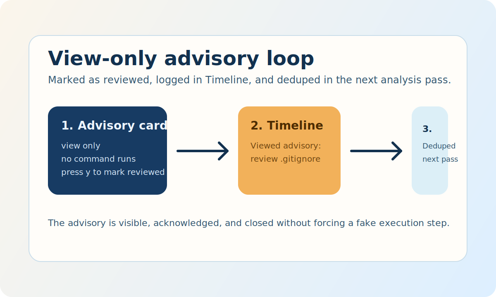

# gitdex

<div align="center">
  
  <p><strong>AI-native Git workflow for local repositories.</strong></p>
  <p>Visible context, memory, raw model output, reasoning, Git state, and execution results in one inspectable TUI.</p>
  <p>
    <a href="https://github.com/Joker-of-Gotham/gitdex/releases"></a>
    <a href="https://github.com/Joker-of-Gotham/gitdex/actions/workflows/ci.yml"></a>
    <a href="https://github.com/Joker-of-Gotham/gitdex/actions/workflows/codeql.yml"></a>
    <a href="LICENSE"></a>
    <a href="https://github.com/Joker-of-Gotham/gitdex/stargazers"></a>
    <a href="https://github.com/Joker-of-Gotham/gitdex/network/members"></a>
  </p>
  <p>
    <a href="docs/GETTING_STARTED.md"></a>
    <a href="docs/README_zh.md"></a>
    <a href="docs/DEPLOYMENT.md"></a>
    <a href="docs/PUBLISHING_TO_GITHUB.md"></a>
  </p>
  <p>
    <a href="README.md"></a>
    <a href="LICENSE"></a>
    <a href="CODE_OF_CONDUCT.md"></a>
    <a href="CONTRIBUTING.md"></a>
    <a href="SECURITY.md"></a>
    <a href="https://github.com/Joker-of-Gotham/gitdex/releases/latest"></a>
  </p>
  <p>
    
    
    
    
    
    
  </p>
</div>

## Start Here

| I want to... | Go to... |
| --- | --- |
| Run gitdex right now | [docs/GETTING_STARTED.md](docs/GETTING_STARTED.md) |
| Read the Chinese overview | [docs/README_zh.md](docs/README_zh.md) |
| Walk through a real TUI session | [docs/OPERATION_DEMO_zh.md](docs/OPERATION_DEMO_zh.md) |
| Understand release and deployment | [docs/DEPLOYMENT.md](docs/DEPLOYMENT.md) |
| Publish `v1.0.0` to GitHub | [docs/PUBLISHING_TO_GITHUB.md](docs/PUBLISHING_TO_GITHUB.md) |

## Repository Guide

| Surface | Purpose |
| --- | --- |
| [README.md](README.md) | Product overview, quick navigation, and current release surface |
| [LICENSE](LICENSE) | MIT terms for reuse and distribution |
| [CODE_OF_CONDUCT.md](CODE_OF_CONDUCT.md) | Community expectations for issues, discussions, and pull requests |
| [CONTRIBUTING.md](CONTRIBUTING.md) | Local setup, quality gate, branch flow, and PR guidance |
| [SECURITY.md](SECURITY.md) | Supported versions and the security reporting path |
| [docs/DEPLOYMENT.md](docs/DEPLOYMENT.md) | GitHub Actions release design, asset layout, and repo settings |
| [docs/PUBLISHING_TO_GITHUB.md](docs/PUBLISHING_TO_GITHUB.md) | Step-by-step publish checklist for this repository |

## Why gitdex

`gitdex` is not a chat box wrapped around Git. It is a local-first Git workbench that keeps the full decision loop visible:

- Repository state is always on screen.
- LLM context partitions and budget are inspectable.
- Memory is persistent, file-backed, and reviewable.
- Raw output, cleaned output, reasoning, and execution results are exposed.
- View-only advisories and executable commands are explicitly separated.
- First-run language selection and runtime switching are built into the TUI.

## Visual Tour

The assets below are safe README placeholders today. You can replace the SVG files in [`docs/assets/`](docs/assets) with real product captures later without touching the README layout.

| Main Surface | Observability Inspector | Advisory Flow |
| --- | --- | --- |
|  |  |  |
| Suggestions, Git areas, and the operation log stay in one working surface. | Workflow, timeline, context, memory, raw output, result, and thinking panels stay inspectable. | View-only advice is marked as reviewed instead of pretending to run a command. |

## Product Snapshot

| Surface | Why it matters |
| --- | --- |
| Language selection on first run | The product is usable immediately instead of assuming one locale forever. |
| Inspectable AI path | You can see what the model saw, what it returned, and what was executed. |
| Advisory deduplication | View-only suggestions stop looping after review. |
| Release-ready repository | CI, CodeQL, release assets, community files, and deployment docs are aligned. |

## What Ships Today

| Area | What you can inspect |
| --- | --- |
| Git state | Working tree, staging area, branch, upstream, remotes, stash, and selected repository metadata |
| AI pipeline | Context budget, prompt partitions, knowledge hits, recent operation injection, raw output, cleaned output, and verifier feedback |
| Workflow | Current stage, active goal, pending suggestions, execution state, and recent events |
| Memory | Repo memory path, update time, preferences, repo patterns, resolved goals, and session goal history |
| Interaction | Advisory, command, file-write, and fill-in suggestions with explicit handling and logs |
| Runtime setup | First-run language selection, model selection, and runtime language switching with `L` |

## Release And Deployment

- Every `v*` tag triggers a GitHub Actions release pipeline.
- The release job builds `windows-amd64`, `windows-arm64`, `linux-amd64`, `linux-arm64`, `macos-amd64`, and `macos-arm64`.
- The GitHub release uploads raw binaries, `gitdex-source.zip`, and `checksums.txt`.
- CI runs `go vet`, `go test`, `go build`, lint, and a dedicated race-test job.
- CodeQL runs on pushes, pull requests, and a weekly schedule.

## Quick Start

Requirements:

- Git
- Go
- One AI provider:
- Ollama with at least one local model, for example `qwen2.5:3b`
- Or OpenAI / DeepSeek credentials plus a configured model name

Run from source:

```bash
go run ./cmd/gitdex
```

Build and run on macOS or Linux:

```bash
make test
make build
./bin/gitdex
```

Build and run on Windows:

```powershell
.\build.ps1 -Target test
.\build.ps1 -Target build
.\bin\gitdex.exe
```

## First 3 Minutes

1. Start `gitdex` inside a real Git repository.
2. Choose your UI language on first launch.
3. If you use a local provider, pick a primary model and optionally a verifier model. If you use OpenAI or DeepSeek, configure the model in `.gitdexrc` or `GITDEX_*` env vars first.
4. Press `o` or `O` to cycle `Workflow`, `Timeline`, `Context`, `Memory`, `Raw`, `Result`, and `Thinking`.
5. Use `[` and `]` to switch scroll focus between the main column, Git Areas, and Observability. Use mouse wheel or `up/down/pgup/pgdn` to scroll the active pane.
6. Press `g` to set a goal or `f` to choose a workflow.
7. Accept a suggestion with `y` and verify the result appears in `Timeline` and `Result`.
8. Press `L` any time to reopen language settings.

## Keyboard Shortcuts

- `y`: accept current suggestion
- `n`: skip current suggestion
- `w`: show or collapse explanation
- `z`: switch focus/full AI mode
- `r`: refresh state and re-analyze
- `l`: expand or collapse the operation log
- `g`: set active goal
- `f`: choose a workflow goal
- `L`: reopen language settings
- `o` / `O`: cycle observability inspectors
- `[` / `]`: switch scroll focus across panes
- `up` / `down` / `PgUp` / `PgDn`: scroll the focused pane
- `t`: toggle reasoning panel
- `Tab` / `Shift+Tab`: move across suggestions
- `q`: quit

## Documentation

- [Chinese overview](docs/README_zh.md)
- [Getting started from zero](docs/GETTING_STARTED.md)
- [Getting started in Chinese](docs/GETTING_STARTED_zh.md)
- [Operation demo](docs/OPERATION_DEMO_zh.md)
- [Deployment design](docs/DEPLOYMENT.md)
- [Deployment design in Chinese](docs/DEPLOYMENT_zh.md)
- [Publishing to GitHub](docs/PUBLISHING_TO_GITHUB.md)
- [Publishing guide in Chinese](docs/PUBLISHING_TO_GITHUB_zh.md)

## Configuration

Primary config locations:

- Project: `.gitdexrc`
- Global on Linux/macOS: `~/.config/gitdex/config.yaml`
- Global on Windows: `%AppData%\gitdex\config.yaml`
- Environment variables: `GITDEX_*`

Compatibility reads remain enabled for:

- `.gitmanualrc`
- legacy global `gitmanual` config directory
- legacy home memory file under `.gitmanual/`
- legacy env prefix `GITMANUAL_*`

See [configs/example.gitdexrc](configs/example.gitdexrc) for a project-level example.

Minimal cloud-provider examples:

```yaml
llm:
  provider: "openai"
  endpoint: "https://api.openai.com/v1"
  api_key_env: "OPENAI_API_KEY"
  primary:
    provider: "openai"
    model: "gpt-4.1-mini"
    enabled: true
```

```yaml
llm:
  provider: "deepseek"
  endpoint: "https://api.deepseek.com"
  api_key_env: "DEEPSEEK_API_KEY"
  primary:
    provider: "deepseek"
    model: "deepseek-chat"
    enabled: true
```

## Forking And Module Path

This repository is aligned to:

```text
github.com/Joker-of-Gotham/gitdex
```

If you fork it under a new owner, use one of the helper scripts:

```powershell
.\scripts\set-module-path.ps1 -ModulePath github.com/<your-user-or-org>/gitdex
```

```bash
./scripts/set-module-path.sh github.com/<your-user-or-org>/gitdex
```

## Repository Layout

```text
cmd/gitdex/                 application entrypoint
configs/                    default and example config
docs/                       user-facing docs and README assets
internal/app/               bootstrap and dependency wiring
internal/config/            config loading, validation, legacy-compatible persistence
internal/engine/            analysis pipeline, parsing, verification, execution helpers
internal/git/               Git types, parsers, status watcher, CLI integration
internal/i18n/              locale loading
internal/llm/               provider abstraction, Ollama/OpenAI/DeepSeek clients, prompts, response cleanup
internal/memory/            persistent repository memory
internal/platform/          GitHub/GitLab/Bitbucket collection
internal/tui/               Bubble Tea UI and observability panels
scripts/                    local build and release helper scripts
test/                       regression coverage
```
