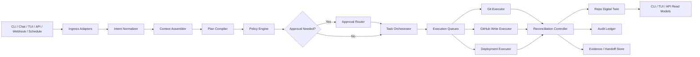
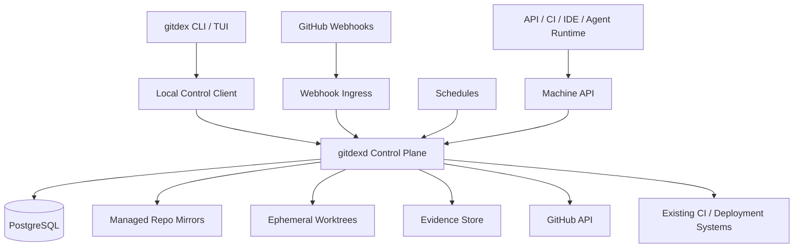
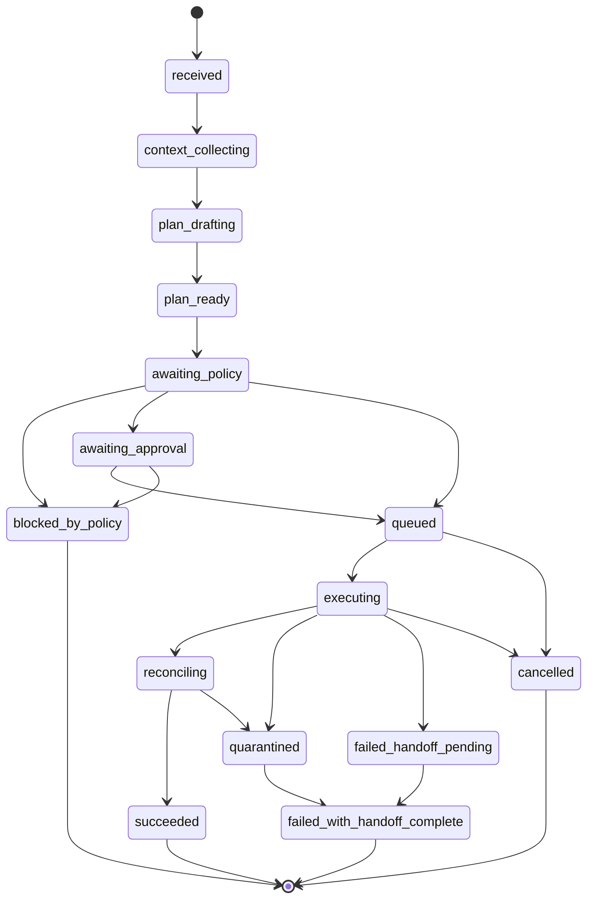

# Architecture Decision Document

Gitdex 的目标不是再做一个“会调用 GitHub API 的 CLI”，而是做一个 `terminal-first operator surface + daemon-first governed control plane`。本架构文档将其作为一个长期运行、受治理、可审计、可接管、支持多仓库 campaign 的仓库自治运维系统来设计。

## Project Context Analysis

### Requirements Overview

**Functional Requirements:**

PRD 共定义 `50` 条功能需求，按架构影响可分为 `7` 组：

1. `FR1-FR6` Operator Interaction & Context Assembly  
   这组需求要求 Gitdex 同时支持显式命令与自然语言聊天，并能把本地 Git、远程仓库、协作对象和自动化状态汇总成同一个可解释的上下文视图。  
   架构含义：需要一个统一上下文装配层，而不是 CLI、TUI、chat 各做一套查询逻辑。

2. `FR7-FR13` Planning & Governed Execution  
   所有可能产生写副作用的请求，都必须先进入结构化执行计划，再经过策略判定、审批与审计。  
   架构含义：需要显式 `typed plan compiler`、`policy engine`、`approval router`、`task state machine` 和 `audit lineage`。

3. `FR14-FR22` Repository & Collaboration Operations  
   Gitdex 既要管理本地仓库与 Git 事务，也要管理 issue、PR、comment、workflow、deployment 等 GitHub 对象。  
   架构含义：必须分离本地 Git 执行域与远程 GitHub 执行域，并提供跨对象的统一任务编排。

4. `FR23-FR29` Autonomous Operations & Task Lifecycle  
   Gitdex 要支持计划任务、事件触发、后台运行、暂停/恢复/接管、失败恢复和 handoff。  
   架构含义：产品本质上是一个有持久任务状态和后台调度能力的控制平面，而不是一次性命令工具。

5. `FR30-FR36` Governance, Security & Audit  
   授权范围、审批策略、风险层级、数据处理规则、kill switch 和完整审计链都必须显式化。  
   架构含义：需要单独的权限/信任平面，不能把这些逻辑散落在命令处理器里。

6. `FR37-FR43` Multi-Repository Governance & Integrations  
   Gitdex 需要治理两仓库及以上的 campaign，并对外提供机器接口供 CI、IDE、agent runtime 和内部工具消费。  
   架构含义：需要 campaign controller、共享 contracts、API surface 和 installation/repository scope 的隔离模型。

7. `FR44-FR50` Configuration, Onboarding & Operator Enablement  
   首次 setup、全局/仓库/会话级配置、JSON/YAML 输出、跨平台 shell 体验和可导出 handoff/report 都是首发要求。  
   架构含义：CLI/TUI 不只是展示层，还要承担 setup、discoverability、输出协议和跨 shell 一致性职责。

**Non-Functional Requirements:**

PRD 定义了 `37` 条可测量 NFR，决定了 Gitdex 不能采用“提示词加脚本”的轻量架构：

- 性能：读类查询 `P95 <= 5s`，计划生成 `90% <= 60s` 且 `P95 <= 90s`，策略评估与 dry-run `P95 <= 10s`。
- 可靠性：正式支持操作集合的最终成功收敛率 `>= 95%`，`100%` 任务必须收敛到显式终态，handoff pack `<= 60s` 可用。
- 控制：pause/cancel/kill switch `<= 30s` 生效；状态漂移 `<= 15 min` 被 reconciliation 发现并恢复到可解释状态。
- 治理：`100%` 受治理写操作必须先生成结构化计划并做策略评估；`100%` 高风险动作必须被审批、明确自动许可，或被拒绝并记录。
- 安全：默认正式部署不得依赖长期 PAT；严重误操作事故目标为 `0`；`100%` 安全相关事件进入安全日志。
- 审计：`100%` 受治理写操作保留完整审计链；`100%` 任务、计划、审批、策略判断和安全事件带 correlation ID / task ID。
- 容量：Phase 1 支持单租户 `50` 个活跃受管仓库、单次 campaign `20` 个仓库、至少 `100` 个并发追踪任务。
- 兼容性：Windows / Linux / macOS 三端 Phase 1 核心闭环全可用；text-only 模式必须完整支持核心 operator 流程。

**Scale & Complexity:**

- Primary domain: `terminal-native repository operations control plane`
- Complexity level: `high`
- Estimated major architectural subsystems: `18`

高复杂度来自六个叠加因素：

1. 同时处理本地 Git 状态、远程 GitHub 状态、后台任务状态和审计状态。
2. 同时支持命令、聊天、TUI、API、webhook、schedule 六类入口。
3. 需要显式治理高风险副作用，而不是直接调用执行器。
4. 需要把单仓库流程和多仓库 campaign 放在同一个状态机体系内。
5. 需要跨 Windows / Linux / macOS 保持核心操作模型一致。
6. 需要在 7x24 后台运行的同时保证可接管、可恢复、可审计。

### Technical Constraints & Dependencies

- Gitdex 必须是 `terminal-first, daemon-backed, service-first` 系统；CLI/TUI 不是系统全貌。
- 命令与聊天是并列入口，但不是并列权限；聊天只能提出意图，不能绕过结构化计划。
- 核心维护闭环不得要求浏览器作为唯一入口。
- 所有对外结构化工件都必须支持 `human-readable text + JSON/YAML + audit/report/handoff artifacts`。
- 默认机器身份必须是 `GitHub App`，而不是长期 PAT。
- Git 侧执行必须采用 `git worktree` 隔离，不在共享工作区直接复用高风险任务。
- GitHub 集成必须 `webhook-first + async processing + reconciliation-only polling`。
- deployment 必须通过现有 CI/CD 与 environment gate 推进，不能在 Phase 1 默认持有直接云控制权。
- 必须尽早建立外部审计归档，因为 GitHub audit retention 有天然上限。
- UX 约束要求 rich TUI 与 text-only 模式共享同一信息层级和状态语义。

### Cross-Cutting Concerns Identified

- Identity and permission brokerage
- Structured plan compilation and deterministic validation
- Policy evaluation and approval routing
- Durable task orchestration and reconciliation
- Repo digital twin and current-state projections
- Evidence packaging and audit ledger integrity
- Blast-radius control for multi-repo campaign execution
- Human takeover and handoff ergonomics
- Cross-platform terminal semantics normalization
- Versioned machine contracts for CLI, API, CI, IDE, and agent integrations

## Starter Template Evaluation

### Primary Technology Domain

Gitdex 的基础工程域不是普通“单进程 CLI”，而是：

`cross-platform terminal operator + background control plane + typed contracts + repository execution runtime`

这决定了 starter 不是只看谁更快出命令，而是看谁更适合：

- 长期维护的控制系统
- 跨平台终端产品
- 同仓库内承载 CLI/TUI、daemon、HTTP/webhook ingress、shared contracts
- 为 AI agent 保持清晰、低歧义的目录和边界

### Starter Options Considered

**Option A: `create-turbo` + `oclif` (TypeScript/Node workspace)**

- 官方依据：
  - Turborepo 官方文档提供 `pnpm dlx create-turbo@latest`
  - oclif 官方文档提供 CLI 生成能力，且 `@oclif/core v4.0` 已发布
- 优点：
  - monorepo、shared contracts、JSON 工件、开发体验成熟
  - chat/LLM/provider adapter 接入门槛低
  - 适合后续 IDE、CI、agent runtime 一体化
- 缺点：
  - 对 terminal-native 交互和单文件分发不如 Go 自然
  - daemon + CLI + TUI 的长期运行内存占用和运行时复杂度更高
  - 对“像 lazygit / gh-dash 一样稳定、快速、轻依赖”的产品调性不占优

**Option B: blank Go module + 手工搭仓库**

- 官方依据：Go 官方稳定发布节奏明确，当前稳定版本为 `Go 1.26.1`
- 优点：
  - 最灵活，最少历史包袱
  - 天然适合单二进制、跨平台、后台服务和终端产品
- 缺点：
  - 初始命令树、help、completion、配置发现、命令骨架全部要手工写
  - 对多 agent 协作实现不够友好，早期容易因目录和命名风格不统一而发散

**Option C: `cobra-cli` 初始化 Go workspace，后续补充 TUI/runtime 组件**

- 官方依据：
  - Cobra 官方 README 提供 `go install github.com/spf13/cobra-cli@latest`
  - `cobra-cli init` 可生成命令树骨架，并原生支持 shell completion
  - Bubble Tea 官方仓库已稳定进入 `v2` 线，适合 terminal-native TUI
- 优点：
  - 最符合 `all in terminal` 与跨平台单二进制分发目标
  - 命令树、help、completion、配置接线和后台命令入口都有清晰起点
  - 与 `lazygit`、`gh-dash` 这类高质量终端产品的工程形态更接近
  - Go 的并发、部署、运行时一致性更适合承载安全关键控制平面
- 缺点：
  - 没有像 create-turbo 那样现成 monorepo“豪华骨架”
  - LLM provider / web SDK 生态没有 TS 那么肥
  - 需要架构上明确区分 safety-critical core 与 provider adapter，防止后续塞入过多临时脚本

### Selected Starter: Cobra-Based Go Workspace Foundation

**Selection rationale:**

Gitdex 首发的第一优先级不是“更快接入更多前端或 AI SDK”，而是：

- 终端主体验质量高
- 后台控制平面可靠
- 跨平台安装与运行形态清晰
- 目录和边界足够稳定，便于后续多 agent 一致实现

因此，选择 `Option C` 作为基础工程方向：

- **Primary implementation language:** `Go 1.26.1`
- **CLI foundation:** `Cobra v1.10.2`
- **TUI foundation:** `Bubble Tea v2`（不作为 starter 直接生成，而作为第一批架构性依赖引入）
- **Persistence baseline:** `PostgreSQL 17.x` 作为参考生产基线，兼容 `18.x`

这里的关键判断是：Gitdex 的核心是一个安全关键的自治控制系统，核心 runtime 更适合使用单语言、单仓库、强类型、低部署摩擦的 Go 形态；而 LLM/provider 侧能力通过清晰 adapter 层吸纳，而不是反过来主导底座语言。

**Initialization commands:**

```bash
mkdir gitdex
cd gitdex
go mod init github.com/your-org/gitdex
go install github.com/spf13/cobra-cli@latest
cobra-cli init --viper
```

**Architectural decisions provided by starter:**

**Language & Runtime**

- Go 单语言底座
- 编译产物适合 `gitdex` 与 `gitdexd` 双入口
- 减少跨语言核心域漂移

**Command System**

- 子命令树天然支持 `gitdex repo`, `gitdex plan`, `gitdex task`, `gitdex audit`, `gitdex campaign`, `gitdex daemon`
- 自动 help、shell completion、man page 支持

**Configuration**

- `--flag + env + config file` 的连接方式清晰
- 适合后续做 `global + repo + session + env` 四层配置叠加

**Build Tooling**

- Go 官方工具链足以支持 build/test/lint/release
- 更适合 Phase 1 做稳定收敛，而不是引入过多工具链层

**Code Organization**

- 可直接采用 `cmd/`, `internal/`, `pkg/`, `test/`, `migrations/`, `schema/` 的标准布局
- 有利于后续把控制平面、执行平面、权限平面做清晰物理隔离

**Development Experience**

- 本地运行、CI、跨平台构建和静态分析路径统一
- 更适合后续生成单文件分发包、签名包和 self-hosted agent runtime

**Note**

starter 只负责“底座和命令骨架”，不负责“高风险自治系统的治理结构”。  
真正决定 Gitdex 质量的是下面的核心架构决策。

## Core Architectural Decisions

### Decision Priority Analysis

**Critical Decisions (Block Implementation):**

- 使用 `Go + Cobra` 作为 CLI/daemon 统一底座
- 使用 `GitHub App` 作为默认机器身份
- 使用 `PostgreSQL` 作为系统记录源，承载任务状态、事件日志、审计索引和当前态投影
- 使用 `git worktree` 作为 Git 侧隔离执行单元
- 所有写动作都必须经过 `typed plan -> policy -> approval -> execution -> reconciliation`
- 执行域必须拆分为 `git executor`、`github write executor`、`deployment executor`
- 采用 `single-writer-per-repo-ref` 并发模型
- deployment 只通过受治理流水线推进，不直接持有云 root 级长期凭证

**Important Decisions (Shape Architecture):**

- rich TUI 使用 `Bubble Tea v2`，text-only 模式保持语义等价
- GitHub 读路径 `GraphQL-first for aggregate reads`，写路径 `REST-first for mutations`
- 使用 `event envelope + inbox/outbox + idempotency keys` 的事件模式
- 本地与远程 repo 状态通过 `repo digital twin` 统一建模
- 通过 `policy bundles + capability grants + mission windows` 产品化权限模型
- 使用 `append-only audit ledger + evidence store + handoff pack`

**Deferred Decisions (Post-MVP):**

- 真正的多租户 SaaS 隔离
- 非 GitHub forge 支持
- 企业 SSO/SAML/GHES 私网一体化
- 外部消息中间件替换 Postgres 内部队列
- 直接云资源编排而非治理现有 deployment pipeline

### System Overview



**Top-level architecture style:** `modular monolith control plane with isolated effect executors`

不是微服务优先，而是高边界模块化优先：

- Phase 1 使用单仓库、单代码库、单逻辑控制平面
- 通过清晰模块边界保证未来可拆分
- 避免过早引入分布式系统复杂度，先把治理、状态机、审计、恢复做扎实

### Architecture Planes

#### 1. Control Plane

控制平面负责做决定，不直接产生副作用。

包含模块：

- `ingress adapters`
  - CLI/command
  - chat input
  - TUI actions
  - webhook ingress
  - schedule trigger
  - machine API
- `context assembler`
  - 收集本地 Git 状态、GitHub 对象、规则集、环境配置、历史审计、最近任务状态
- `plan compiler`
  - 把命令或自然语言意图编译为结构化计划
  - LLM 只参与建议和起草，最终计划必须过 deterministic schema + validator
- `policy engine`
  - 结合 capability grant、repo classification、risk tier、mission window、budget 做决策
- `approval router`
  - 将高风险计划路由到 repo owner、security approver、release manager
- `task orchestrator`
  - 驱动任务状态机
  - 把计划拆成 effect-specific job
- `campaign controller`
  - 管理多仓库分波次执行、逐仓库排除、局部暂停和 partial success
- `reconciliation controller`
  - 对账 Git、GitHub、deployment 状态
  - 负责 drift 检测、补偿和状态回收

#### 2. Execution Plane

执行平面只负责按批准的计划执行副作用，不做最终授权判断。

子执行域：

- `git executor`
  - clone/fetch
  - worktree create/dispose
  - diff/patch/apply
  - branch choreography
  - rebase/merge simulation
- `github read adapter`
  - GraphQL 聚合读
  - REST 补充读
  - rate budget accounting
- `github write executor`
  - issue / PR / comment / label / workflow dispatch / checks / deployment intent
- `deployment executor`
  - 不直接发布云资源
  - 负责触发/推进现有 pipeline 与 environment gate
- `artifact collector`
  - 收集 patch preview、diff、policy result、test output、workflow refs、deployment refs

执行平面规则：

- 执行器不能绕开 policy engine
- 执行器不能自己决定 scope 扩大
- 不同 effect domain 之间不共享最高权限上下文
- 所有执行都必须带 `task_id`, `attempt_id`, `correlation_id`

#### 3. Permission & Trust Plane

权限平面是 Gitdex 的第一层产品能力，不是基础设施附属品。

核心原语：

- `GitHub App` installation token 作为默认机器身份
- workflow/job 级 `GITHUB_TOKEN` 作为受限执行子身份
- `OIDC` 或等价 broker 作为云端短时凭证来源
- capability grants 高于原始 GitHub permission 暴露给产品层
- repo classification 驱动 policy bundle
- mission window 限制某段时间内某类任务权限
- layered kill switch
  - task-level
  - repository-level
  - installation/fleet-level

核心原则：

- 默认最小权限
- 默认短时令牌
- 默认安装级隔离
- 默认不能修改自身治理核心

#### 4. State, Audit & Evidence Plane

Gitdex 需要同时持有“当前状态”和“可追溯历史”。

系统记录源：

- `PostgreSQL`
  - tasks
  - task_events
  - plans
  - approvals
  - policies_evaluated
  - repo_projections
  - campaign_runs
  - execution_attempts
  - audit_records
  - integration_deliveries

外部或本地工件存储：

- evidence bundle
- handoff pack
- exported reports
- diff/patch snapshots
- workflow and deployment reference snapshots

状态建模原则：

- 当前态通过 projection 提供快速查询
- 历史态通过 append-only event log 保留可追溯性
- 不对 audit ledger 做“就地改写”

#### 5. Operator Experience Plane

操作体验平面不是单纯 UI，而是面向不同操作模式的同一语义层。

- `command mode`
  - 精确、可脚本化、适合自动化和 CI
- `chat mode`
  - 解释、探索、提出意图、审查计划
- `TUI cockpit`
  - 持续观察、审批、接管、campaign 编排
- `text-only mode`
  - 与 rich TUI 保持同一能力集

所有模式都读取同一任务状态和计划结构，不允许各自产生不同治理语义。

### Core Runtime Topology

#### Logical Topology



#### Deployment Topologies

**Topology A: Local workstation mode**

- `gitdex` 与 `gitdexd` 在同一开发机上运行
- 适合 solo maintainer 与个人仓库
- evidence store 可先落本地文件系统
- PostgreSQL 可本机或本地容器

**Topology B: Single-tenant team mode**

- `gitdexd` 独立部署
- 操作员使用本地 CLI/TUI 连接
- webhook ingress 对外暴露
- PostgreSQL 与 evidence store 独立持久化
- 受管 repo 镜像与 worktree 在专用执行节点或同机卷上

**Topology C: Enterprise self-hosted mode**

- control plane、worker、DB、object store 独立部署
- installation / org / business unit 做治理边界
- 审计对接外部 sink / SIEM
- 仍然保持逻辑单租户或强隔离租户单元，不做 Phase 1 多租户 SaaS

### Data Architecture

#### Canonical Data Stores

**PostgreSQL**

用于：

- durable task state
- orchestration metadata
- event log
- projections
- approvals
- audit index
- rate budget state

选择理由：

- 事务性强，适合承载计划、审批、状态机与审计的强一致核心
- 能同时承载 inbox/outbox、锁、投影和报表索引
- Phase 1 可减少消息中间件数量，降低运维面

**Managed Repo Mirror Store**

用于：

- 每个受管仓库保留一个 Git mirror
- 支持后台 fetch、replay、worktree 派生

规则：

- 背景自治任务不直接在开发者活 checkout 上运行
- worktree 从 mirror 或受控 attached repo 派生

**Evidence Store**

用于：

- plan snapshots
- patch previews
- handoff packs
- exported audit bundles
- workflow and deployment reference snapshots

#### Repo Digital Twin

repo digital twin 不是简单缓存，而是面向控制平面的一致状态视图。

至少跟踪：

- local repo status or managed mirror status
- tracked branches and divergence
- open PRs / linked issues
- workflow runs and latest checks
- deployment and environment state
- latest policy bundle and repo classification
- open tasks affecting this repo
- last known drift markers

### Git Execution Architecture

#### Worktree Model

所有真正的 Git 写任务都必须在独立 worktree 内运行。

规则：

- 每个 `task_id + repo_id + target_ref` 默认创建独立 worktree
- worktree 必须可重建
- task 结束后，成功归档元数据并清理 worktree；失败则保留到 quarantine/handoff 决策
- 对 attached local repo 的改动，只能在用户显式允许的模式下进行，并需要工作树锁

#### Single Writer Rule

Gitdex 强制 `single-writer-per-repo-ref`：

- 同一个 repo 的同一个目标 ref 不允许多个 mutative task 并发执行
- 允许并发读与不同 ref 上的受控并发写
- campaign fan-out 时按 repo/ref 分区排队

#### Git Change Pipeline

```mermaid
flowchart LR
    A[Fetch / Mirror Sync] --> B[Create Worktree]
    B --> C[Collect Current Diff/State]
    C --> D[Compile Patch or Git Action Plan]
    D --> E[Dry-run / Simulation]
    E --> F[Policy Checks]
    F --> G[Execute Git Action]
    G --> H[Run Validation / Tests]
    H --> I[Reconcile Branch and PR State]
    I --> J[Archive Evidence]
```



#### Rollback Semantics

Gitdex 不把“回滚”简化为一个 Git 命令。

分四类：

1. `discard`
   - 尚未发布的本地 worktree 改动，直接销毁 worktree
2. `revert`
   - 已提交但未合并的分支变更，可生成显式 revert commit 或新计划
3. `compensation`
   - 已写入 GitHub 对象或 workflow/deployment 状态时，执行补偿动作，而不是假装完全撤销
4. `handoff`
   - 当自动补偿无法保证正确性时，生成 handoff pack 交由人工接管

### GitHub Integration Architecture

#### Identity Model

- Primary machine identity: `GitHub App installation token`
- Secondary delegated identity: `GitHub App user token`，仅在需要“代表用户执行”的狭窄场景
- Workflow sub-identity: `GITHUB_TOKEN`
- Cloud access identity: `OIDC short-lived token`

#### Read / Write Split

**GraphQL-first for aggregate reads**

适用：

- cockpit summary
- issue/PR matrix views
- campaign dashboard
- multi-object context assembly

**REST-first for mutations**

适用：

- create/update issue
- create/update PR
- comments/reviews/labels
- workflow dispatch
- deployment status / intent writes

原因：

- GraphQL 适合聚合读，但 mutation 风险控制和部分资源写操作用 REST 更清晰
- 与 GitHub 速率限制和 secondary rate limit 策略更容易配合

#### Webhook Model

- webhook 只做接收、验签、去重、持久化与快速 ack
- 不在 handler 线程内执行长任务
- 每个 delivery 进入 `event envelope`
- envelope 通过 inbox 去重后交给 orchestrator
- polling 只用于 reconciliation，不作为主触发模式

#### GitHub Rate Governance

GitHub 官方建议：

- 避免高并发
- mutative request 之间至少间隔 `1` 秒
- 使用 webhook 替代高频 polling

因此 Gitdex 采用：

- installation-scoped rate budget
- effect-specific write queues
- write pacing
- secondary-rate-limit backoff
- reconciliation throttle

### LLM and Cognitive Architecture

Gitdex 不是通用 AI coding agent，因此 LLM 只能处于认知平面，不能直接进入执行平面。

#### Allowed LLM Responsibilities

- 自然语言意图解析
- issue/PR/comment triage 与总结
- 结构化计划草案生成
- 风险解释文案生成
- handoff pack 和 report 草案生成
- repo/project context compression

#### Forbidden LLM Responsibilities

- 直接调用高权限执行器
- 自行修改 policy bundle
- 绕过 deterministic validator 写出最终计划
- 决定审批已满足但不保留证据

#### LLM Safety Boundary

LLM 输出必须经过：

1. schema validation
2. policy capability check
3. target scope validation
4. risk scoring
5. plan normalization
6. approval routing if needed

也就是说，LLM 负责“建议什么”，控制平面负责“是否允许做、按什么步骤做、如何追责”。

### Policy, Risk, and Approval Architecture

#### Policy Bundles

policy bundle 是 Gitdex 的一等工件，版本化、可审查、可回滚。

包含：

- capability grants
- protected targets
- approval rules
- risk scoring thresholds
- mission windows
- data handling rules
- allowed execution modes
- deployment guardrails

#### Risk Model

风险评分至少由以下因素组成：

- effect type
- target scope
- repo classification
- protected branch/environment hit
- historical failure rate
- blast radius
- concurrent related tasks
- current mission window

#### Approval Routing

审批不是二元开关，而是路由系统：

- repo owner approval
- security approval
- release approval
- quorum approval
- wait timer
- prevent self-review

审批输出也必须进入事件流和审计链。

### Task Lifecycle & State Machine

#### Task State Machine



#### Campaign State Model

campaign 是任务之上的编排层：

- `draft`
- `plan_ready`
- `awaiting_approval`
- `wave_running`
- `partially_blocked`
- `paused`
- `completed`
- `completed_with_exceptions`
- `terminated_with_handoff`

campaign 不允许只支持“全局成功 / 全局失败”。  
必须原生支持 partial success 和 per-repo intervention。

### Recovery, Reconciliation, and Compensation

#### Failure Handling Modes

- `retry`
  - 仅对瞬态故障生效，如 rate limit、短暂网络失败
- `reconcile`
  - 针对 webhook 丢失、乱序、外部状态变化
- `quarantine`
  - 状态可疑但不适合继续执行
- `compensate`
  - 对远程副作用执行补偿
- `handoff`
  - 生成可接管包并明确停在安全终态

#### Handoff Pack Minimum Fields

- trigger source
- task scope
- target repo/ref/object IDs
- current state
- last successful step
- failing or blocking step
- related approvals and policy result
- relevant evidence links
- recommended next action
- safe/unsafe operations from this point

#### Reconciliation Rules

reconciliation controller 定期或事件驱动检查：

- repo mirror vs target branch divergence
- PR open/closed/merged state
- workflow run and check suite state
- deployment requested vs actually approved/promoted
- orphaned worktree or stuck queue item
- audit chain completeness

### Deployment Governance Architecture

Gitdex 在 Phase 1 不是新的 CD 引擎，而是 deployment governance plane。

#### Phase 1 Deployment Boundary

Gitdex 负责：

- 汇总 deployment readiness
- 生成 deployment intent
- 检查 environment rules
- 触发或推进现有 pipeline
- 等待 required reviewers / custom protection
- 跟踪结果并归档证据

Gitdex 不负责：

- 默认直接持有云 root 凭证
- 绕开 GitHub environments 直接上线
- 未审计地改写 deployment protection rules

#### Deployment Executor Rules

- 只能通过受支持 pipeline adapter 推进
- 只能使用短时云凭证
- 必须记录 approval lineage
- 失败后必须进入 compensation or handoff，而不是无限重试

### API & Integration Architecture

#### External Machine Interfaces

Gitdex 对外提供两个层级的接口：

1. `CLI contracts`
   - 供脚本、CI、本地自动化直接调用
2. `HTTP/JSON control-plane API`
   - 供 IDE、agent runtime、internal tooling、campaign orchestrator 调用

#### Contract Principles

- 所有 machine-readable artifacts 都有版本化 schema
- CLI JSON/YAML 与 HTTP payload 共用同一 contract model
- 任务、计划、审计、handoff、campaign 统一使用稳定 ID 命名体系
- 不允许 CLI 和 API 输出语义漂移

#### Integration Boundary

集成者能做的是：

- 提交 structured intent
- 查询任务状态
- 拉取 plan/report/handoff artifacts
- 订阅受支持事件

集成者不能做的是：

- 绕过 policy 直接调用执行器
- 写入内部状态表
- 伪造审批完成

### Observability & Audit Architecture

#### Telemetry Layers

- `logs`
  - 结构化 JSON logs
- `metrics`
  - queue depth
  - task duration
  - approval latency
  - rate budget
  - reconciliation lag
- `traces`
  - event -> plan -> execution -> reconciliation 链路
- `audit ledger`
  - 面向追责、复盘、证据导出

#### Audit Record Minimum Fields

- audit_id
- task_id
- correlation_id
- trigger_source
- actor_type
- actor_id
- scope
- plan_hash
- policy_result
- approval_state
- effect_domain
- outcome_state
- timestamps
- evidence_refs

### Decision Impact Analysis

**Implementation sequence:**

1. 初始化 Go workspace 与双入口骨架
2. 建立 shared contracts、config、logging、ID 和 audit primitives
3. 上线 Postgres state store、task event log、health/readiness
4. 上线 GitHub App identity、webhook ingress、read-only repo summary
5. 上线 typed plan compiler、policy engine、task state machine
6. 上线 git worktree execution 和低风险 repo operations
7. 上线 GitHub collaboration writes、handoff pack、audit exports
8. 上线 campaign controller、per-repo wave execution 和 operator takeover
9. 最后接入 deployment governance

**Cross-component dependencies:**

- plan compiler 依赖 context assembler 和 contract schemas
- policy engine 依赖 repo classification、capability grants 和 risk model
- executors 依赖 orchestrator 分配的 task envelope，而不是直接接收用户输入
- audit ledger 依赖所有关键模块统一 correlation ID
- TUI/CLI/API 依赖同一 read model，不单独访问底层状态表

## Implementation Patterns & Consistency Rules

### Pattern Categories Defined

Gitdex 至少有 `11` 类高风险一致性冲突点：命名、命令、配置、数据库、事件、状态、输出格式、错误处理、审计记录、目录结构、执行流程。

### Naming Patterns

**Command Naming**

- 命令使用 `lowercase kebab-case`
- 一级命令按对象或动作域组织：
  - `gitdex repo`
  - `gitdex plan`
  - `gitdex task`
  - `gitdex audit`
  - `gitdex campaign`
  - `gitdex daemon`
- 子命令遵循 `verb-noun` 或 `object-verb`

**Go Package Naming**

- 包名使用短小、全小写、单词化命名
- 优先领域名而不是技术名：
  - `policy`
  - `planning`
  - `orchestrator`
  - `audit`
- 禁止同层多个近义包并存，如 `planner`, `planning`, `planutil`

**File Naming**

- Go 文件使用 `snake_case.go`
- 处理器与服务文件使用职责命名：
  - `task_service.go`
  - `webhook_handler.go`
  - `plan_compiler.go`

**Database Naming**

- 表：`snake_case plural`
  - `tasks`
  - `task_events`
  - `approval_records`
- 列：`snake_case`
  - `task_id`
  - `campaign_id`
  - `created_at`
- 外键统一 `<entity>_id`

**JSON/YAML Contract Naming**

- 外部字段统一 `snake_case`
- 时间统一 `RFC3339 UTC`
- 枚举统一 `lower_snake_case`

### Structure Patterns

**Project Organization**

- `cmd/` 只放入口
- `internal/` 放核心实现
- `pkg/contracts/` 只放外部可共享 schema/struct，不放业务逻辑
- `schema/` 放 JSON Schema 与 OpenAPI
- `test/` 放跨模块集成与 E2E
- `migrations/` 放数据库迁移

**Module Boundaries**

- `planning` 不能直接调用 `execution`
- `execution` 不能自己做最终 policy 判断
- `cli/tui/api` 不能直接读写数据库
- `audit` 不能依赖具体 UI

### Format Patterns

**Plan Envelope**

所有结构化计划统一：

```json
{
  "schema_version": "v1",
  "plan_id": "plan_...",
  "task_id": "task_...",
  "intent": {},
  "scope": {},
  "risk": {},
  "steps": [],
  "policy_result": {},
  "approval_requirements": [],
  "evidence_refs": []
}
```

**API Response Envelope**

```json
{
  "data": {},
  "error": null,
  "meta": {
    "schema_version": "v1",
    "correlation_id": "corr_..."
  }
}
```

**Error Envelope**

```json
{
  "code": "policy_blocked",
  "message": "Deployment intent requires release approval.",
  "retryable": false,
  "suggested_action": "request_approval",
  "correlation_id": "corr_..."
}
```

### Communication Patterns

**Event Naming**

- 使用 `domain.subject.action` 风格
- 示例：
  - `task.plan_ready`
  - `task.execution_started`
  - `task.execution_blocked`
  - `campaign.wave_completed`
  - `github.webhook_received`

**Event Envelope**

- `event_id`
- `event_name`
- `occurred_at`
- `source`
- `scope`
- `task_id`
- `correlation_id`
- `idempotency_key`
- `payload`

**State Update Rule**

- 先追加事件，再更新 projection
- 不允许“只改当前表，不记事件”

### Process Patterns

**All Write Flows MUST follow**

`intent -> context -> structured_plan -> policy -> approval -> queue -> execute -> reconcile -> audit_close`

**All User-Facing Results MUST show**

- scope
- risk
- policy status
- current state
- next possible actions
- evidence or explanation entry point

**All Failure Paths MUST end in**

- explicit retry
- quarantine
- blocked
- cancelled
- failed with handoff complete

而不是停留在模糊的“unknown error”。

### Enforcement Guidelines

**All AI Agents MUST**

- 通过共享 contracts 创建和解析 plan/task/audit artifacts
- 使用统一命名模式，不自行发明平行术语
- 把所有副作用路径接入任务状态机
- 在所有写路径上创建审计记录
- 遵守 `single-writer-per-repo-ref`

**Pattern Enforcement**

- CI 运行 schema conformance tests
- lint 规则检查目录边界和 forbidden imports
- contract tests 验证 CLI/API/artifact round-trip
- architecture tests 防止 planning 直接依赖 execution
- migration review 检查命名和审计字段完整性

### Pattern Examples

**Good examples**

- `internal/planning/plan_compiler.go`
- `internal/orchestrator/task_service.go`
- `schema/json/plan.schema.json`
- event `task.execution_started`
- JSON field `approval_requirements`

**Anti-patterns**

- `internal/utils/magic.go`
- `policyHelperFinal2.go`
- event `DoTaskNow`
- JSON field `approvalRequirements` 与 `approval_requirements` 混用
- 直接从 TUI 组件调用 GitHub 写接口

## Project Structure & Boundaries

### Complete Project Directory Structure

```text
gitdex/
├── README.md
├── LICENSE
├── go.mod
├── go.sum
├── .gitignore
├── .env.example
├── Taskfile.yml
├── Makefile
├── .golangci.yml
├── .goreleaser.yml
├── configs/
│   ├── gitdex.example.yaml
│   └── policies/
│       ├── default/
│       │   ├── global.yaml
│       │   ├── repo_class_public.yaml
│       │   ├── repo_class_sensitive.yaml
│       │   └── repo_class_release_critical.yaml
│       └── schemas/
│           └── policy_bundle.schema.json
├── cmd/
│   ├── gitdex/
│   │   └── main.go
│   └── gitdexd/
│       └── main.go
├── internal/
│   ├── app/
│   │   ├── bootstrap/
│   │   └── version/
│   ├── cli/
│   │   ├── command/
│   │   ├── completion/
│   │   └── output/
│   ├── tui/
│   │   ├── app/
│   │   ├── panes/
│   │   ├── presenter/
│   │   └── keymap/
│   ├── api/
│   │   ├── http/
│   │   ├── handlers/
│   │   └── middleware/
│   ├── daemon/
│   │   ├── service/
│   │   ├── schedule/
│   │   └── leader/
│   ├── ingress/
│   │   ├── webhook/
│   │   ├── api/
│   │   ├── cli/
│   │   └── scheduler/
│   ├── planning/
│   │   ├── intent/
│   │   ├── context/
│   │   ├── compiler/
│   │   └── explain/
│   ├── llm/
│   │   ├── adapter/
│   │   ├── redaction/
│   │   └── guardrails/
│   ├── policy/
│   │   ├── engine/
│   │   ├── bundles/
│   │   ├── capability/
│   │   ├── approval/
│   │   └── risk/
│   ├── orchestrator/
│   │   ├── tasks/
│   │   ├── campaigns/
│   │   ├── waves/
│   │   └── reconciliation/
│   ├── execution/
│   │   ├── git/
│   │   ├── github/
│   │   ├── workflows/
│   │   ├── deployment/
│   │   └── artifacts/
│   ├── gitrepo/
│   │   ├── mirror/
│   │   ├── worktree/
│   │   ├── patch/
│   │   ├── diff/
│   │   └── refs/
│   ├── githubapp/
│   │   ├── auth/
│   │   ├── rest/
│   │   ├── graphql/
│   │   ├── webhooks/
│   │   └── ratebudget/
│   ├── state/
│   │   ├── store/
│   │   ├── events/
│   │   ├── projections/
│   │   └── twin/
│   ├── audit/
│   │   ├── ledger/
│   │   ├── evidence/
│   │   ├── reports/
│   │   └── handoff/
│   ├── integration/
│   │   ├── ci/
│   │   ├── ide/
│   │   ├── api/
│   │   └── agent/
│   ├── notify/
│   │   ├── terminal/
│   │   └── chatops/
│   └── platform/
│       ├── ids/
│       ├── logging/
│       ├── telemetry/
│       ├── config/
│       └── clock/
├── pkg/
│   └── contracts/
│       ├── plan/
│       ├── task/
│       ├── audit/
│       ├── campaign/
│       ├── handoff/
│       └── api/
├── schema/
│   ├── json/
│   │   ├── plan.schema.json
│   │   ├── task.schema.json
│   │   ├── campaign.schema.json
│   │   ├── audit_event.schema.json
│   │   ├── handoff_pack.schema.json
│   │   └── api_error.schema.json
│   └── openapi/
│       └── control_plane.yaml
├── migrations/
│   ├── 000001_init.sql
│   ├── 000002_task_events.sql
│   ├── 000003_repo_projections.sql
│   └── 000004_audit_records.sql
├── scripts/
│   ├── dev/
│   ├── ci/
│   └── fixtures/
├── test/
│   ├── integration/
│   ├── e2e/
│   ├── contracts/
│   ├── conformance/
│   └── fixtures/
│       ├── repos/
│       ├── policies/
│       ├── webhooks/
│       └── campaigns/
└── docs/
    └── architecture/
```

### Architectural Boundaries

**API Boundaries**

- CLI/TUI/API 只能访问 control-plane facade
- machine API 不能直接操作 execution domain
- external integrations 不能跳过 policy and approval layers

**Component Boundaries**

- `tui` 只消费 read models 和 command actions
- `planning` 输出结构化计划，不产生副作用
- `policy` 返回 allow / deny / escalate / downgrade，不直接执行
- `orchestrator` 负责状态机和队列分发
- `execution` 负责副作用但不做产品级授权判断

**Service Boundaries**

- logical modular monolith
- physical deployment 可先单进程多模块，后续再拆 worker
- effect executors 保持独立队列与权限上下文

**Data Boundaries**

- `state/store` 是数据库唯一入口
- `audit/ledger` 只追加，不做业务改写
- evidence store 与 relational store 分离

### Requirements to Structure Mapping

**Feature / FR Mapping**

- `FR1-FR6` -> `internal/cli`, `internal/tui`, `internal/planning/context`, `internal/state/projections`
- `FR7-FR13` -> `internal/planning/compiler`, `internal/policy`, `internal/orchestrator/tasks`, `pkg/contracts/plan`
- `FR14-FR22` -> `internal/gitrepo`, `internal/execution/git`, `internal/githubapp`, `internal/execution/github`
- `FR23-FR29` -> `internal/daemon`, `internal/orchestrator/reconciliation`, `internal/audit/handoff`
- `FR30-FR36` -> `internal/policy/bundles`, `internal/policy/capability`, `internal/audit/ledger`, `internal/platform/logging`
- `FR37-FR43` -> `internal/orchestrator/campaigns`, `internal/integration/api`, `schema/openapi`
- `FR44-FR50` -> `internal/cli/completion`, `internal/platform/config`, `internal/cli/output`, `test/conformance`

**Cross-Cutting Concerns**

- Authentication & installation scope -> `internal/githubapp/auth`
- Correlation IDs -> `internal/platform/ids`
- Audit completeness -> `internal/audit/*`
- Schema versioning -> `pkg/contracts/*` and `schema/*`
- Cross-platform terminal behavior -> `internal/cli`, `internal/tui`, `test/conformance`

### Integration Points

**Internal Communication**

- in-process service calls between modules
- task dispatch through persistent queue tables and orchestrator workers
- read models exposed through facade services

**External Integrations**

- GitHub App auth and API
- GitHub webhooks
- existing CI workflows
- deployment pipeline endpoints
- optional external audit sink / SIEM
- future IDE / agent / CI integrations through HTTP/JSON

**Data Flow**

- ingress event -> normalized intent -> plan -> policy -> approval -> queue -> execution -> reconciliation -> projection update -> audit close

### File Organization Patterns

**Configuration Files**

- root: environment and task tooling
- `configs/`: example configs and policy bundles
- `.env.example`: local bootstrap only

**Source Organization**

- `cmd/` for binaries
- `internal/` for implementation
- `pkg/contracts/` for shared contracts

**Test Organization**

- package-local unit tests next to code
- cross-module integration tests under `test/integration`
- CLI/TUI/operator conformance under `test/conformance`
- synthetic repo lab under `test/fixtures/repos`

**Asset Organization**

- machine contracts in `schema/`
- evidence/report templates under `internal/audit/reports`
- no UI assets outside terminal/exported report requirements

### Development Workflow Integration

**Development Server Structure**

- `gitdex daemon run` starts local control plane
- `gitdex tui` attaches to local/remote daemon
- local PostgreSQL and fixture repos provide repeatable dev environment

**Build Process Structure**

- `go test ./...` for unit/integration layers
- contract test suite validates schema stability
- fixture-based orchestration tests validate task lifecycle

**Deployment Structure**

- `gitdexd` as control-plane binary
- worker execution can start in-process, later split as dedicated pods/services
- repo mirror volume and evidence volume mounted explicitly

## Architecture Validation Results

### Coherence Validation

**Decision Compatibility:**

- Go + Cobra + Bubble Tea 与 terminal-first 目标一致
- GitHub App + webhook-first + REST/GraphQL split 与 GitHub 官方运行约束一致
- Postgres 作为单一 durable state source 与 task state machine、audit ledger、reconciliation 相容
- worktree isolation 与 single-writer-per-repo-ref 能自然支撑受治理 Git 写操作
- deployment governance plane 的边界与产品 trust model 一致，没有与“全自治发版”目标混淆

**Pattern Consistency:**

- 命令、事件、JSON、DB 命名模式已统一
- CLI/TUI/API 使用同一 plan/task contracts
- failure path、audit path、approval path 都收敛到统一状态机

**Structure Alignment:**

- 目录结构明确分离了 control plane、execution plane、permission plane、audit/state plane
- 结构允许未来拆 worker，但不会迫使 Phase 1 先做微服务
- 测试、schema、policy、migrations 都有明确落点

### Requirements Coverage Validation

**Functional Requirements Coverage:**

- `FR1-FR50` 全部有对应模块和物理结构落点
- 聊天与命令双模、campaign、integration、handoff、审计和跨平台要求均已在顶层架构中体现

**Non-Functional Requirements Coverage:**

- 性能通过 projection/read model、async ingress、bounded executor 实现
- 可靠性通过 durable state machine、reconciliation、quarantine、handoff 实现
- 安全与治理通过 GitHub App、policy bundles、capability grants、approval router、kill switch 实现
- 可审计性通过 append-only ledger、correlation IDs、evidence store 实现
- 可移植性通过 Go 单语言二进制与跨平台 shell/TUI conformance 实现

### Implementation Readiness Validation

**Decision Completeness:**

- runtime、identity、state store、queue model、Git/GitHub integration、deployment boundary 已定
- 任务状态机、事件模型、审批模型、回滚与补偿模型已定

**Structure Completeness:**

- 工程树可直接指导第一轮实现
- 命令入口、daemon 入口、contracts、schema、migrations、tests 都已明确

**Pattern Completeness:**

- 多 agent 最容易打架的命名、事件、目录、写路径、状态和工件模式已约束

### Gap Analysis Results

**Critical gaps:** none

**Important deferred items:**

- enterprise SSO / GHES / private networking
- external audit sink productization
- non-GitHub forge support
- external queue broker for larger-scale deployment
- provider-specific LLM adapters and data-governance hardening

**Nice-to-have deferred items:**

- richer plugin SDK
- more advanced read-side analytics warehouse
- operator persona-specific TUI layouts

### Validation Issues Addressed

- 已明确 Gitdex 不是“聊天即执行”的 agent，而是 `plan-first` 系统。
- 已明确 deployment 不是首发直接控制云资源，而是治理现有 pipeline。
- 已明确 campaign 不是广播式脚本，而是 per-repo stateful orchestration。
- 已明确本地 Git 与远程 GitHub 副作用需要不同恢复语义。

### Architecture Completeness Checklist

**Requirements Analysis**

- [x] Project context thoroughly analyzed
- [x] Scale and complexity assessed
- [x] Technical constraints identified
- [x] Cross-cutting concerns mapped

**Architectural Decisions**

- [x] Critical decisions documented
- [x] Technology baseline specified
- [x] Integration patterns defined
- [x] Governance and trust model defined

**Implementation Patterns**

- [x] Naming conventions established
- [x] Structure patterns defined
- [x] Communication patterns specified
- [x] Process patterns documented

**Project Structure**

- [x] Complete directory structure defined
- [x] Component boundaries established
- [x] Integration points mapped
- [x] Requirements to structure mapping complete

### Architecture Readiness Assessment

**Overall Status:** `READY FOR IMPLEMENTATION`

**Confidence Level:** `high`

**Key Strengths:**

- 与 PRD 和 UX 的终端优先、治理优先、可接管优先主线完全对齐
- 高风险能力边界清晰，没有把“自动化范围”误当成“产品价值”
- Phase 1 通过 Go + Postgres + GitHub App + worktree 的组合保持高质量且运维面可控
- campaign、审计、handoff、policy 是系统原生能力，不是后补模块

**Areas for Future Enhancement:**

- enterprise-grade tenancy hardening
- external audit streaming and SIEM integrations
- provider-specific LLM execution sandboxes
- non-GitHub ecosystem adapters

### Implementation Handoff

**AI Agent Guidelines**

- 先实现 shared contracts、task state machine 和 policy primitives，再实现具体副作用
- 所有 mutative story 都必须以结构化计划与审计记录为前置条件
- 任何 story 如果绕开 `task_id / correlation_id / audit`，视为架构违背
- 任何跨 repo story 如果不支持 per-repo intervention，视为 campaign 架构违背

**First Implementation Priority**

第一批实现不应直接做“会自动改仓库”的功能，而应按以下顺序落地：

1. `cobra` workspace 初始化，建立 `gitdex` 与 `gitdexd` 双入口
2. contracts、IDs、logging、config、health endpoints
3. Postgres state store、task event log、audit primitives
4. GitHub App auth 与 webhook ingress
5. read-only repo state summary
6. structured plan skeleton 与 policy engine skeleton

## Completion Summary

Gitdex 的架构已经从“终端里的全能 bot 愿景”收敛成一个可以真正落地的系统定义：

- 它是 `terminal-first operator experience + daemon-first governed control plane`
- 它以 `GitHub App + Postgres + git worktree + typed plan + policy bundles + audit ledger` 为主骨架
- 它把 chat、command、TUI、API、webhook、schedule 全部统一到一个可解释任务状态机
- 它把自治能力放在信任和治理之后，而不是之前

这份文档现在可以作为后续 `bmad-create-epics-and-stories` 与 `bmad-check-implementation-readiness` 的技术单一事实源。
