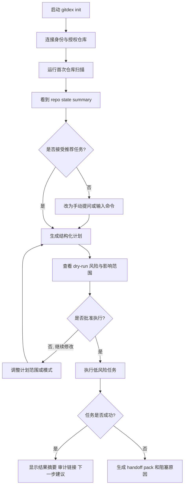
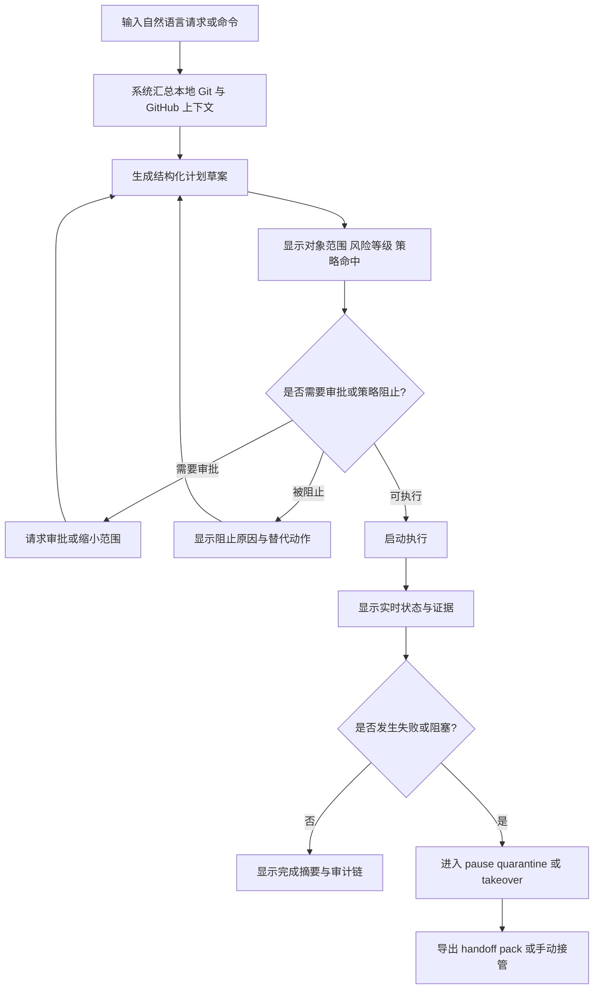
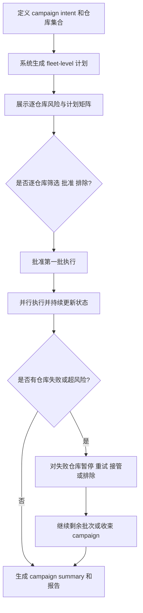

---
stepsCompleted:
  - 1
  - 2
  - 3
  - 4
  - 5
  - 6
  - 7
  - 8
  - 9
  - 10
  - 11
  - 12
  - 13
  - 14
lastStep: 14
workflowComplete: true
inputDocuments:
  - ./prd.md
  - ./product-brief-Gitdex-2026-03-18.md
  - ./research/domain-repository-autonomous-operations-research-2026-03-18.md
  - ./research/technical-gitdex-architecture-directions-research-2026-03-18.md
  - ./research/market-gitdex-competitive-boundaries-and-trust-models-research-2026-03-18.md
  - ../brainstorming/brainstorming-session-20260318-152000.md
  - ./validation-report-2026-03-18.md
generatedAssets:
  - ./ux-color-themes.html
  - ./ux-design-directions.html
author: Chika Komari
date: 2026-03-18
lastEdited: 2026-03-18
---

# UX Design Specification Gitdex

**Author:** Chika Komari
**Date:** 2026-03-18

---

## Executive Summary

### Project Vision

Gitdex 的 UX 目标不是把一堆 Git、GitHub 和 LLM 能力塞进终端，而是把“仓库运维”重构成一个长期可依赖的终端操作体验。用户应当可以在同一套终端环境中完成状态理解、意图表达、计划审查、受治理执行、异常接管、审计追溯和多仓库治理，而不必不断在网页、脚本、零散工具和上下文碎片之间跳转。

这个体验要同时容纳两类入口：一类是明确命令，负责精确、可复现、可脚本化的操作；另一类是自然语言聊天，负责意图表达、问题探索、上下文压缩、建议生成和任务协商。两者共享状态与对象模型，但不共享不受约束的执行权。任何可能导致写操作的自然语言请求，都必须在执行前收敛为显式、可审查、可解释的结构化执行计划。

因此，Gitdex 的体验本质不是“更聪明的终端助手”，而是“更可信的终端控制平面”。它应当让用户在终端里感觉到：系统始终知道当前处于什么状态、为什么要这么做、准备影响哪些对象、在什么边界内执行、出了问题如何暂停与接管。

### Target Users

主要 UX 用户：

- 独立维护者和开源维护者：高频处理 issue、PR、上游同步、仓库卫生与日常维护。
- 初创团队工程负责人和平台工程师：需要将仓库治理、多仓库整治和低风险自动化纳入统一操作面。
- API / integration user 与 campaign operator：需要把 Gitdex 作为可编排控制平面接入其他工作流，并在多仓库场景下进行批量干预。

关键非日常但高影响角色：

- repo owner / approver：关注授权边界、审批体验和最终责任。
- security reviewer：关注凭据、日志、审计链和策略命中。
- release manager / on-call operator：关注值班时的异常定位、手动接管、冻结与恢复。

这些角色的共同需求不是“更多功能”，而是“在不牺牲控制感的前提下降低认知负担”。

### Key Design Challenges

- 双模交互张力：聊天必须足够自然，命令必须足够确定，二者又必须共享同一个任务上下文与对象模型。
- 高权力动作可读性：`dry-run`、风险解释、审批节点、影响范围、回滚路径和证据必须在终端中一眼读懂。
- 长任务心智模型：系统在后台巡航时，用户仍要清楚它“正在做什么、为什么还没结束、何时需要我介入”。
- 信息架构复杂度：repo、branch、PR、issue、workflow、deployment、campaign、audit 和 evidence 汇聚到同一终端面，极易失控。
- 跨平台一致性：Windows、Linux、macOS 的 shell 和终端行为差异，不能破坏统一操作语义。

### Design Opportunities

- 把终端做成真正的仓库运维驾驶舱，而不是一组零散命令与滚动日志。
- 把“结构化执行计划”做成最核心的 UX 对象，让用户质询 AI，不是旁观 AI。
- 把 `handoff` 和 `takeover` 做成第一等体验，这会成为 Gitdex 与大多数自动化工具之间的根本差异。
- 通过 fleet / campaign 视图，把 Gitdex 从单仓库助手提升为多仓库治理控制面。

## Core Experience Foundation

### Defining Experience

Gitdex 的核心体验不是“执行命令”，而是“把模糊意图迅速转化为可治理行动”。用户最常见的高价值动作应当是：

1. 用命令或自然语言表达一个仓库目标。
2. 立即看到跨本地 Git 与 GitHub 对象的状态摘要。
3. 获得一份结构化、可审查、可裁剪的执行计划。
4. 根据风险与策略决定执行、修改、延期或接管。
5. 在执行过程中持续理解状态，在异常时直接接管。

也就是说，Gitdex 最重要的体验循环是：

`理解状态 -> 表达意图 -> 生成计划 -> 评估风险 -> 受治理执行 -> 审计 / 接管 / 收束`

### Platform Strategy

Gitdex 采用 `terminal-first, daemon-backed` 的平台策略。

终端交互面分为四种互补形态：

- 命令模式：适合精确操作、批处理、脚本与 CI。
- 聊天模式：适合意图表达、状态询问、任务讨论与解释。
- TUI 驾驶舱模式：适合持续观察、审批、接管、campaign 管理与对象穿梭。
- 后台自治模式：适合 webhook、计划任务、持续巡航与长任务执行。

这些形态必须共享同一个状态模型、任务模型、计划模型和审计模型。非交互式 API、CI 和 agent runtime 入口不应拥有独立的语义体系，而应复用同样的计划与治理契约。

### Effortless Interactions

以下动作必须做到几乎“零思考”：

- 询问“当前这个仓库最需要处理什么”
- 在命令和聊天之间无损切换当前任务上下文
- 预览一项计划将影响哪些对象、需要什么审批、风险等级如何
- 在执行中的任务里跳转到最近证据、最近失败点和下一步建议
- 一键进入 `pause / resume / cancel / takeover / export handoff`
- 在多仓库 campaign 中按仓库逐条批准、排除或重试

以下动作应该自动完成，而不是要求用户手动拼接：

- 汇总 repo state、PR / issue / workflow / deployment 状态
- 将自然语言目标编译为结构化计划草案
- 收集执行前证据、策略命中说明与审批需求
- 为失败和阻塞任务自动生成 handoff 包
- 将任务状态变化写入审计链并保持跨会话可恢复

### Critical Success Moments

Gitdex 的关键成功时刻有四个：

- 第一次 setup 之后，用户立刻看到一份真正有用的 repo state summary，而不是空洞欢迎页。
- 第一次自然语言请求之后，系统给出的计划与用户脑中的意图高度吻合，且没有越权感。
- 第一次低风险执行之后，用户明确感到“这件事我本来要自己查半天，现在在终端里几步就做完了”。
- 第一次异常接管时，用户不需要先翻日志、开网页、追 comment，而是直接从 handoff 包进入判断与操作。

### Experience Principles

- 意图优先，语法第二：用户先说“要做什么”，系统再帮助把它变成可执行对象。
- 计划优先，变更在后：任何写动作前都必须看到计划，而不是事后解释。
- 一个终端，多种模式，一个状态机：聊天、命令、TUI、后台任务在语义上必须一致。
- 后台自治，前台清晰：系统可以长期巡航，但绝不允许“静悄悄地黑箱执行”。
- 证据按需可达：摘要必须简洁，但任何结论都必须能追到对象与证据。
- 可安全中断：暂停、拒绝、回退、接管应当比继续执行更容易被发现。

## Desired Emotional Response

### Primary Emotional Goals

Gitdex 最核心的情绪目标不是“兴奋”，而是：

- 冷静：用户不必高频盯盘和追状态。
- 掌控：用户知道系统为何行动、何时行动、行动到哪一步。
- 信任：系统不会突然越权，也不会把失败藏起来。
- 推进感：用户始终看到明确下一步，而不是被复杂性困住。

### Emotional Journey Mapping

- 初识阶段：应当从“怀疑这是另一个噪音工具”转为“它确实理解我的仓库处境”。
- 首次成功阶段：应当从“试试看”转为“这个结果值得保留并继续授权”。
- 日常使用阶段：应当从“我得不停确认它有没有搞砸”转为“我可以安心让它看着这些低风险维护工作”。
- 异常场景阶段：应当从“糟了，又要自己查半天”转为“我知道现在发生了什么，也知道怎么接手”。
- 回访阶段：应当形成“默认入口”心智，而不是“偶尔用一下的新鲜工具”。

### Micro-Emotions

- 以“信心”替代“迷茫”
- 以“可追责的安心”替代“黑箱焦虑”
- 以“聚焦”替代“被信息撕裂”
- 以“熟练感”替代“指令恐惧”
- 以“缓解负担的轻松”替代“维护疲劳”

### Design Implications

- 风险和权限必须用清晰、稳定的语言表达，避免模糊措辞。
- 高风险动作必须显式减速，通过确认、审批、计划预览和语义标记建立安全感。
- 默认界面应该先呈现“现在是什么情况”和“最安全的下一步”，而不是先呈现所有功能入口。
- 成功反馈不应喧宾夺主；失败反馈必须可定位、可恢复、可接管。
- 文案语气应当专业、冷静、直接，避免过度拟人化导致责任边界模糊。

### Emotional Design Principles

- 绝不以“惊喜”换取“惊吓”
- 绝不隐藏副作用
- 绝不让用户在失败时孤立无援
- 压缩上下文负担，但不模糊责任边界
- 把“最安全的下一步”持续放在用户眼前

## UX Pattern Analysis & Inspiration

### Inspiring Products Analysis

#### `lazygit`

可借鉴点：

- 安全与速度之间的平衡很清晰。
- 关键动作周围有明确的上下文说明和提示。
- 高风险操作有确认机制，且用户始终知道当前焦点在哪里。

对 Gitdex 的启发：

- TUI 必须具备强 discoverability，不能要求用户死记热键。
- 焦点、对象、影响范围和动作提示要同时可见。
- 任何高风险操作都要有明确“退出 / 返回 / 取消”路径。

#### `gh-dash`

可借鉴点：

- 扫描效率高，适合快速总览仓库与 GitHub 对象。
- per-repo 区块和键盘优先体验有很强操作连贯性。

对 Gitdex 的启发：

- 驾驶舱首页要支持快速扫描，而不是从聊天输入开始。
- 多对象与多队列状态需要具备强烈的视觉分层和筛选能力。
- 键盘操作应支持“看完就做”，不强迫用户切换工作模式。

#### `octo.nvim`

可借鉴点：

- 把 issue、PR、comment 这些 GitHub 对象变成可直接操作的工作对象。
- 在原有工作环境中完成 GitHub 协作，而不是被迫跳网页。

对 Gitdex 的启发：

- GitHub 对象必须是第一等对象，不应只是摘要里的链接。
- 对象详情、评论、审批、标签、review 和 workflow 必须支持上下文内操作。
- 浏览与编辑之间要尽量无缝切换。

#### `Claude Code / Codex / agent runtimes`

可借鉴点：

- 自然语言交互可以显著降低表达门槛。
- 用户喜欢用聊天来询问状态、探索方案和压缩上下文。

对 Gitdex 的启发：

- 聊天应承担“表达目标、理解处境、生成草案”的角色。
- 但所有写操作必须从聊天世界收敛到结构化计划世界。
- 可观察的工具使用、任务状态和中间结果展示会显著提高信任。

#### `Symphony`

可借鉴点：

- 长任务与自治执行必须配套“proof of work”和状态面板。
- 用户更愿意“管理工作”而不是“盯着代理人”。

对 Gitdex 的启发：

- 后台任务必须具备强任务感和证据感，而不是仅有流式日志。
- Handoff、结果包和状态快照应作为系统主产物，而不是边缘附件。

### Transferable UX Patterns

可直接迁移或改造的模式：

- 总览仪表面：参考 `gh-dash` 的扫描效率，但加入任务、计划与风险。
- 上下文动作面：参考 `lazygit` 和 `octo.nvim`，让动作紧贴对象而不是藏在多层菜单。
- 结构化计划卡：参考 coding agents 的计划输出，但强化审批、证据和影响范围。
- 任务时间线：参考 orchestration 产品，把“发生了什么”做成线性可回放对象。
- 证据抽屉：摘要只给结论，证据应一跳展开，不跳出当前上下文。

### Anti-Patterns to Avoid

- 让单一聊天流承担所有浏览、计划、执行和审计功能。
- 让关键写操作只能通过网页完成，从而破坏 `all in terminal`。
- 把后台自治变成没有状态解释的日志瀑布。
- 用颜色承担全部状态语义，忽视终端和无障碍限制。
- 把“智能建议”写得像权威命令，模糊用户与系统的责任边界。

### Design Inspiration Strategy

- Adopt：`lazygit` 的安全与发现性，`gh-dash` 的扫描效率，`octo.nvim` 的对象内操作，agent runtimes 的计划表达，`Symphony` 的任务与证据思维。
- Adapt：把这些模式统一到 `intent -> structured plan -> governed action -> evidence -> takeover` 的 Gitdex 核心闭环中。
- Avoid：任何让用户回到“找网页、翻日志、猜状态、拼上下文”的设计。

## Design System Foundation

### 1.1 Design System Choice

Gitdex 的设计系统基础选择为：`自定义的 terminal-native design system`，而不是直接依附 Material、Ant Design 这类传统图形界面系统。

这个设计系统的核心不是一套网页组件，而是一套跨以下载体共享的体验语法：

- rich TUI
- plain text terminal
- machine-readable JSON / YAML artifacts
- HTML 导出资产和报告

### Rationale for Selection

- Gitdex 的主场景是终端，不是浏览器。
- 它的核心对象不是按钮、卡片和页面，而是 repo、task、plan、policy、evidence、campaign。
- 它必须同时支持密度很高的 TUI 和可读性极强的 text-only fallback。
- 它要在命令、聊天、任务面板、审计视图和导出文档之间保持同一套语义映射。

因此，最佳方案不是拿现成网页组件库硬套，而是先定义：

- 语义色与风险色 token
- 任务与计划的状态层级
- 动作优先级与确认层级
- 面板、列表、时间线、抽屉、表格、diff、banner 的共同表现规范

### Implementation Approach

- 用语义 token 驱动全部界面：`neutral / info / success / warning / danger / focus / muted`
- 用统一对象语法驱动全部视图：`object header -> current state -> risk -> next actions -> evidence`
- rich TUI 与 text-only 模式共享同一个信息层级，不允许功能降格为只读
- HTML 导出资产只作为规范展示与报告承载，不反向定义终端体验

### Customization Strategy

- 颜色定制允许跟随终端主题亮暗变化，但语义映射固定
- 键位允许重映射，但动作层级、确认语义和状态模型不允许漂移
- 输出样式允许在“稠密 / 标准 / 审计友好”之间切换，但信息优先级稳定
- 文档与报告可使用更丰富的版式，但必须与终端中的对象命名、状态命名和风险命名完全一致

## Core Interaction Definition

### 2.1 Defining Experience

Gitdex 的定义性交互是：

`一句目标 -> 一份结构化计划 -> 一次受治理执行 -> 一条完整证据链 -> 随时可接管`

如果这一条链路做对了，后面的多仓库治理、后台自治、审批、handoff、campaign 都会自然成立。

用户描述给朋友听时，理想句式应当是：

“我只要在终端里说我要处理什么，Gitdex 就会先把当前状态和执行计划整理出来，告诉我风险和影响，再由我批准执行；如果哪里卡住，我可以直接接手，不用自己重新查上下文。”

### 2.2 User Mental Model

用户并不是按 API、模块或内部代理来思考问题的。用户的心智模型是：

- 我关心的是仓库当前处境，而不是系统内部怎么组织调用。
- 我关心的是接下来最值得做的动作，而不是功能菜单总表。
- 我希望命令是确定的，聊天是灵活的，但最终行动必须是明确的。
- 我把系统视为一位长期值守的协作者，而不是一个能随意代我做决定的黑箱。

Gitdex 必须顺应这一心智模型：

- 先从“状态”和“目标”开始
- 再进入“计划”和“风险”
- 最后才进入“执行细节”

### 2.3 Success Criteria

这个核心交互要成立，至少满足以下标准：

- 用户在 `60 秒` 内拿到第一份结构化计划或明确阻塞原因
- 用户在不离开终端的前提下完成计划审查、批准或修改
- 用户始终知道当前计划会影响哪些对象、需要什么权限、触发哪些策略
- 用户可以在任意时刻暂停、返回、改写或接管，不会被流程锁死
- 成功、失败、阻塞和 handoff 都有清晰的状态收束

### 2.4 Novel UX Patterns

Gitdex 采用的是“熟悉模式的组合创新”，而不是完全陌生的交互范式。

熟悉模式：

- shell 命令
- dashboard 扫描
- 列表 + 详情
- diff / timeline / inspector
- 审批和确认

创新模式：

- 结构化计划卡：把自然语言意图翻译成可以签署的执行合同
- 策略判定条：直接展示为什么允许、阻止或升级审批
- takeover pack：失败时不是抛日志，而是抛完整接管包
- campaign matrix：把多仓库治理做成可批次审批、可逐仓库干预的矩阵视图

### 2.5 Experience Mechanics

#### Initiation

用户可以通过以下入口发起动作：

- 显式命令
- 自然语言聊天
- TUI 中的对象动作
- schedule / webhook / API 触发后进入待审查任务

#### Interaction

系统先汇总上下文，再产出计划。用户应看到：

- 当前对象与范围
- 状态摘要
- 风险等级
- 拟执行步骤
- 审批需求
- 预期结果
- 可查看证据入口

#### Feedback

在用户推进过程中，系统应持续给出：

- 当前状态
- 最近完成步骤
- 当前阻塞点
- 是否需要人工动作
- 成功 / 失败 / 阻塞的明确说明

#### Completion

成功完成时，系统输出：

- 结果摘要
- 受影响对象
- 可导出的计划与报告
- 审计链入口

失败或阻塞时，系统输出：

- 原因
- 已完成步骤
- 风险状态
- 建议下一步
- handoff pack

## Visual Design Foundation

### Color System

Gitdex 的颜色系统必须服务于可读性和风险表达，而不是追求装饰性。建议采用低饱和、强语义、适合长时间终端工作的配色体系。

核心语义色：

- `Ink` `#111827`：主文本、主要框线、关键结构
- `Slate` `#334155`：次级文本、分隔线、辅助标签
- `Cloud` `#F8FAFC`：亮背景导出和文档背景
- `Mist` `#E5E7EB`：浅背景中的次级边界
- `Signal Blue` `#2C6BED`：主动作、焦点、高亮选择
- `Focus Cyan` `#0F9FB5`：活动输入、光标、联动提示
- `Success Green` `#1C8C5E`：成功、通过、已执行
- `Warning Amber` `#B7791F`：待确认、需注意、预算靠近阈值
- `Danger Red` `#C44536`：高风险、失败、阻止、破坏性动作

配色原则：

- 颜色从不单独承担状态表达，必须配合文案、图标或标签。
- 高风险动作颜色应显著，但数量要少，避免“满屏告警色”。
- 默认界面以中性色为基底，重点通过稀疏的信号色突出。
- dark terminal 与 light documentation 共享同一语义映射，不共享绝对色值。

### Typography System

Gitdex 的主要阅读载体是终端，因此排版策略必须同时考虑密度和扫描性。

推荐字体策略：

- 终端与 TUI 主字体：`JetBrains Mono`, `IBM Plex Mono`, `Cascadia Code`, `SF Mono`, `Consolas`, `ui-monospace`
- 导出文档与 HTML 资产标题字体：`IBM Plex Sans`, `Segoe UI`, `Helvetica Neue`, `Arial`, `sans-serif`

层级建议：

- 页面标题：24-28px 等效
- 面板标题：18-20px 等效
- 对象标题：16px 等效，半粗
- 正文：14-15px 等效
- 稠密数据 / 表格 / 日志：13px 等效
- 辅助注释：12-13px 等效

排版原则：

- 标题层级少而稳，不滥用大号字。
- 数据密集区域优先对齐与留白，而不是字号变化。
- 长段说明不应出现在核心操作路径中央，应折叠或边栏化。

### Spacing & Layout Foundation

Gitdex 采用“稠密但不拥挤”的布局策略。

空间基线：

- `4`：微交互、图标与标签贴合
- `8`：同组信息内部间距
- `12`：列表项与表格组块
- `16`：面板内部段落与控制区
- `24`：面板之间的主间隔
- `32`：页面级或导出文档级分区

布局原则：

- 紧急信息永远靠近当前对象，而不是远处全局警报栏。
- 在宽终端中优先使用三段式：导航 / 队列、主工作区、右侧检查器。
- 在窄终端中优先使用单列 + 面板切换，而不是压缩到不可读。
- 列表优先保证扫描效率，详情优先保证理解深度。

### Accessibility Considerations

- 颜色不是唯一信号，所有关键状态必须有文字标签和符号。
- rich TUI 与 text-only 模式都必须支持纯键盘操作。
- 默认焦点位置必须始终可见。
- 导出 HTML 资产需满足 WCAG AA 对比度基线。
- 终端中的错误、阻塞与审批需求必须可以被线性阅读，而不是只能靠空间位置理解。

## Design Direction Decision

### Design Directions Explored

本轮设计方向共收敛出六个候选方向：

1. `Ops Cockpit`
   面向持续观察，强调队列、状态总览和任务运行态。
2. `Review Desk`
   面向计划审查，强调计划卡、风险、审批和证据联读。
3. `Command Ledger`
   面向极简终端流，强调命令、结果和审计链的线性叙事。
4. `Investigation Board`
   面向失败与值班场景，强调时间线、对象关联和证据抽屉。
5. `Campaign Radar`
   面向多仓库治理，强调矩阵视图、批次推进和逐仓库干预。
6. `Night Shift Console`
   面向后台自治与值守摘要，强调运行、告警、冻结和交接。

### Chosen Direction

最终选定方向为：`Calm Ops Cockpit`

它是 `Ops Cockpit + Review Desk + Campaign Radar` 的组合体，具体表现为：

- 首页是驾驶舱，不是聊天页。
- 聊天与命令输入位于统一底部输入区，但不主导全局信息架构。
- 主工作区优先展示当前对象、当前计划或当前任务。
- 右侧检查器始终承载风险、审批、证据、对象详情或审计线索。
- 多仓库场景切换为矩阵 / 队列表现，但复用相同的计划与状态语法。

### Design Rationale

- 这一路线最符合 `all in terminal` 的产品定位。
- 它天然支持“看一眼就知道当前状况”和“直接采取下一步动作”。
- 它对聊天模式足够友好，但不会沦为单线程聊天产品。
- 它能同时承接单仓库维护、值班接管和 fleet / campaign 治理。

### Implementation Approach

- 宽屏终端：三栏驾驶舱
- 中等宽度终端：双栏主工作区 + 抽屉式检查器
- 窄终端：单栏主流程 + 全屏切换面板
- text-only 模式：同样的信息结构，但以“段落 + 表格 + 状态块 + 命令提示”呈现

## User Journey Flows

### Journey 1: 新用户从首次 setup 到第一次“值得保留”的成功体验

目标：让新用户在 24 小时内完成一次真正有价值的低风险闭环。

体验重点：

- setup 后不是落到空界面，而是立即给出有意义的状态摘要。
- 首次计划必须小、清晰、可逆。
- 首次成功闭环要让用户看到“它真的帮我省掉了重复工作”。

### Journey 2: 维护者从自然语言请求到计划审查再到受治理执行

目标：把“我想处理这个仓库问题”转化为清晰、安全、可追责的执行闭环。

体验重点：

- 用户始终能看到“为什么可以做”和“为什么不能做”。
- 风险、范围和审批关系必须一眼可读。
- 异常时直接进入可操作状态，而不是只给日志。

### Journey 3: Campaign operator 发起多仓库治理并逐仓库干预

目标：让多仓库治理从脚本堆和广播协作变成可分批、可审查、可追踪的编排能力。

体验重点：

- fleet 计划和逐仓库计划必须同时可见。
- campaign 不能只有“全局执行 / 全局取消”。
- 失败项要与成功项同样清楚，便于继续治理而不是重新开始。

### Journey Patterns

- 先摘要，后动作：所有流程先告诉用户发生了什么，再要求用户决定做什么。
- 先范围，后权限，后执行：任何影响范围不明的动作都不应直接执行。
- 一处失败，不应污染整条流程：单仓库失败必须可局部处理，不拖垮整个 campaign。
- 对象与动作同屏：用户不应在“对象详情”和“可执行动作”之间反复切换。

### Flow Optimization Principles

- 把“达到首个有价值结果”的步骤压到最少。
- 把“需要用户负责的判断”显式提前，把“可以系统代劳的拼接工作”自动完成。
- 在每个决策点都提供最安全的下一步。
- 错误恢复优先于错误解释的完整性；先让用户能接手，再让用户看全历史。

## Component Strategy

### Design System Components

可复用的基础组件：

- 面板容器
- 列表与树状列表
- 标签、状态徽标、风险徽标
- 表格与矩阵
- 时间线
- Markdown / diff 查看器
- 搜索与过滤条
- Banner / callout / toast

这些组件应共用同一套语义 token、焦点行为和键盘导航模式。

### Custom Components

#### Intent Composer

**Purpose:** 统一聊天输入、命令输入和结构化参数补全。  
**Usage:** 作为底部固定输入区或全局唤起层。  
**States:** idle / typing / compiling plan / invalid scope / ready to run。  
**Accessibility:** 必须支持键盘提交、历史调用、参数补全和纯文本提示。  

#### Repo State Summary Board

**Purpose:** 以可扫描形式汇总本地与远程状态。  
**Usage:** 首页、仓库详情页、任务前上下文。  
**Content:** branch、diff、upstream、PR / issue / workflow / deployment 信号。  
**States:** healthy / drifting / blocked / degraded / unknown。  

#### Structured Plan Card

**Purpose:** 成为 Gitdex 中最核心的“签署对象”。  
**Usage:** 任何可能导致治理动作的任务前。  
**Anatomy:** 标题、范围、步骤、风险、策略命中、审批需求、可逆性、预期结果。  
**States:** draft / review required / approved / blocked / executing / completed。  

#### Policy Verdict Bar

**Purpose:** 直接解释“为什么允许、为什么阻止、为什么升级审批”。  
**Usage:** 计划卡顶部、审批页、错误页。  
**States:** allowed / escalated / blocked / degraded。  

#### Evidence Drawer

**Purpose:** 在不跳出当前视图的前提下展开证据。  
**Usage:** 计划、任务、审计和失败诊断中。  
**Content:** 相关对象、最近事件、diff、日志片段、策略依据。  

#### Handoff Pack Viewer

**Purpose:** 用于人工接管。  
**Usage:** 失败、阻塞、值班、升级审批场景。  
**Content:** 触发来源、当前状态、已完成步骤、未完成步骤、风险点、建议下一步。  

#### Campaign Matrix

**Purpose:** 展示多仓库计划、状态、审批和异常。  
**Usage:** fleet / campaign 视图。  
**Behavior:** 支持排序、过滤、逐仓库批准、排除、重试和导出。  

### Component Implementation Strategy

- 所有自定义组件都必须优先服务“状态理解 + 风险判断 + 下一步动作”。
- 每个组件都必须定义 text-only 表达方式。
- 组件之间以对象引用和任务 ID 串联，保证从摘要跳证据、从任务跳对象、从失败跳接管是一跳完成。
- 组件默认应支持键盘焦点、过滤、批处理和导出。

### Implementation Roadmap

#### Phase 1

- Intent Composer
- Repo State Summary Board
- Structured Plan Card
- Policy Verdict Bar
- Handoff Pack Viewer

#### Phase 2

- Evidence Drawer
- Task Timeline
- Approval Sheet
- Audit Explorer

#### Phase 3

- Campaign Matrix
- Fleet Summary Board
- Cross-object Inspector

## UX Consistency Patterns

### Button Hierarchy

虽然 Gitdex 是终端产品，但动作层级仍必须非常清楚：

- Primary：当前上下文中唯一推荐推进动作，例如 `Review Plan`、`Approve`、`Execute`
- Secondary：不改变主状态的辅助动作，例如 `Inspect Evidence`、`Filter`、`Expand`
- Safe Utility：低风险便捷动作，例如 `Copy`, `Export`, `Open Diff`
- Destructive：如 `Cancel Task`, `Kill Switch`, `Force Stop`，必须显著区分并带确认

规则：

- 任一视图内主动作不超过一个。
- 破坏性动作不能与主动作共色。
- 终端热键与视觉主次要保持一致。

### Feedback Patterns

- Success：短反馈 + 可追踪结果链接，不用夸张庆祝。
- Warning：说明风险和建议下一步，不只报“有问题”。
- Error：必须包含失败对象、失败原因、最近成功步骤和恢复入口。
- Running：提供任务阶段、最近心跳和当前执行对象，不显示无意义转圈。
- Blocked：明确阻塞责任方，是策略、审批、权限还是外部系统。

### Form Patterns

- 优先使用渐进式参数收集，而不是一次性大表单。
- 聊天输入补全出的结构化参数必须可回看、可编辑、可确认。
- 缺失输入应以内联提问或参数提示解决，而不是打断式错误。
- 高风险参数必须显式二次确认，例如作用范围、分支、环境、仓库集合。

### Navigation Patterns

- 驾驶舱导航优先级：任务 -> 仓库 -> 计划 -> 证据 -> 审计
- 全局跳转通过命令面板、搜索、对象快捷定位和最近访问栈完成
- 返回操作必须稳定；不能让用户因为进入证据或详情就迷路
- campaign 与单仓库模式切换时，保持相同的列表、详情、检查器结构

### Additional Patterns

#### Empty States

- 不说“暂无数据”，而说“当前没有需要你处理的对象”或“先运行首次扫描”。
- 给出下一步建议，而不是结束。

#### Loading States

- 长于 `3 秒` 的操作必须说明当前阶段。
- 长于 `10 秒` 的操作必须说明是否可离开当前界面。

#### Search & Filtering

- 默认支持模糊搜索与多条件过滤。
- 过滤条件始终可见、可撤销。

#### Confirmation

- 低风险动作：单次确认即可
- 中风险动作：计划审查 + 确认
- 高风险动作：计划审查 + 风险说明 + 审批或 typed confirmation

## Responsive Design & Accessibility

### Responsive Strategy

Gitdex 的 MVP 不以手机应用为目标。它的响应式策略应围绕“不同终端视口和信息密度”展开，而不是围绕传统网页断点。

视口策略：

- `Compact Terminal`：80-99 列，单列主流程 + 可切换面板
- `Standard Terminal`：100-139 列，双栏布局
- `Wide Terminal`：140 列以上，三栏驾驶舱
- `Short Height`：32 行以下，隐藏非关键辅助区，保留状态、主内容、输入

补充策略：

- 手机端不承载主操作，但导出报告与 handoff 包应可阅读。
- 平板与小屏笔电主要用于查看摘要、审批和接管，不适合复杂批量编辑。

### Breakpoint Strategy

终端断点以字符列和行数为主：

- 宽度断点：80 / 100 / 140
- 高度断点：32 / 40 / 52

导出 HTML 和静态资产可使用常规浏览器断点：

- Mobile: `<768px`
- Tablet: `768-1023px`
- Desktop: `>=1024px`

但这些断点只影响阅读资产，不重新定义 Gitdex 主体验。

### Accessibility Strategy

目标级别：

- 终端主体验：达到“键盘完整可操作、颜色非唯一信号、线性阅读可理解”的工程级可访问性标准
- HTML 导出与文档资产：以 `WCAG 2.1 AA` 为目标

关键要求：

- 所有主要交互可用键盘完成
- 焦点位置始终清晰
- 颜色从不承担唯一语义
- 错误和阻塞信息可被屏幕阅读器友好读取于导出资产中
- text-only 模式必须保留核心能力而非缩水到只读

### Testing Strategy

- 终端尺寸回归测试：80 / 100 / 140 列布局
- OS 测试：Windows Terminal、PowerShell、bash / zsh、macOS Terminal / iTerm
- rich TUI 与 text-only 回归对照测试
- 键盘专用路径测试
- 高对比模式与低彩色环境测试
- HTML 导出资产的自动对比度和语义结构测试
- 对值班、失败接管和审批场景做任务演练测试

### Implementation Guidelines

- 所有状态标签必须有文字，不只靠颜色或图标。
- 所有关键动作都应有可发现的快捷键提示。
- 主视图不滚动隐藏关键状态；关键状态必须钉住。
- 在窄终端上优先删减装饰，不删减控制与解释。
- 文案优先使用直接动词，如 `Approve`, `Pause`, `Take Over`, `Inspect Evidence`，避免模糊词。

## Workflow Completion Notes

本规格已覆盖：

- 项目理解与用户类型
- 核心体验与情绪目标
- 灵感分析与反模式
- 设计系统基础
- 定义性交互与机制
- 视觉基础与设计方向
- 关键用户旅程
- 组件策略
- 一致性模式
- 响应式与无障碍策略

配套资产：

- `./ux-color-themes.html`
- `./ux-design-directions.html`
